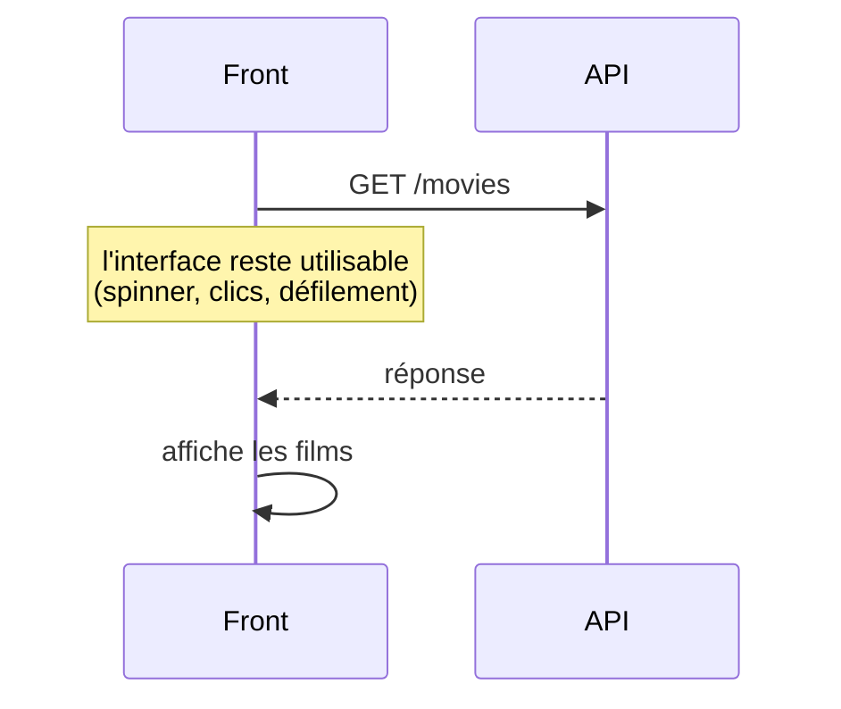

# Synchrone vs Asynchrone

> [!abstract] En bref
> **Synchrone** : chaque ligne attend que la précédente soit finie. **Asynchrone** : on lance une opération longue (appel réseau, lecture de fichier, minuteur) et on **continue**, le résultat arrivera plus tard. C'est comme au restaurant : tu passes commande, puis tu discutes en attendant le plat, au lieu de fixer la cuisine sans bouger. Toute application web repose là-dessus.

## Voir la différence

```ts
console.log('1 : je commande');
setTimeout(() => console.log('3 : le plat arrive'), 1000);
console.log('2 : je discute en attendant');
```

Affiche `1`, `2`, puis `3` une seconde plus tard. Le programme n'a **pas attendu**.

## Pourquoi c'est indispensable

Un appel réseau prend 100 à 1 000 ms. Le processeur, lui, fait des millions d'opérations pendant ce temps.

Si le navigateur **attendait** la réponse, la page serait **figée** : impossible de cliquer, de défiler, de taper. Avec l'asynchrone, l'interface reste fluide pendant le chargement.



## Comment on écrit de l'asynchrone

| Outil | Pour | Note |
|---|---|---|
| **callback** | ancienne façon | à éviter aujourd'hui |
| **Promise** + `async` / `await` | **une** valeur qui arrivera plus tard | [[JS-07-Promises-Async-Await\|Promises et async/await]] |
| **Observable** (RxJS) | un **flux** de valeurs (saisie, WebSocket) | [[ANG-08-RxJS\|RxJS]] |

```ts
async function loadMovie(id: number) {
  const response = await fetch(`/api/movies/${id}`);   // on attend ici, sans bloquer la page
  return response.json();
}
```

## Lancer en parallèle quand c'est possible

```ts
// ❌ l'un après l'autre : ~2 s
const movies = await loadMovies();
const genres = await loadGenres();

// ✅ les deux en même temps : ~1 s
const [movies, genres] = await Promise.all([loadMovies(), loadGenres()]);
```

Si les deux appels ne dépendent pas l'un de l'autre, lance-les **ensemble**.

## Concurrence et parallélisme

- **Concurrence** : plusieurs tâches **avancent en alternance** sur un seul fil. C'est ce que fait JavaScript avec l'[[JS-06-Event-Loop|event loop]] : pendant qu'une requête attend le réseau, il s'occupe d'autre chose.
- **Parallélisme** : plusieurs tâches tournent **vraiment en même temps** sur plusieurs cœurs (threads, Web Workers).

JavaScript est asynchrone mais **pas parallèle** : un gros calcul bloque quand même la page.

## Pièges

- **Utiliser la donnée avant qu'elle arrive** : elle vaut `undefined`.
- **Oublier `await`** : tu obtiens une Promise au lieu de la valeur.
- **Enchaîner des appels indépendants** au lieu de les lancer ensemble.
- **Un calcul très lourd** dans le navigateur : l'asynchrone ne l'empêche pas de figer la page.
