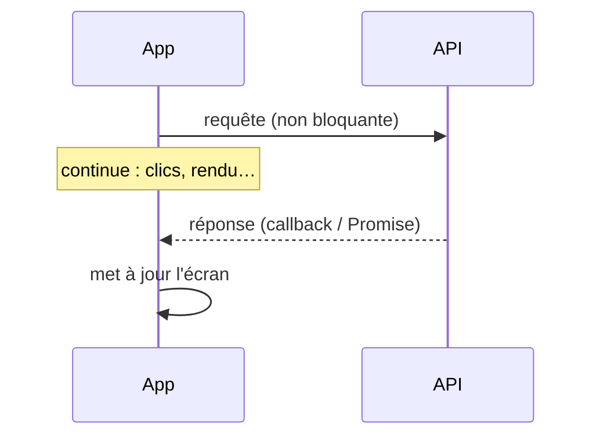

# Synchrone vs Asynchrone

> [!abstract] Introduction
> Synchrone : chaque instruction attend la fin de la précédente. Asynchrone : on lance une opération longue (réseau, disque, timer) et on continue, le résultat arrivera plus tard — la base de toute application web.

---

## Théorie

> [!question]- C'est quoi ?
> ```javascript
> console.log("1 : je commande");
> setTimeout(() => console.log("3 : la commande arrive"), 1000);
> console.log("2 : je continue ma vie");
> ```
> Concepts voisins à ne pas confondre :
> - **Concurrence** : gérer plusieurs tâches qui avancent en alternance (event loop JS)
> - **Parallélisme** : exécuter réellement plusieurs tâches en même temps sur plusieurs cœurs (threads, workers)

> [!example]- Analogie
> Synchrone : faire la queue au guichet sans rien faire d'autre. Asynchrone : prendre un ticket, aller boire un café, revenir quand son numéro s'affiche.

> [!question]- Pourquoi l'utiliser ?
> Les opérations d'entrée/sortie (I/O) sont des milliers de fois plus lentes que le CPU : les attendre en bloquant gaspillerait tout. Une UI bloquée = application figée.

> [!question]- Comment ça marche ?
> Évolution en JS : callbacks → Promises → async/await → Observables (flux). Côté serveur, Node gère des milliers de connexions sur un seul thread grâce à l'I/O non bloquante ; Java/Spring utilise classiquement un thread par requête (ou threads virtuels).

### Schéma



---

## Vocabulaire

| Terme | Définition en une ligne |
|-------|--------------------------|
| I/O | Entrées/sorties (réseau, disque) |
| Bloquant | Qui empêche la suite de s'exécuter |
| Callback | Fonction appelée quand le résultat arrive |
| Concurrence | Alternance de tâches |
| Parallélisme | Exécution simultanée réelle |

---

## Points clés

- Asynchrone ≠ parallèle en JavaScript
- Toute I/O est asynchrone dans le navigateur
- Promise = une valeur future ; Observable = un flux de valeurs

---

## Pièges courants

> [!bug]- Erreurs fréquentes
> - Utiliser une valeur asynchrone avant qu'elle soit arrivée (`undefined`)
> - Enchaîner séquentiellement des appels indépendants

---

## Exemple minimal

```typescript
// Séquentiel : ~2 s
const a = await chargerFilms();
const b = await chargerGenres();
// Concurrent : ~1 s
const [films, genres] = await Promise.all([chargerFilms(), chargerGenres()]);
```

> [!note] Ce que j'en retiens
> Lancer d'abord, attendre ensuite : les deux requêtes voyagent en même temps.

---

## Pour aller plus loin (niveau senior)

> [!tip]- Ce qui distingue un dev expérimenté
> - Comprendre backpressure, annulation, race conditions (switchMap)

---

## Connexions

**Arbre théorique :**
- Sujet parent → [[Théorie Générale]]
- Sous-sujets → [[JS-06-Event-Loop|Event Loop JavaScript]], [[JS-07-Promises-Async-Await|Promises et Async Await JavaScript]]
- À comparer avec → (—)

**Pratique :**
- Extrait de code → [[04_Snippets/tg-04-synchrone-vs-asynchrone]]
- Projet → [[02_Projects/CinéTrack]]

---

## Auto-vérification

> [!check]- Est-ce que je maîtrise vraiment ?
> - Quelle différence entre concurrence et parallélisme ?

> [!faq]- Questions d'entretien
> - JavaScript est mono-thread : comment gère-t-il plusieurs requêtes ?

---

## Tâches

- [ ] #task Mesurer séquentiel vs Promise.all sur deux fetch
- [ ] #task Mettre à jour `status` une fois maîtrisé

---

## Notes brutes

- ?
