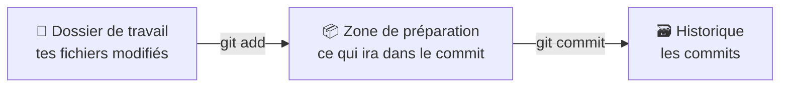

# Git Fondamentaux

> [!abstract] En bref
> **Git** garde l'**historique** de ton projet : chaque étape enregistrée (un *commit*) est une photo de ton code que tu peux retrouver. Il permet aussi de travailler à plusieurs sans s'écraser. Tu t'en sers tous les jours, au travail comme dans tes projets.

## L'image : un jeu vidéo avec des sauvegardes

Chaque **commit** est une **sauvegarde** avec un message (« ajoute le formulaire de contact »). Si tu casses tout, tu reviens à une sauvegarde précédente. Et tu peux voir qui a changé quoi, et quand.

## Les 3 zones



1. Tu modifies des fichiers (**dossier de travail**).
2. Tu choisis ce que tu veux enregistrer : `git add` (**zone de préparation**, *staging*).
3. Tu enregistres une étape : `git commit` (**historique**).

## Les commandes du quotidien

```bash
git init                         # créer un dépôt (une fois)
git clone <url>                  # récupérer un projet existant

git status                       # ⭐ que se passe-t-il ? (à taper tout le temps)
git diff                         # voir mes modifications
git add src/app/contact.ts       # préparer un fichier
git add .                        # préparer tout
git commit -m "feat: ajoute le formulaire de contact"
git log --oneline --graph -15    # l'historique, en résumé
```

| Commande | Rôle |
|---|---|
| `git status` | l'état actuel : fichiers modifiés, préparés, branche |
| `git diff` | les lignes modifiées (pas encore préparées) |
| `git diff --staged` | ce qui va partir dans le commit |
| `git add` | préparer |
| `git commit -m "…"` | enregistrer |
| `git log` | l'historique |
| `git show <id>` | le détail d'un commit |

## Configurer une fois

```bash
git config --global user.name "Ton Nom"
git config --global user.email "ton.email@exemple.fr"
git config --global init.defaultBranch main
git config --global core.autocrlf input    # sur Windows / WSL : fins de ligne propres
```

## Le fichier `.gitignore`

Ce que Git doit **ignorer** : dépendances, fichiers générés, secrets.

```gitignore
node_modules/
dist/
.env
*.log
.idea/
```

## Un bon commit

- **Petit** : une seule idée par commit (« ajoute le filtre par techno »), pas « modifs du jour ».
- **Un message clair** : ce que fait le commit. Convention : [[GIT-07-Conventions-Commits-SemVer|Conventional Commits]].
- **Qui fonctionne** : le projet compile à chaque commit.

La suite : [[GIT-02-Branches-Merge-Rebase|Branches]] → [[GIT-03-Depots-Distants|GitLab / GitHub]].

## Pièges

- **Commiter `.env` ou une clé secrète** : elle reste dans l'historique même après suppression. Si c'est arrivé, change le secret.
- **Commiter `node_modules`** : des milliers de fichiers inutiles. Vérifie ton `.gitignore` dès le début.
- **`git add .` sans regarder** : fais `git status` avant.
