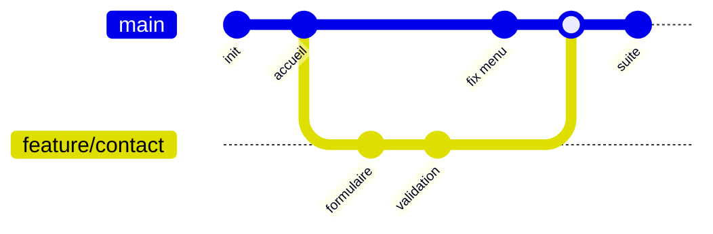

# Branches Merge et Rebase

> [!abstract] En bref
> Une **branche** est une ligne de travail à part : tu développes le formulaire de contact sans toucher à `main`. Quand c'est prêt, tu **réintègres** ton travail : avec un **merge** (on fusionne, l'historique garde la trace de la branche) ou un **rebase** (on rejoue tes commits par-dessus, l'historique devient une ligne droite).

## L'image

`main` est la **route principale**. Une branche est une **déviation** pour faire des travaux sans bloquer la circulation. Une fois les travaux finis, la déviation rejoint la route.



## Les commandes

```bash
git switch -c feature/contact      # créer une branche et y aller
git switch main                    # revenir sur main
git branch                         # lister les branches locales
git branch -d feature/contact      # supprimer une branche fusionnée
```

**Nommer ses branches :** `feature/contact-form`, `fix/menu-mobile`, `chore/update-deps`.

## Merge : fusionner

```bash
git switch main
git merge feature/contact
```

Git crée un **commit de fusion** qui relie les deux histoires. Rien n'est réécrit : c'est sûr, mais l'historique peut devenir touffu.

## Rebase : rejouer par-dessus

```bash
git switch feature/contact
git rebase main                     # rejoue mes commits après les derniers de main
```

Avant : ta branche est partie d'un vieux `main`. Après : c'est comme si tu avais commencé ton travail sur le `main` d'aujourd'hui. Historique **linéaire**, plus lisible.

| | Merge | Rebase |
|---|---|---|
| Historique | garde les embranchements | ligne droite |
| Réécrit les commits | non | **oui** (nouveaux identifiants) |
| Sûr sur une branche partagée | oui | **non** |
| Usage typique | intégrer une MR dans `main` | mettre à jour **ta** branche avant la MR |

## La règle d'or du rebase

> **Ne jamais rebaser une branche que d'autres utilisent déjà.**

Le rebase crée de nouveaux commits. Si un collègue avait les anciens, vos historiques divergent. Rebaser **ta** branche perso avant de la proposer : oui. Rebaser `main` : jamais.

Après un rebase d'une branche déjà poussée :

```bash
git push --force-with-lease        # force, mais refuse si quelqu'un d'autre a poussé entretemps
```

## Au travail

Suis la convention de l'équipe : certaines équipes fusionnent (merge), d'autres rebasent ou « squashent » (tous les commits de la MR réunis en un seul). Voir [[GIT-06-Workflows-Equipe|Workflows]].

## Pièges

- **Travailler directement sur `main`**.
- **Une branche qui vit 3 semaines** : les conflits s'accumulent. Petites branches, fusionnées vite.
- **`git push --force`** sans `-with-lease` : peut effacer le travail d'un collègue.
