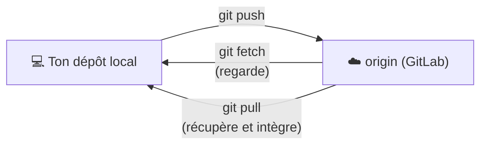

# Dépôts Distants

> [!abstract] En bref
> Ton dépôt Git est sur ton ordinateur. Un **dépôt distant** (*remote*) est une copie hébergée en ligne, sur GitLab ou GitHub, pour sauvegarder ton travail et le partager. Trois gestes : **envoyer** (`push`), **récupérer** (`pull`), **regarder ce qui a changé** (`fetch`).

## Le schéma



`origin` est le nom donné par défaut au dépôt distant.

## Les commandes

```bash
git clone git@gitlab.com:ton-nom/portfolio.git   # copier un dépôt distant

git remote -v                           # voir les dépôts distants
git remote add origin <url>             # relier un dépôt local à un distant

git push -u origin feature/contact      # 1re fois : envoyer ET relier la branche
git push                                # ensuite

git fetch                               # télécharger les nouveautés sans rien modifier
git pull                                # télécharger ET intégrer dans ta branche
git pull --rebase                       # pareil, en rebasant (historique propre)
```

## `fetch` ou `pull` ?

| | `fetch` | `pull` |
|---|---|---|
| Télécharge | oui | oui |
| Modifie tes fichiers | **non** | **oui** (merge ou rebase) |
| Quand | « qu'est-ce qui a changé ? » | « je veux la dernière version » |

## SSH ou HTTPS ?

| | SSH (`git@gitlab.com:…`) | HTTPS (`https://gitlab.com/…`) |
|---|---|---|
| Authentification | une clé SSH, configurée une fois | identifiant + jeton d'accès |
| Au quotidien | **rien à taper** | le gestionnaire d'identifiants s'en souvient |

Créer une clé SSH (dans WSL) :

```bash
ssh-keygen -t ed25519 -C "ton.email@exemple.fr"
cat ~/.ssh/id_ed25519.pub     # à coller dans GitLab → Préférences → Clés SSH
ssh -T git@gitlab.com         # test
```

## Le déroulé quotidien

```bash
git switch main && git pull              # partir d'un main à jour
git switch -c feature/filtre-technos     # nouvelle branche
# … coder, commiter …
git push -u origin feature/filtre-technos
# → GitLab propose de créer une Merge Request
```

Voir [[02-Merge-Requests|Merge Requests]].

## Pièges

- **« rejected: non-fast-forward »** au `push` : quelqu'un a poussé avant toi. Fais `git pull --rebase`, puis repousse.
- **Travailler plusieurs jours sans `pull`** : les conflits s'accumulent.
- **Oublier `-u` au premier push** : ensuite `git push` tout court ne sait pas où envoyer.
