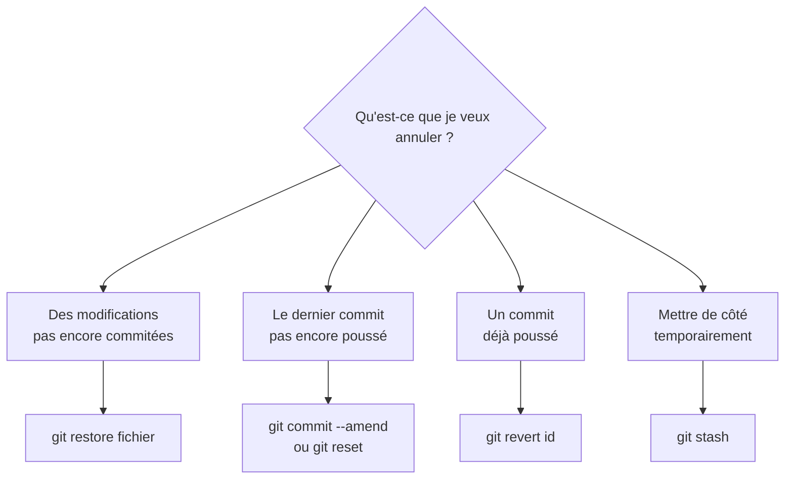

# Annuler et Corriger avec Git

> [!abstract] En bref
> Avec Git, presque tout se rattrape. Le bon outil dépend d'**une seule question** : ce que je veux annuler a-t-il **déjà été poussé** (partagé avec d'autres) ? Si non, on peut réécrire l'historique. Si oui, on ajoute un commit qui corrige.

## Le guide de choix



## Aide-mémoire

| Situation | Commande | Danger |
|---|---|---|
| annuler les modifs d'un fichier (pas commité) | `git restore fichier.ts` | ⚠️ les modifs sont perdues |
| retirer un fichier de la préparation (`add`) | `git restore --staged fichier.ts` | aucun |
| corriger le message ou ajouter un oubli au **dernier** commit (pas poussé) | `git add oubli.ts && git commit --amend` | réécrit le commit |
| défaire le dernier commit, **garder** le code | `git reset --soft HEAD~1` | réécrit l'historique |
| défaire le dernier commit **et** le code | `git reset --hard HEAD~1` | ⚠️ code perdu |
| annuler un commit **déjà poussé** | `git revert <id>` | aucun : crée un commit inverse |
| mettre de côté pour changer de branche | `git stash` puis `git stash pop` | aucun |
| retrouver un commit « perdu » | `git reflog` | aucun |

## `revert` : la méthode sûre pour ce qui est partagé

```bash
git log --oneline          # trouver l'id du commit fautif, ex. a1b2c3d
git revert a1b2c3d         # crée un nouveau commit qui fait l'inverse
git push
```

L'historique garde les deux commits : personne n'est perturbé.

## `stash` : le tiroir

Tu es en plein travail, et on te demande une correction urgente sur une autre branche :

```bash
git stash                  # range tes modifs dans un tiroir
git switch main            # … corrige, commite …
git switch feature/contact
git stash pop              # ressort tes modifs
```

## `reflog` : le filet de sécurité

Git note **tout** ce que tu fais pendant environ 90 jours, même après un `reset --hard` :

```bash
git reflog                 # liste de tous tes déplacements
git reset --hard HEAD@{3}  # revenir à l'état d'il y a 3 actions
```

## Pièges

- **`reset --hard` ou `restore`** sur du travail non commité : il est **vraiment** perdu (le reflog ne voit que les commits). Commite souvent, ou `stash`.
- **`reset` ou `--amend` sur un commit déjà poussé** : tes collègues auront un historique incompatible. Utilise `revert`.
- **Paniquer** : avant toute commande risquée, `git status` et `git log --oneline`.
