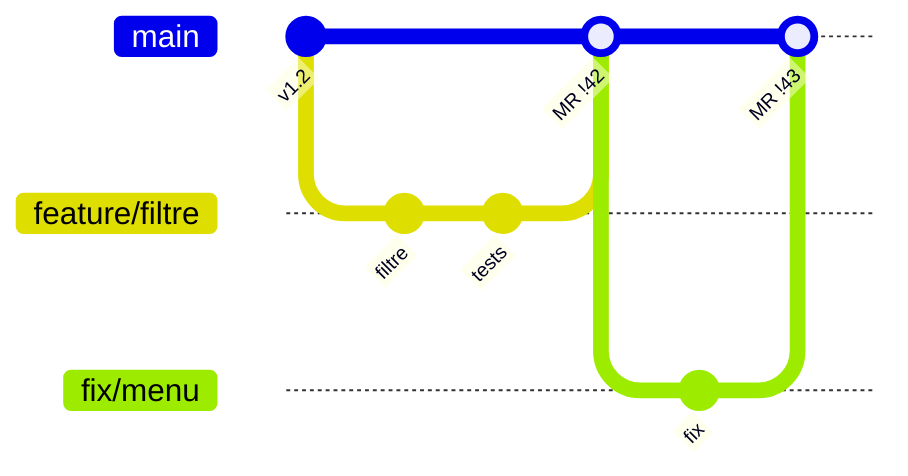
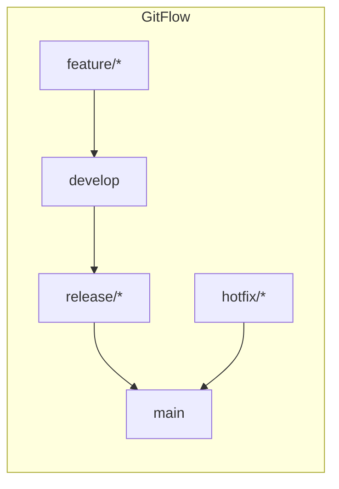

# Workflows Git en Équipe

> [!abstract] En bref
> Un **workflow** Git, c'est la règle du jeu de l'équipe : quelles branches existent, qui peut écrire où, comment on intègre le travail. Le plus courant aujourd'hui : **une branche par tâche, une Merge Request, puis fusion dans `main`**. Au travail, tu suis celui de ton équipe.

## Le workflow par branches de fonctionnalité (le plus courant)

1. `main` est **protégée** : personne ne pousse directement dessus.
2. Une tâche = une branche (`feature/…`, `fix/…`).
3. Une **Merge Request** avec revue de code et pipeline vert.
4. Fusion dans `main`, suppression de la branche.
5. Déploiement depuis `main` (souvent automatique).

C'est celui que tu utilises dans tes projets. Voir [[02-Merge-Requests|Merge Requests]].

## Les autres workflows

| Workflow | Principe | Pour |
|---|---|---|
| **Feature branches + MR** (GitHub / GitLab Flow) | branches courtes vers `main` | la plupart des équipes |
| **GitFlow** | `main` + `develop` + branches `release/` et `hotfix/` | versions planifiées (logiciel livré par version) |
| **Trunk-based** | tout le monde intègre dans `main` plusieurs fois par jour, fonctionnalités cachées derrière des interrupteurs | équipes très matures, déploiement continu |

GitFlow est plus lourd : beaucoup de branches à maintenir. Tu le croiseras dans des projets existants.

## Les bonnes pratiques de l'équipe

- **Branches courtes** : quelques jours maximum.
- **Petites MR** : une MR de 200 lignes est relue sérieusement, une de 2 000 est survolée.
- **`main` toujours déployable** : ce qui y entre est testé.
- **Un nom de branche lié au ticket** : `feature/123-filtre-technos`.
- **Stratégie de fusion commune** : merge, rebase ou squash, mais tout le monde pareil.

## Pièges

- **Pousser directement sur `main`** « juste pour une petite correction ».
- **Une branche `develop` qui diverge** pendant des semaines de `main`.
- **Imposer ton workflow** dans une équipe qui en a déjà un : propose, mais suis l'existant.
