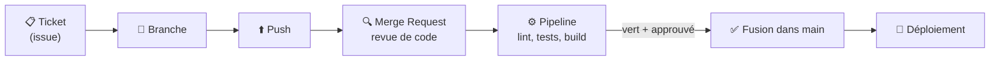

# Fondamentaux GitLab

> [!abstract] En bref
> **Git** est l'outil qui garde l'historique sur ta machine. **GitLab** est la plateforme en ligne autour : il héberge le code et ajoute ce qu'il faut pour travailler en équipe (Merge Requests, pipelines automatiques, tickets). Ton entreprise utilise son propre GitLab, hébergé sur ses serveurs.

## L'image

Git est le **moteur**. GitLab est l'**usine** construite autour : un bureau d'études (les tickets), un contrôle qualité (les Merge Requests et les pipelines), un entrepôt (le registre d'images), un service d'expédition (le déploiement).

## Le parcours d'une modification

## L'organisation

| Élément | C'est… |
|---|---|
| **Groupe** | une équipe ou un département, qui contient des projets |
| **Projet** | un dépôt Git + ses tickets, MR, pipelines, wiki |
| **Branche protégée** | `main` : modifiable seulement via une MR validée |
| **Rôle** | ce que tu as le droit de faire |

| Rôle | Peut |
|---|---|
| Guest / Reporter | lire, commenter les tickets |
| **Developer** | pousser des branches, ouvrir des MR (ton rôle habituel) |
| Maintainer | fusionner, configurer le projet |
| Owner | tout, y compris supprimer |

## Les fonctionnalités que tu utiliseras

| Fonctionnalité | Note |
|---|---|
| Merge Requests | [[02-Merge-Requests\|Merge Requests]] |
| Pipelines CI/CD | [[03-CI-CD\|CI/CD]] |
| Tickets et tableaux | [[04-Issues-Boards\|Issues et boards]] |
| Registre d'images, Pages, sécurité | [[05-GitLab-Avance\|GitLab avancé]] |

## Tes projets perso

Mets tes projets sur **gitlab.com** (ou GitHub) : c'est ce que regardera un recruteur. Un dépôt propre = un README clair, des commits lisibles, un pipeline vert, un lien vers la démo.

## Pièges

- **Confondre Git et GitLab** : Git marche très bien sans GitLab, l'inverse non.
- **Travailler directement sur `main`** : impossible si elle est protégée, et c'est tant mieux.
