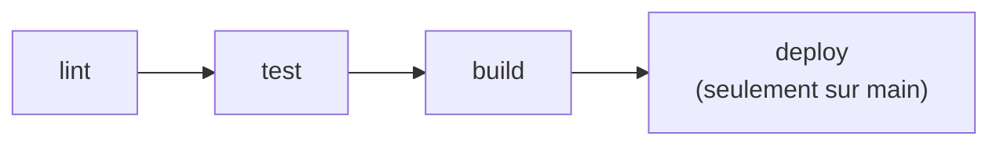

# GitLab CI/CD

> [!abstract] En bref
> À chaque push, GitLab peut lancer **automatiquement** une suite de vérifications et d'actions : installer, vérifier le style, lancer les tests, construire, déployer. C'est le **pipeline**, décrit dans un fichier `.gitlab-ci.yml` à la racine du projet. Plus besoin de faire confiance à « ça marche sur ma machine ».

## Le vocabulaire

| Mot | Sens |
|---|---|
| **Pipeline** | l'ensemble des vérifications lancées pour un commit |
| **Stage** (étape) | un groupe de jobs, exécutés dans l'ordre (lint → test → build → deploy) |
| **Job** | une tâche : une suite de commandes |
| **Runner** | la machine qui exécute les jobs |
| **Artifact** | un fichier produit par un job et transmis aux suivants (le dossier `dist/`) |
| **Variable** | une valeur de configuration ou un secret, réglé dans GitLab |



Si un job échoue, les étapes suivantes ne sont pas lancées.

## Le pipeline du Portfolio (Vue)

```yaml
# .gitlab-ci.yml
image: node:22

stages: [lint, test, build, deploy]

cache:
  key: { files: [package-lock.json] }
  paths: [.npm/]

before_script:
  - npm ci --cache .npm --prefer-offline

lint:
  stage: lint
  script:
    - npm run lint
    - npx vue-tsc --noEmit

test:
  stage: test
  script:
    - npx vitest run --coverage

build:
  stage: build
  script:
    - npm run build
  artifacts:
    paths: [dist/]

pages:                                  # GitLab Pages : publie le site
  stage: deploy
  script:
    - cp -r dist public
    - cp public/index.html public/404.html   # pour que Vue Router fonctionne au rafraîchissement
  artifacts:
    paths: [public]
  rules:
    - if: $CI_COMMIT_BRANCH == "main"   # seulement sur main
```

## Les éléments utiles

| Clé | Rôle |
|---|---|
| `image` | l'environnement du job (une image Docker : `node:22`, `postgres:17`) |
| `script` | les commandes |
| `rules` | quand lancer le job (branche, MR, tag) |
| `cache` | réutiliser `node_modules` / `.npm` d'un pipeline à l'autre |
| `artifacts` | garder des fichiers produits |
| `services` | lancer une base à côté (PostgreSQL pour les tests d'API) |
| `needs` | lancer un job dès qu'un autre est fini, sans attendre toute l'étape |

## Les secrets

Jamais dans le fichier : **Settings → CI/CD → Variables**, cochées **Masked** (cachées dans les logs) et **Protected** (disponibles seulement sur les branches protégées). Dans le script : `$TMDB_TOKEN`.

## Déboguer un pipeline rouge

1. Ouvre le job en échec et lis le log **depuis la fin**.
2. Relance **la même commande** en local (`npm ci && npm run lint`).
3. Les différences classiques : version de Node, variable manquante, fichier non commité, test qui dépend de l'ordre.

Pipeline complet front + back + Docker : [[CICD-02-Pipeline-Full-Stack|Pipeline full stack]].

## Pièges

- **`npm install` au lieu de `npm ci`** : versions différentes de celles du `package-lock.json`.
- **Un secret dans `.gitlab-ci.yml`** : il est dans l'historique Git.
- **Déployer depuis n'importe quelle branche** : limite avec `rules`.
