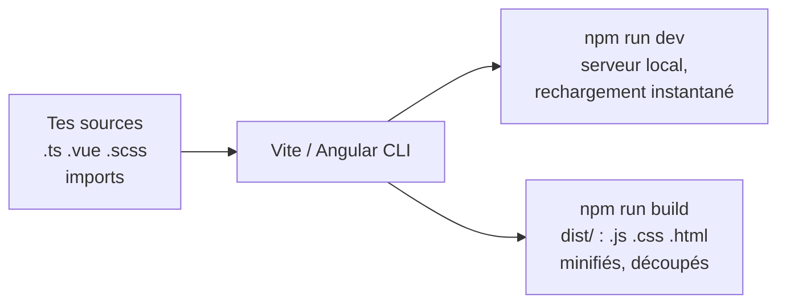

# Outillage de Build Vite et Bundlers

> [!abstract] En bref
> Ton navigateur ne comprend ni le TypeScript, ni les fichiers `.vue`, ni le SCSS. Un **outil de build** (Vite pour Vue, le builder d'Angular CLI) **transforme** tes sources en fichiers que le navigateur sait lire, et les **optimise** pour la production. Pendant le développement, il rafraîchit la page instantanément à chaque sauvegarde.

## Ce qu'il fait



| Étape | En clair |
|---|---|
| **Transpiler** | TypeScript → JavaScript, `.vue` → JavaScript |
| **Regrouper** (*bundle*) | des centaines de fichiers → quelques fichiers |
| **Supprimer le code inutile** (*tree-shaking*) | ce qui n'est jamais importé disparaît |
| **Minifier** | retirer espaces et raccourcir les noms → fichiers plus légers |
| **Découper** (*code splitting*) | un fichier par page chargée à la demande |
| **Nommer avec une empreinte** | `main-4f3a2b.js` : le navigateur recharge seulement ce qui a changé |

## Vite (Vue)

```bash
npm run dev       # serveur de développement : http://localhost:5173
npm run build     # production → dist/
npm run preview   # tester la version de production en local
```

```ts
// vite.config.ts
export default defineConfig({
  plugins: [vue(), tailwindcss()],
  resolve: { alias: { '@': fileURLToPath(new URL('./src', import.meta.url)) } },
  server: {
    proxy: { '/api': 'http://localhost:3000' },   // appelle ton API sans problème de CORS en dev
  },
});
```

Les variables d'environnement : fichiers `.env`, `.env.production`, lues avec `import.meta.env.VITE_…` (et visibles par tous dans le navigateur).

## Angular CLI

```bash
ng serve          # développement : http://localhost:4200
ng build          # production → dist/
```

La configuration est dans `angular.json`. Angular utilise esbuild et Vite en interne : tu n'as rien à régler pour commencer.

## Pourquoi c'est rapide aujourd'hui

Les anciens outils (webpack) reconstruisaient tout le projet à chaque modification. Vite, en développement, envoie les fichiers **au fur et à mesure** au navigateur et utilise **esbuild** (écrit en Go, très rapide) : démarrage en une seconde.

## Pièges

- **Tester seulement avec `npm run dev`** : certains problèmes n'apparaissent qu'au build de production. Lance `npm run build` avant de pousser.
- **Un bundle énorme** : regarde quelles librairies pèsent le plus (`npx vite-bundle-visualizer`).
- **Un secret dans une variable `VITE_`** : il finit dans le JavaScript public.
