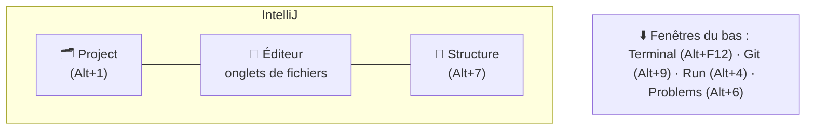

# Interface et Fondamentaux IntelliJ

> [!abstract] En bref
> **IntelliJ IDEA** (et **WebStorm**, sa version dédiée au web) est un environnement de développement complet de JetBrains. Contrairement à VS Code, il **comprend** tout le projet dès l'ouverture, sans extensions : navigation, refactoring, Git, base de données, tests. Sa force : il analyse (« indexe ») tout ton code.

## Les zones de l'écran

| Zone | Rôle |
|---|---|
| **Project** (gauche) | l'arborescence des fichiers |
| **Éditeur** (centre) | le code, avec les onglets |
| **Fenêtres d'outils** (bords) | Terminal, Git, Run, Debug, Database, Problems |
| **Barre de navigation** (haut) | le chemin du fichier, la branche Git, le bouton Run |
| **Marge** (à gauche du code) | points d'arrêt, modifications Git, icônes d'actions |

Les fenêtres d'outils s'ouvrent avec **`Alt` + un chiffre**.

## L'indexation

À l'ouverture d'un projet, IntelliJ lit tout le code (barre de progression en bas). **Attends la fin** : ensuite la recherche, l'autocomplétion et le refactoring sont instantanés et fiables.

## Les réglages à faire une fois

| Réglage | Où (`Ctrl+Alt+S` ouvre les réglages) |
|---|---|
| Version de Node | *Languages & Frameworks → Node.js* |
| TypeScript du projet | *Languages & Frameworks → TypeScript* → version de `node_modules` |
| Prettier à la sauvegarde | *Languages & Frameworks → JavaScript → Prettier* → *On save* |
| ESLint automatique | *Languages & Frameworks → JavaScript → Code Quality Tools → ESLint* |
| Actions à la sauvegarde | *Tools → Actions on Save* (reformater, optimiser les imports) |
| Thème | *Appearance & Behavior → Appearance* |

## Travailler avec WSL (Windows)

Ouvre le projet par le chemin réseau `\\wsl$\Ubuntu\home\ton-nom\projets\…`, et règle l'interpréteur Node sur celui de WSL (*Node.js → Add → WSL*). Le terminal intégré peut aussi ouvrir Ubuntu (*Tools → Terminal → Shell path* : `wsl.exe`).

## Le raccourci à retenir en premier

**Double `Shift`** : « chercher partout » (fichiers, classes, actions, réglages). Puis **`Alt+Entrée`** : « que peux-tu faire ici ? » (corriger une erreur, ajouter un import). Tous les raccourcis : [[IJ-02-Raccourcis-Clavier|Raccourcis]].

## Pièges

- **Travailler pendant l'indexation** : les résultats de recherche sont incomplets.
- **Committer le dossier `.idea/`** entier : il contient des réglages personnels. Ignore-le, ou ne garde que les fichiers partagés par l'équipe.
