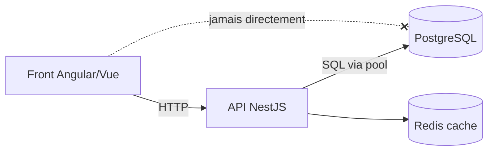

# Fondamentaux des Bases de Données

> [!abstract] Introduction
> Une base de données stocke durablement les données d'une application et permet de les interroger de façon fiable et concurrente ; on distingue bases relationnelles (SQL) et non relationnelles (NoSQL).

---

## Théorie

> [!question]- C'est quoi ?
> - **Relationnelles (SGBDR)** : PostgreSQL, MySQL/MariaDB, Oracle, SQL Server — tables, schéma strict, SQL, transactions ACID
> - **NoSQL** : documents (MongoDB), clé-valeur (Redis), colonnes (Cassandra), graphes (Neo4j)
> - **Autres** : moteurs de recherche (Elasticsearch/OpenSearch), séries temporelles, vectorielles (pgvector, pour l'IA)

> [!example]- Analogie
> Un SGBD relationnel est une bibliothèque avec un catalogue rigoureux (chaque livre a sa fiche normalisée) ; une base documents est une armoire de dossiers où chaque dossier peut avoir sa propre forme.

> [!question]- Pourquoi l'utiliser ?
> Les fichiers ne suffisent pas : accès concurrent, intégrité, recherche rapide, sauvegarde, sécurité.

> [!question]- Comment ça marche ?
> Architecture typique : l'API se connecte au SGBD (via un pool de connexions) ; le front ne parle JAMAIS directement à la base.

> [!question]- Quand l'utiliser ?
> PostgreSQL par défaut pour une application métier (robuste, standard, riche : JSONB, plein texte, extensions).

> [!danger]- Quand NE PAS l'utiliser / Limites
> Choisir NoSQL « pour la scalabilité » sans besoin réel fait perdre les garanties relationnelles.

### Schéma



---

## Vocabulaire

| Terme | Définition en une ligne |
|-------|--------------------------|
| SGBD | Système de gestion de base de données |
| Schéma | Structure des tables |
| Pool | Connexions réutilisées |
| Réplication | Copie de la base sur plusieurs serveurs |
| Sauvegarde | Copie restaurable des données |

---

## Points clés

- PostgreSQL par défaut
- Le front ne touche jamais la BDD
- Sauvegardes testées (une sauvegarde non restaurée n'existe pas)
- Relationnel pour les données structurées et liées

---

## Pièges courants

> [!bug]- Erreurs fréquentes
> - Exposer le port de la BDD sur Internet
> - Utiliser le compte superuser pour l'application

---

## Exemple minimal

```bash
docker run -d --name pg -e POSTGRES_USER=cine -e POSTGRES_PASSWORD=secret \
  -e POSTGRES_DB=cinetrack -p 5432:5432 -v pgdata:/var/lib/postgresql/data postgres:17
docker exec -it pg psql -U cine -d cinetrack
```

> [!note] Ce que j'en retiens
> Une vraie base PostgreSQL persistante en une commande.

---

## Pour aller plus loin (niveau senior)

> [!tip]- Ce qui distingue un dev expérimenté
> - Réplication, haute disponibilité, sauvegardes PITR

---

## Connexions

**Arbre théorique :**
- Sujet parent → [[Bases de Données]]
- Sous-sujets → [[SQL-01-Fondamentaux-SELECT|Fondamentaux SQL SELECT]], [[BDD-02-Modelisation-Normalisation|Modélisation Relationnelle et Normalisation]], [[BDD-06-NoSQL-MongoDB|NoSQL et MongoDB]]
- À comparer avec → (—)

**Pratique :**
- Extrait de code → [[04_Snippets/bdd-01-fondamentaux-sgbd]]
- Projet → [[02_Projects/CinéTrack-API]]

---

## Auto-vérification

> [!check]- Est-ce que je maîtrise vraiment ?
> - Pourquoi le front ne doit-il jamais se connecter directement à la BDD ?

---

## Tâches

- [ ] #task Lancer PostgreSQL en Docker et s'y connecter avec psql et un client graphique (DBeaver, IntelliJ Database)
- [ ] #task Mettre à jour `status` une fois maîtrisé

---

## Notes brutes

- ?
