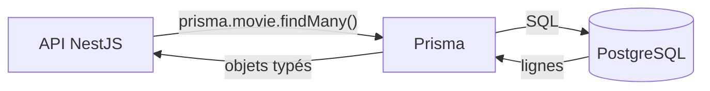

# Fondamentaux des SGBD

> [!abstract] En bref
> Un **SGBD** (Système de Gestion de Base de Données) est le logiciel qui stocke tes données de façon **fiable** : PostgreSQL, MySQL, MongoDB, Redis… Il garantit que rien ne se perd, que plusieurs utilisateurs peuvent écrire en même temps sans tout casser, et qu'on retrouve vite ce qu'on cherche. Pour tes projets : **PostgreSQL**.

## Pourquoi pas un simple fichier JSON ?

| Besoin | Fichier JSON | SGBD |
|---|---|---|
| 2 utilisateurs écrivent en même temps | l'un écrase l'autre | géré |
| le serveur plante pendant une écriture | fichier corrompu | rien n'est perdu |
| chercher parmi 1 million de lignes | tout relire | quelques millisecondes (index) |
| empêcher une note de 15 | à coder partout | une contrainte |
| qui a le droit de lire quoi | à coder | géré |

## Les grandes familles

| Famille | Exemples | Principe | Pour |
|---|---|---|---|
| **Relationnelle (SQL)** | **PostgreSQL**, MySQL, SQL Server, Oracle | tables liées entre elles, schéma strict | la plupart des applications |
| Document | MongoDB | documents JSON, schéma souple | données très variables |
| Clé-valeur | **Redis** | une clé → une valeur, en mémoire | cache, sessions, compteurs |
| Recherche | Elasticsearch, Meilisearch | index plein texte | moteur de recherche |
| Vectorielle | pgvector, Qdrant | recherche par sens (IA) | RAG, recommandations |

Voir [[BDD-06-NoSQL-MongoDB|NoSQL]] et [[BDD-07-Redis-Cle-Valeur|Redis]].

## Pourquoi PostgreSQL

- Gratuit, open source, très fiable.
- Le plus complet des SGBD libres : JSON (`JSONB`), recherche plein texte, et même les vecteurs pour l'IA (extension `pgvector`).
- Très demandé en entreprise.
- Parfaitement supporté par Prisma.

Pratique au quotidien : [[BDD-09-PostgreSQL-Pratique|PostgreSQL en pratique]].

## Le vocabulaire

| Mot | Sens |
|---|---|
| Base de données | l'ensemble des tables d'une application |
| Table | un type de donnée (users, movies) |
| Ligne / enregistrement | un élément (un film) |
| Colonne / champ | une information (le titre) |
| Clé primaire | identifiant unique d'une ligne |
| Clé étrangère | colonne qui pointe vers une autre table |
| Index | « sommaire » pour chercher vite |
| Requête | une question posée en SQL |
| Transaction | un groupe d'opérations tout-ou-rien |

## Comment ton application parle à la base

Le front **ne parle jamais directement** à la base : il passe toujours par l'API, qui vérifie les droits.

## Pièges

- **Choisir MongoDB « parce que c'est du JSON comme en JavaScript »** : pour des données liées (utilisateurs, films, critiques), le relationnel est plus simple et plus sûr.
- **Exposer la base sur Internet** (port 5432 ouvert) : seul le serveur de l'API doit pouvoir s'y connecter.
