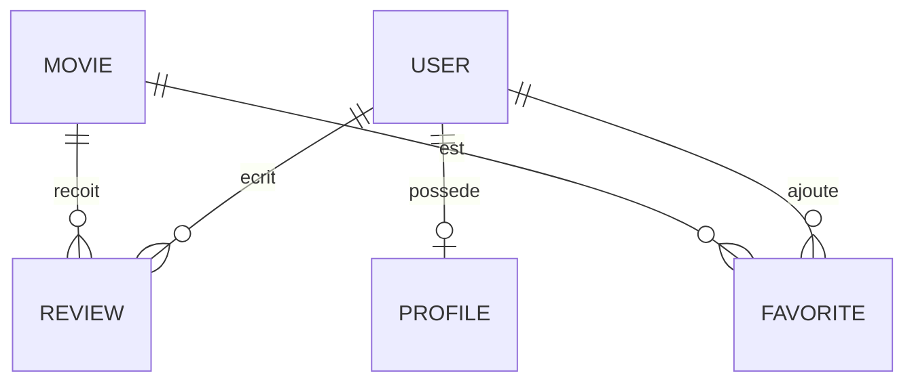

# Modélisation et Normalisation

> [!abstract] En bref
> **Modéliser**, c'est décider **quelles tables** créer et **comment les relier**, avant d'écrire la moindre ligne de code. La **normalisation** est un ensemble de règles pour éviter de stocker la même information à plusieurs endroits (source d'incohérences). Un bon modèle rend tout le reste facile.

## La méthode en 4 étapes

1. **Lister les « choses »** du métier (les noms) : utilisateur, film, critique, favori. → des tables.
2. **Lister leurs informations** : un film a un titre, une année. → des colonnes.
3. **Trouver les liens** : un utilisateur écrit des critiques. → des relations.
4. **Préciser les cardinalités** : combien de l'un pour combien de l'autre ?

## Les 3 types de relations

| Relation | Exemple | Comment on la construit |
|---|---|---|
| **1 – N** (un à plusieurs) | un utilisateur → plusieurs critiques | une clé étrangère `user_id` dans `reviews` |
| **N – N** (plusieurs à plusieurs) | des utilisateurs ↔ des films favoris | une **table de liaison** `favorites (user_id, movie_id)` |
| **1 – 1** | un utilisateur → un profil | une clé étrangère **unique** |



Lecture : `||--o{` = « un … vers zéro ou plusieurs ».

## La normalisation : une information à un seul endroit

```text
❌ Table reviews
| id | user_email       | movie_title | movie_year | rating |
| 1  | awa@mail.fr      | Dune        | 2021       | 9      |
| 2  | awa@mail.fr      | Heat        | 1995       | 8      |
| 3  | moussa@mail.fr   | Dune        | 2012 😱    | 7      |
```

Problèmes : si Awa change d'e-mail, il faut modifier plusieurs lignes ; l'année de Dune est incohérente.

```text
✅ Chaque chose dans sa table, reliée par des identifiants
users   (id, email)
movies  (id, title, year)
reviews (id, user_id → users, movie_id → movies, rating)
```

Les règles de base, en clair :
1. **Une valeur par case** : pas de liste `"SF, Thriller"` dans une colonne → une table `movie_genres`.
2. **Chaque colonne dépend de la clé de sa table** : le titre du film dépend du film, pas de la critique.
3. **Pas d'information qui se déduit d'une autre colonne** : l'âge se calcule à partir de la date de naissance.

## Dénormaliser, parfois

Recopier volontairement une info pour aller plus vite : par exemple garder `review_count` dans `movies` pour ne pas recompter à chaque affichage. Acceptable si on **sait** le maintenir à jour (transaction). À faire seulement quand un besoin de performance est mesuré.

## Dans tes projets

Tu dessines le modèle (sur papier ou Mermaid) **avant** d'écrire le `schema.prisma`. Voir [[CONC-07-Modelisation-Donnees-MCD-MLD|MCD / MLD]] et [[ORM-01-Prisma-Schema-Migrations|Schéma Prisma]].

## Pièges

- **Une table « fourre-tout »** avec 40 colonnes dont la moitié vides.
- **Des listes dans une colonne texte** (`"12,45,78"`) : impossible à filtrer ou relier proprement.
- **Oublier les contraintes d'unicité** métier : deux critiques du même utilisateur sur le même film.
