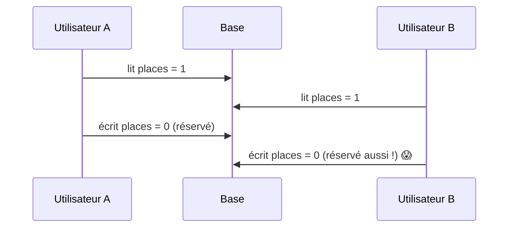

# Transactions et ACID

> [!abstract] En bref
> Une **transaction** regroupe plusieurs opérations en **tout ou rien** : soit elles réussissent toutes, soit aucune n'est appliquée. L'exemple classique : un virement bancaire (débiter un compte ET créditer l'autre). Sans transaction, un plantage au milieu laisse les données incohérentes.

## L'exemple

Publier une critique et mettre à jour le compteur du film :

```sql
BEGIN;
INSERT INTO reviews (user_id, movie_id, rating, comment) VALUES (42, 27205, 9, '…');
UPDATE movies SET review_count = review_count + 1 WHERE id = 27205;
COMMIT;      -- tout est validé d'un coup
-- en cas d'erreur : ROLLBACK;  tout est annulé
```

En Prisma :

```ts
await prisma.$transaction(async (tx) => {
  await tx.review.create({ data: { userId, movieId, rating, comment } });
  await tx.movie.update({ where: { id: movieId }, data: { reviewCount: { increment: 1 } } });
});   // si une erreur est lancée dans la fonction, tout est annulé
```

## Les 4 garanties : ACID

| Lettre | Garantie | En clair |
|---|---|---|
| **A**tomicité | tout ou rien | pas de critique sans compteur mis à jour |
| **C**ohérence | les règles restent vraies | les contraintes (clés, `CHECK`) sont respectées à la fin |
| **I**solation | les transactions ne se gênent pas | deux utilisateurs en même temps ne voient pas le travail à moitié fait de l'autre |
| **D**urabilité | ce qui est validé reste | même si le serveur plante juste après le `COMMIT` |

## Le problème des écritures simultanées

Deux personnes réservent la **dernière place** au même moment :



Solutions :
- **Faire le calcul dans la base** en une seule instruction : `UPDATE … SET places = places - 1 WHERE id = 5 AND places > 0` (et vérifier qu'une ligne a été modifiée).
- **Verrouiller la ligne** : `SELECT … FOR UPDATE` dans la transaction.
- **Une contrainte** qui rend l'état impossible (`CHECK (places >= 0)`, `UNIQUE`).

## Quand utiliser une transaction

Dès que **plusieurs écritures** doivent rester cohérentes entre elles : créer une commande et ses lignes, déplacer de l'argent, publier une critique et mettre à jour une statistique.

## Pièges

- **Une transaction longue** (appeler une API externe ou envoyer un e-mail au milieu) : elle bloque des lignes pendant tout ce temps. Garde-la courte, fais les appels externes avant ou après.
- **Lire puis écrire en deux étapes** sans protection : le problème de la dernière place.
