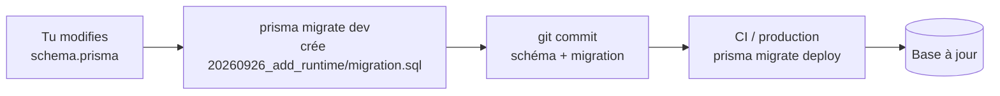

# Migrations

> [!abstract] En bref
> Une **migration** est un fichier qui décrit **une modification de la structure** de la base (ajouter une table, une colonne, un index). Les migrations sont versionnées avec le code : chaque développeur, la CI et la production appliquent **les mêmes changements, dans le même ordre**. C'est Git, mais pour ta base de données.

## Le problème sans migrations

Tu ajoutes une colonne `runtime` à la main dans ta base locale. Ton code marche. Tu pousses. Chez ton collègue et en production, la colonne n'existe pas → tout plante.

## Le principe



```text
prisma/migrations/
├── 20260901120000_init/migration.sql
├── 20260915093000_add_reviews/migration.sql
└── 20260926101500_add_movie_runtime/migration.sql
```

La base garde une table interne qui note **quelles migrations ont déjà été appliquées**. `migrate deploy` applique seulement les nouvelles.

## Les commandes Prisma

| Commande | Où | Effet |
|---|---|---|
| `prisma migrate dev --name xxx` | ta machine | crée la migration et l'applique |
| `prisma migrate deploy` | CI / production | applique les migrations en attente |
| `prisma migrate reset` | ta machine | efface la base et rejoue tout (+ seed) |
| `prisma migrate status` | partout | liste ce qui est appliqué ou non |

## Les règles d'or

1. **Une migration appliquée ne se modifie jamais.** Pour corriger, crée une nouvelle migration.
2. **Relis le SQL généré** avant de commiter : Prisma peut proposer de supprimer une colonne (et ses données) quand tu la renommes.
3. **Commite le schéma ET la migration** ensemble.
4. **Les migrations tournent dans la CI**, jamais à la main en production.

## Modifier sans casser (production avec des données)

Renommer `title` en `name` en une seule migration supprime les données. La méthode sûre, en plusieurs déploiements :

1. ajouter la nouvelle colonne `name` ;
2. copier les données (`UPDATE movies SET name = title`) ;
3. faire lire et écrire le code dans `name` ;
4. plus tard, supprimer `title`.

Pareil pour une colonne obligatoire : l'ajouter d'abord optionnelle (ou avec une valeur par défaut), la remplir, puis la rendre obligatoire.

## Le seed : les données de départ

```ts
// prisma/seed.ts
await prisma.user.upsert({
  where: { email: 'admin@cinetrack.fr' },
  create: { email: 'admin@cinetrack.fr', passwordHash: await argon2.hash('…'), role: 'ADMIN' },
  update: {},
});
```

Utile pour les tests et pour démarrer une base de développement avec des données réalistes.

## Pièges

- **`migrate dev` ou `migrate reset` en production** : risque d'effacer les données.
- **Des migrations en conflit** entre deux branches : après le merge, régénère une migration propre en local.
