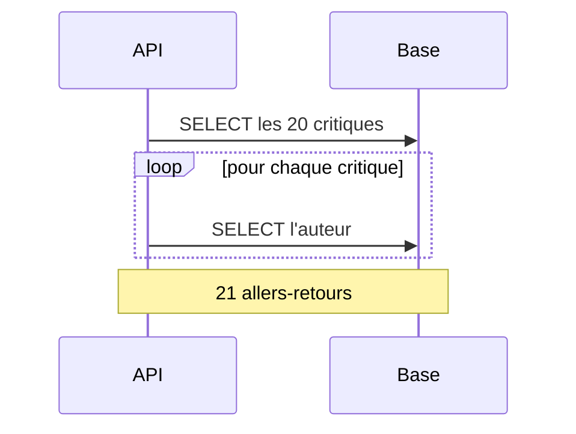

# ORM Concepts et Problème N+1

> [!abstract] En bref
> Un **ORM** (Prisma, TypeORM) traduit tes objets TypeScript en SQL. C'est pratique, mais il cache ce qui est réellement exécuté. Le piège le plus courant : le **problème N+1**, où l'affichage d'une liste déclenche une requête par élément. 20 critiques = 21 requêtes au lieu d'une ou deux.

## Ce que fait un ORM

```ts
await prisma.review.findMany({ where: { movieId: 42 } });
```

devient :

```sql
SELECT * FROM "Review" WHERE "movieId" = 42;
```

| Avantages | Inconvénients |
|---|---|
| typage, autocomplétion | on ne voit plus le SQL |
| protection contre l'injection SQL | des requêtes inefficaces passent inaperçues |
| migrations | le SQL avancé est moins naturel |

## Le problème N+1

Afficher 20 critiques avec le nom de leur auteur :

```ts
// ❌ 1 requête pour les critiques + 20 requêtes pour les auteurs = 21
const reviews = await prisma.review.findMany({ where: { movieId: 42 } });
for (const r of reviews) {
  r.author = await prisma.user.findUnique({ where: { id: r.userId } });
}
```



Avec 20 lignes, ça passe inaperçu. Avec 1 000 lignes et plusieurs utilisateurs, la page met des secondes.

## La solution : charger les relations en une fois

```ts
// ✅ 1 ou 2 requêtes au total
const reviews = await prisma.review.findMany({
  where: { movieId: 42 },
  include: { user: { select: { id: true, email: true } } },
});
```

Ou, si tu as déjà une liste d'identifiants :

```ts
const users = await prisma.user.findMany({ where: { id: { in: userIds } } });   // une seule requête
```

## Voir le SQL exécuté

```ts
const prisma = new PrismaClient({ log: ['query'] });   // affiche chaque requête dans la console
```

**Le réflexe :** si tu vois défiler la même requête en boucle dans les logs, c'est un N+1.

## Les autres pièges des ORM

| Piège | Solution |
|---|---|
| ramener toutes les colonnes | `select` les champs utiles |
| ramener toute la table | paginer (`take` / `skip`) |
| trop de `include` imbriqués | charger seulement ce que l'écran affiche |
| requête complexe illisible avec l'ORM | écrire le SQL (`$queryRaw`) |

## Pièges

- **Un `await` dans une boucle** qui interroge la base : presque toujours un N+1.
- **Croire que l'ORM optimise tout seul** : il fait exactement ce que tu lui demandes.
