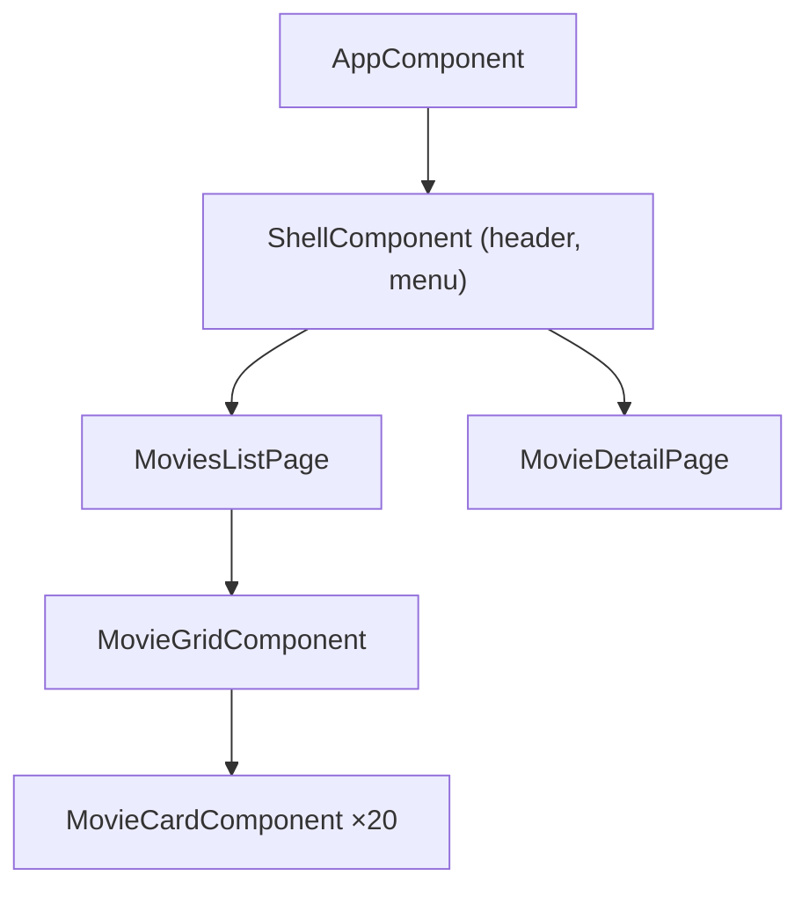

# Composants Angular

> [!abstract] En bref
> Un composant est un morceau d'écran réutilisable : une carte de film, un en-tête, une page. En Angular, c'est une **classe TypeScript** avec le décorateur `@Component`, qui contient son template (HTML) et ses styles. Une page = un assemblage de composants.

## Anatomie

```ts
// movie-card.component.ts
import { Component, ChangeDetectionStrategy, input } from '@angular/core';
import type { Movie } from '../data/movie.model';

@Component({
  selector: 'app-movie-card',                         // <app-movie-card />
  changeDetection: ChangeDetectionStrategy.OnPush,    // à mettre partout (voir plus bas)
  templateUrl: './movie-card.component.html',         // ou template: `…` si court
  styleUrl: './movie-card.component.scss',
})
export class MovieCardComponent {
  movie = input.required<Movie>();                    // donnée reçue du parent
}
```

```html
<!-- movie-card.component.html -->
<article class="card">
  
  <h3>{{ movie().title }}</h3>
  <p>{{ movie().year }}</p>
</article>
```

## Utiliser un composant dans un autre

Il faut l'**importer** dans le composant qui l'utilise :

```ts
@Component({
  selector: 'app-movie-grid',
  imports: [MovieCardComponent],                      // ← sinon : balise inconnue
  template: `
    @for (m of movies(); track m.id) {
      <app-movie-card [movie]="m" />
    }
  `,
})
export class MovieGridComponent {
  movies = input.required<Movie[]>();
}
```

Depuis Angular 17, les composants sont **standalone** : chacun déclare lui-même ce qu'il importe. Tu croiseras l'ancienne méthode (NgModules) dans du code existant : [[ANG-13-Modules-NgModules|NgModules]].

## Découper CinéTrack



| Type | Rôle | Injecte des services ? |
|---|---|---|
| **Page** (`movies-list.page.ts`) | récupère les données, assemble | oui |
| **Composant d'affichage** (`movie-card.component.ts`) | affiche ce qu'on lui donne | **non** |

## `OnPush` : à mettre partout

`changeDetection: ChangeDetectionStrategy.OnPush` dit à Angular : « ne revérifie ce composant que si ses entrées ou ses signals changent ». C'est plus rapide et ça t'oblige à bien faire circuler les données. Voir [[ANG-11-Detection-de-changement|Détection de changement]].

## Conventions

| Quoi | Convention |
|---|---|
| Fichier | `movie-card.component.ts` (kebab-case) |
| Classe | `MovieCardComponent` |
| Sélecteur | `app-movie-card` (préfixe `app-`) |
| Génération | `ng g c features/movies/components/movie-card` |

## Pièges

- **Oublier l'import** dans `imports: […]` : erreur « is not a known element ».
- **Un composant de 400 lignes** : découpe.
- **Appeler une API depuis un composant d'affichage** : passe par un service et une page.
