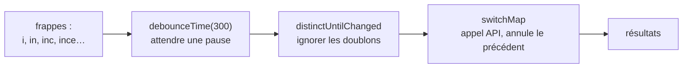

# Programmation Réactive (RxJS) Angular

> [!abstract] En bref
> **RxJS** manipule des **flux** : des valeurs qui arrivent les unes après les autres dans le temps (les lettres tapées dans une recherche, les réponses d'une API). On les transforme avec des **opérateurs**, comme on transforme un tableau avec `map` et `filter`. Angular l'utilise pour `HttpClient`, le routeur et les formulaires.

## L'image : un tapis roulant

Une **Promise** est un colis livré **une fois**. Un **Observable** est un **tapis roulant** : des objets arrivent au fil du temps, et tu places des machines (opérateurs) le long du tapis pour les trier, les transformer, les ralentir.



## Le vocabulaire minimum

| Mot | Sens |
|---|---|
| **Observable** | le flux (le tapis roulant) |
| **subscribe** | se brancher au flux pour recevoir les valeurs |
| **opérateur** | une transformation, dans `.pipe(…)` |
| `$` à la fin du nom | convention : `search$` est un Observable |

**Rien ne se passe tant que personne ne s'abonne.** Un `http.get()` sans `subscribe` (ou sans `async` / `toSignal`) n'envoie aucune requête.

## Le cas de CinéTrack : la recherche

```ts
export class SearchPage {
  private api = inject(MoviesApi);
  search = new FormControl('', { nonNullable: true });

  results = toSignal(
    this.search.valueChanges.pipe(
      debounceTime(300),                  // attend 300 ms sans frappe
      map(t => t.trim()),
      distinctUntilChanged(),             // ignore si le texte n'a pas changé
      filter(t => t.length >= 2),         // au moins 2 lettres
      switchMap(t => this.api.search(t)), // annule la recherche précédente
    ),
    { initialValue: [] as Movie[] },
  );
}
```

```html
<input type="search" [formControl]="search" placeholder="Rechercher un film">
@for (m of results(); track m.id) { <app-movie-card [movie]="m" /> }
```

Sans `switchMap`, une réponse lente pour « inc » pourrait arriver **après** celle de « inception » et écraser le bon résultat.

## Les opérateurs à connaître d'abord

| Opérateur | Comme… | Rôle |
|---|---|---|
| `map` | `Array.map` | transformer chaque valeur |
| `filter` | `Array.filter` | laisser passer certaines valeurs |
| `debounceTime(ms)` | | attendre une pause |
| `distinctUntilChanged()` | | ignorer les répétitions |
| `switchMap` | | lancer un appel, **annuler le précédent** |
| `catchError` | `try/catch` | gérer une erreur |
| `tap` | | effet de bord (log), sans rien changer |

Les autres (`mergeMap`, `combineLatest`, `shareReplay`…) : [[ANG-24-RxJS-Avance|RxJS avancé]].

## Se désabonner

Un abonnement qui reste ouvert après la destruction du composant = fuite mémoire. Les solutions, de la plus simple :

1. **`toSignal(obs$)`** : se désabonne tout seul. **À privilégier.**
2. **`| async`** dans le template : pareil.
3. **`takeUntilDestroyed()`** si tu fais un `subscribe` manuel :
   ```ts
   this.store.events$.pipe(takeUntilDestroyed()).subscribe(e => …);
   ```

Les appels `HttpClient` se terminent seuls après la réponse : pas de fuite.

## Signals ou RxJS ?

| Besoin | Outil |
|---|---|
| un **état** (liste, compteur, utilisateur) | signal |
| un **flux d'événements dans le temps** (frappes, websocket, annulation) | RxJS |

On passe de l'un à l'autre avec `toSignal` et `toObservable` (voir [[ANG-23-Signals-Avances|Signals avancés]]).

## Pièges

- **`subscribe` dans un `subscribe`** : utilise `switchMap`.
- **Oublier de gérer l'erreur** : une erreur arrête définitivement le flux. Ajoute `catchError`.
- **Tout faire en RxJS** : pour un simple état, un signal est plus lisible.
