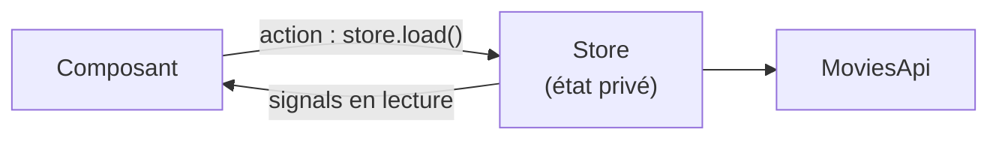

# State Management Angular

> [!abstract] En bref
> L'**état**, ce sont les données qui vivent dans l'application : les films chargés, les favoris, l'utilisateur connecté, les filtres. Le **state management**, c'est décider **où** ranger chaque donnée et **qui** a le droit de la modifier. En Angular moderne, un **service avec des signals** suffit pour la grande majorité des cas.

## Où ranger chaque donnée ?

| La donnée sert à… | Où la mettre | Exemple CinéTrack |
|---|---|---|
| un seul composant | un signal dans le composant | le menu mobile ouvert / fermé |
| un composant et ses enfants | le parent, transmis par inputs | le film affiché dans la fiche |
| plusieurs écrans | un **store** (service `providedIn: 'root'` + signals) | les favoris, l'utilisateur |
| être partagée par lien | l'**URL** | la page, le genre filtré (`?genre=action`) |
| rester après fermeture | `localStorage` (via le store) | les favoris d'un visiteur |

## Le store « maison » : service + signals

```ts
@Injectable({ providedIn: 'root' })
export class MoviesStore {
  private api = inject(MoviesApi);

  // état privé
  private readonly state = signal<LoadState<Movie[]>>({ status: 'idle' });

  // lecture publique
  readonly movies = computed(() => { const s = this.state(); return s.status === 'success' ? s.data : []; });
  readonly loading = computed(() => this.state().status === 'loading');
  readonly error = computed(() => { const s = this.state(); return s.status === 'error' ? s.message : null; });

  // actions
  load(page = 1) {
    this.state.set({ status: 'loading' });
    this.api.popular(page).subscribe({
      next: data => this.state.set({ status: 'success', data }),
      error: () => this.state.set({ status: 'error', message: 'Impossible de charger les films' }),
    });
  }
}
```

Les **trois règles** qui rendent un store fiable :
1. l'état est **privé** ;
2. les composants **lisent** via des signals en lecture seule ;
3. les composants **modifient** uniquement via des méthodes (actions).

Ainsi, quand un bug touche les films, tu sais qu'il vient de ces quelques méthodes. Le type `LoadState` est expliqué dans [[TS-18-Patterns-TypeScript-Pro|Patterns TypeScript]].



## Et NgRx ?

**NgRx** est une librairie de state management plus structurée, utilisée dans beaucoup d'entreprises. Le **Signal Store** de NgRx reprend exactement les idées ci-dessus avec moins de code à écrire. Voir [[ANG-25-NgRx-Signal-Store|NgRx et Signal Store]].

| | Service + signals | NgRx Signal Store | NgRx Store (Redux) |
|---|---|---|---|
| Code à écrire | peu | peu | beaucoup |
| Structure imposée | à toi de la fixer | oui | très forte |
| Pour | la plupart des apps, CinéTrack | équipes qui veulent un cadre commun | grosses apps existantes |

**Au travail, utilise ce que l'équipe utilise déjà.**

## Pièges

- **Tout mettre dans un store global** : un état local reste dans son composant.
- **Exposer un `signal` modifiable** publiquement : n'importe quel composant peut tout changer. Utilise `asReadonly()` ou `computed`.
- **Copier les données du store** dans des variables du composant : elles ne seront plus à jour. Lis directement les signals du store.
