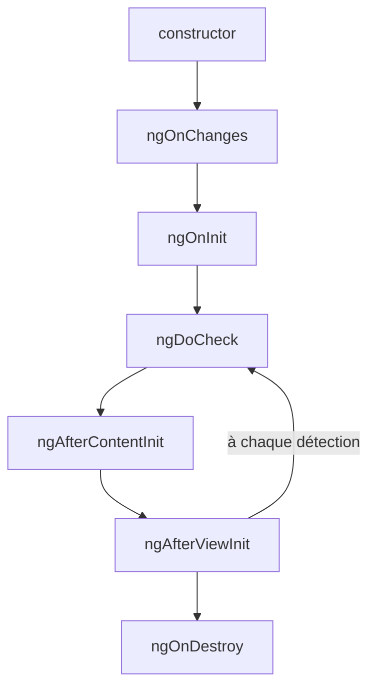

# Cycle de vie des composants Angular

> [!abstract] Introduction
> Un composant Angular naît, se met à jour et meurt ; des « hooks » (ngOnInit, ngOnDestroy…) permettent d'exécuter du code à chaque étape.

> [!warning]- Prérequis
> [[ANG-02-Composants|Composants Angular]]

---

## Théorie

> [!question]- C'est quoi ?
> Ordre principal :
> 1. `constructor` — création de la classe (injection uniquement)
> 2. `ngOnChanges` — un `@Input` a changé (avant `ngOnInit` puis à chaque changement)
> 3. `ngOnInit` — une fois, inputs disponibles → initialisation
> 4. `ngDoCheck` — à chaque détection de changement (rare)
> 5. `ngAfterContentInit` / `Checked` — contenu projeté prêt
> 6. `ngAfterViewInit` / `Checked` — vue et enfants (`viewChild`) prêts
> 7. `ngOnDestroy` — juste avant destruction → nettoyage
> API modernes : `DestroyRef`, `afterNextRender()`, `afterEveryRender()`.

> [!example]- Analogie
> La vie d'un employé : embauche (constructor), premier jour et installation du poste (ngOnInit), mises à jour de ses missions (ngOnChanges), départ et restitution du badge (ngOnDestroy).

> [!question]- Pourquoi l'utiliser ?
> Charger des données au bon moment, accéder au DOM seulement quand il existe, et surtout NETTOYER (abonnements, timers, listeners) pour éviter les fuites mémoire.

> [!question]- Comment ça marche ?
> ```typescript
> export class FilmDetailComponent implements OnInit {
>   private destroyRef = inject(DestroyRef);
>   ngOnInit() {
>     const id = setInterval(() => this.rafraichir(), 30_000);
>     this.destroyRef.onDestroy(() => clearInterval(id));   // nettoyage déclaré à côté
>   }
> }
> ```
> Avec les signals : un `input()` se lit directement, un `computed()` remplace souvent `ngOnChanges`, et `effect()` se nettoie tout seul.

> [!question]- Quand l'utiliser ?
> - `ngOnInit` : initialisation dépendante des inputs, chargement initial
> - `ngAfterViewInit` / `afterNextRender` : mesurer le DOM, initialiser une lib graphique
> - `ngOnDestroy` / `DestroyRef` : nettoyage

> [!danger]- Quand NE PAS l'utiliser / Limites
> Mettre de la logique lourde dans le `constructor` (inputs pas encore disponibles) ou modifier l'état dans `ngAfterViewInit` (erreur `ExpressionChangedAfterItHasBeenCheckedError` en dev).

### Schéma



---

## Vocabulaire

| Terme | Définition en une ligne |
|-------|--------------------------|
| Hook | Méthode appelée par le framework à une étape précise |
| `DestroyRef` | Service pour enregistrer du code de nettoyage |
| `afterNextRender` | Exécute du code après le prochain rendu (navigateur uniquement) |

---

## Points clés

- Constructor = injection, ngOnInit = initialisation
- Toujours nettoyer ce qu'on démarre
- `takeUntilDestroyed()` pour les Observables
- Préférer `computed()` à `ngOnChanges` avec les signal inputs

---

## Pièges courants

> [!bug]- Erreurs fréquentes
> - Lire un `@Input` dans le constructor → `undefined`
> - Oublier de désabonner un `interval` → fuite et appels fantômes
> - `ExpressionChangedAfterItHasBeenChecked` en modifiant l'état après la vérification

---

## Exemple minimal

```typescript
@Component({ selector: 'app-graphique', template: `<canvas #canvas></canvas>` })
export class GraphiqueComponent {
  canvas = viewChild.required<ElementRef<HTMLCanvasElement>>('canvas');
  constructor() {
    afterNextRender(() => dessiner(this.canvas().nativeElement));   // DOM disponible, pas en SSR
  }
}
```

> [!note] Ce que j'en retiens
> `afterNextRender` est le bon endroit pour toucher au DOM, et il n'est jamais exécuté côté serveur.

---

## Pour aller plus loin (niveau senior)

> [!tip]- Ce qui distingue un dev expérimenté
> - Expliquer `ExpressionChangedAfterItHasBeenCheckedError` et comment l'éviter
> - Remplacer les hooks par des primitives réactives (signals, `DestroyRef`)

---

## Connexions

**Arbre théorique :**
- Sujet parent → [[Angular]]
- Sous-sujets → (aucun pour l'instant)
- À comparer avec → [[VUE-11-Cycle-de-Vie|Cycle de Vie Vue.js]]

**Pratique :**
- Extrait de code → [[04_Snippets/ang-18-cycle-de-vie]]
- Projet → [[02_Projects/CinéTrack]]

---

## Auto-vérification

> [!check]- Est-ce que je maîtrise vraiment ?
> - Pourquoi un input est-il `undefined` dans le constructor ?

> [!faq]- Questions d'entretien
> - Quelle différence entre constructor et ngOnInit ?
> - Comment éviter les fuites mémoire dans un composant ?

---

## Tâches

- [ ] #task Logger chaque hook d'un composant et observer l'ordre
- [ ] #task Mettre à jour `status` une fois maîtrisé

---

## Notes brutes

- ?
