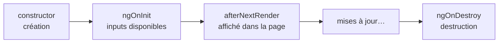

# Cycle de vie des composants Angular

> [!abstract] En bref
> Un composant est **créé**, **affiché**, **mis à jour**, puis **détruit**. Angular permet d'exécuter du code à ces moments-là avec des méthodes spéciales (*hooks*). Avec les signals, tu en as beaucoup moins besoin qu'avant : `ngOnInit`, `ngOnDestroy` et `afterNextRender` couvrent presque tout.

## Les moments utiles



| Moment | Hook | Usage |
|---|---|---|
| Création | `constructor` / propriétés | `inject()`, créer les signals et `computed` |
| Inputs disponibles | `ngOnInit` | lancer un chargement qui dépend d'un input |
| Affiché dans la page | `afterNextRender(() => …)` | donner le focus, mesurer, démarrer une librairie graphique |
| Destruction | `ngOnDestroy` ou `inject(DestroyRef).onDestroy(…)` | nettoyer minuteurs et écouteurs |

## Exemple

```ts
export class MovieDetailPage implements OnInit {
  id = input.required<number>();
  private store = inject(MovieDetailStore);

  constructor() {
    afterNextRender(() => document.querySelector<HTMLElement>('h1')?.focus());

    const timer = setInterval(() => this.store.refreshRating(), 60_000);
    inject(DestroyRef).onDestroy(() => clearInterval(timer));
  }

  ngOnInit() {
    this.store.load(this.id());   // les inputs ne sont pas encore là dans le constructeur
  }
}
```

## Ce que les signals remplacent

| Avant | Maintenant |
|---|---|
| `ngOnChanges` pour réagir au changement d'un input | `computed(() => … this.id() …)` ou `effect` |
| `ngOnInit` + `subscribe` + `ngOnDestroy` + `unsubscribe` | `toSignal(obs$)` ou `httpResource` (nettoyés automatiquement) |
| `ngAfterViewInit` pour accéder au DOM | `afterNextRender` + `viewChild()` |

## Pièges

- **Lire un input dans le constructeur** : il n'a pas encore de valeur. Utilise `ngOnInit`, ou mieux un `computed`.
- **Oublier de nettoyer** un `setInterval` ou un `addEventListener` sur `window` : il continue après la destruction.
- **Accéder au DOM dans `ngOnInit`** : il n'est pas encore affiché. Utilise `afterNextRender`.
