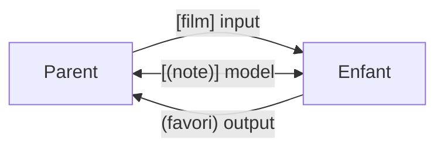

# Communication parent-enfant Angular

> [!abstract] Introduction
> Un parent transmet des données à un enfant par des inputs ; l'enfant prévient le parent par des outputs (événements) ; `model()` combine les deux pour un binding bidirectionnel.

> [!warning]- Prérequis
> [[ANG-02-Composants|Composants Angular]], [[ANG-03-Templates-Data-Binding|Templates & Data Binding Angular]]

---

## Théorie

> [!question]- C'est quoi ?
> API moderne (signals, Angular 17.1+ / stable 19) :
> ```typescript
> export class FilmCardComponent {
>   film = input.required<Film>();          // donnée entrante (signal en lecture seule)
>   compact = input(false);                  // avec valeur par défaut
>   favori = output<number>();              // événement sortant
>   note = model(0);                         // two-way : [(note)]
> }
> ```
> ```html
> <app-film-card [film]="f" [compact]="true" (favori)="ajouter($event)" [(note)]="maNote" />
> ```
> API historique (encore partout dans le code existant) : `@Input() film!: Film;` et `@Output() favori = new EventEmitter<number>();`.

> [!example]- Analogie
> Inputs = lettres que le parent glisse sous la porte ; outputs = sonnette que l'enfant actionne ; model = un carnet partagé que les deux peuvent modifier.

> [!question]- Pourquoi l'utiliser ?
> Des composants réutilisables et testables qui ne connaissent pas leur contexte : la carte de film ne sait pas qui l'utilise, elle reçoit un film et émet des événements.

> [!question]- Comment ça marche ?
> - Les inputs sont en **lecture seule** pour l'enfant (flux de données descendant)
> - `input()` renvoie un signal : `this.film().titre`, utilisable dans `computed()`
> - `transform` : `input(false, { transform: booleanAttribute })`
> - `alias` : `input(0, { alias: 'valeur' })`
> - Composants éloignés (frères, cousins) → service partagé (voir [[ANG-12-State-Management|State Management Angular]])

> [!question]- Quand l'utiliser ?
> Toujours entre un composant et ses enfants directs. Au-delà de 2 niveaux de « transit », passer par un service.

> [!danger]- Quand NE PAS l'utiliser / Limites
> Faire remonter/descendre des données à travers 4 niveaux (prop drilling) alourdit tout. Muter un objet reçu en input modifie aussi celui du parent (même référence) → à proscrire.

### Schéma



---

## Vocabulaire

| Terme | Définition en une ligne |
|-------|--------------------------|
| Input | Propriété alimentée par le parent |
| Output | Événement émis vers le parent |
| `model()` | Input + output combinés (two-way binding) |
| Prop drilling | Transmission à travers des niveaux intermédiaires inutiles |
| Composant de présentation | Composant « bête » piloté uniquement par inputs/outputs |

---

## Points clés

- Données descendent, événements remontent
- `input.required` quand la donnée est obligatoire
- Ne jamais muter un input
- Préférer `input()`/`output()` aux décorateurs sur du nouveau code

---

## Pièges courants

> [!bug]- Erreurs fréquentes
> - Modifier `this.film().titre = …` dans l'enfant
> - Oublier `$event` dans le template pour récupérer la valeur émise
> - Lire un `@Input` décorateur dans le constructor

---

## Exemple minimal

```typescript
@Component({
  selector: 'app-etoiles',
  template: `@for (i of [1,2,3,4,5]; track i) {
    <button type="button" (click)="note.set(i)" [attr.aria-label]="i + ' étoiles'">{{ i <= note() ? '★' : '☆' }}</button>
  }`
})
export class EtoilesComponent { note = model(0); }
// parent : <app-etoiles [(note)]="noteFilm" />
```

> [!note] Ce que j'en retiens
> `model()` rend un composant de saisie maison utilisable avec la syntaxe banane `[( )]`.

---

## Pour aller plus loin (niveau senior)

> [!tip]- Ce qui distingue un dev expérimenté
> - Concevoir des API de composants (inputs minimalistes, outputs explicites)
> - Migrer automatiquement avec les schematics `@angular/core:signal-input-migration`

---

## Connexions

**Arbre théorique :**
- Sujet parent → [[Angular]]
- Sous-sujets → (aucun pour l'instant)
- À comparer avec → [[VUE-05-Props-Emits|Props & Emits Vue.js (Communication Parent-Enfant)]]

**Pratique :**
- Extrait de code → [[04_Snippets/ang-19-communication-composants]]
- Projet → [[02_Projects/CinéTrack]]

---

## Auto-vérification

> [!check]- Est-ce que je maîtrise vraiment ?
> - Pourquoi l'enfant ne doit-il jamais modifier un input ?

> [!faq]- Questions d'entretien
> - Comment deux composants frères communiquent-ils ?

---

## Tâches

- [ ] #task Créer `FilmCard` (input film, output favori) et `Etoiles` (model)
- [ ] #task Mettre à jour `status` une fois maîtrisé

---

## Notes brutes

- ?
