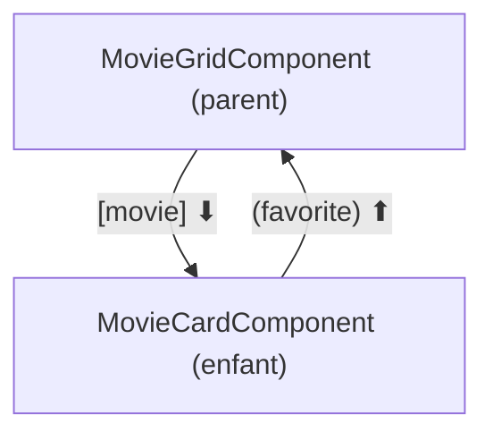

# Communication parent-enfant Angular

> [!abstract] En bref
> Un parent **donne des données** à un enfant avec `input()`. L'enfant **prévient** son parent avec `output()`. `model()` combine les deux pour une valeur modifiable par l'enfant. Les données descendent, les événements remontent : exactement comme les props et emits de Vue.

## Le schéma



## Côté enfant

```ts
@Component({
  selector: 'app-movie-card',
  changeDetection: ChangeDetectionStrategy.OnPush,
  template: `
    <article [class.highlighted]="highlighted()">
      <h3>{{ movie().title }}</h3>
      <button type="button" (click)="favorite.emit(movie().id)">♡</button>
    </article>
  `,
})
export class MovieCardComponent {
  movie = input.required<Movie>();        // obligatoire
  highlighted = input(false);             // optionnel, false par défaut
  favorite = output<number>();            // événement qui transporte un id
}
```

## Côté parent

```html
@for (m of movies(); track m.id) {
  <app-movie-card
    [movie]="m"
    [highlighted]="m.rating > 8"
    (favorite)="favorites.toggle($event)"
  />
}
```

- `[movie]="m"` → donne une **donnée**.
- `(favorite)="…"` → écoute l'**événement** ; `$event` contient la valeur émise (l'id).

## `model()` : une valeur modifiable par l'enfant

Pour un composant de filtre ou un champ personnalisé :

```ts
// genre-filter.component.ts
export class GenreFilterComponent {
  genre = model<string | null>(null);
}
```
```html
<!-- dans le filtre -->
<button type="button" (click)="genre.set('action')">Action</button>

<!-- dans le parent -->
<app-genre-filter [(genre)]="selectedGenre" />
```

`[(genre)]` : quand le parent change `selectedGenre`, le filtre se met à jour ; quand le filtre fait `genre.set(…)`, `selectedGenre` change aussi.

## Transformer un input

```ts
disabled = input(false, { transform: booleanAttribute });   // permet d'écrire <app-x disabled />
```

## Et quand ce n'est pas parent-enfant ?

| Situation | Solution |
|---|---|
| parent ↔ enfant direct | `input` / `output` |
| composants éloignés (en-tête et carte) | un **service** partagé (voir [[ANG-12-State-Management\|State management]]) |
| le parent veut appeler une méthode de l'enfant | `viewChild(MovieCardComponent)` (rare) |

## Anciennes écritures

Tu les verras dans du code existant : `@Input() movie!: Movie;` et `@Output() favorite = new EventEmitter<number>();`. Même principe, sans signals.

## Pièges

- **Modifier un input dans l'enfant** : impossible (lecture seule). Émets un événement, ou utilise `model()`.
- **Oublier les crochets** : `movie="m"` passe le texte « m ».
- **Faire passer une donnée sur 4 niveaux** : utilise un service.
