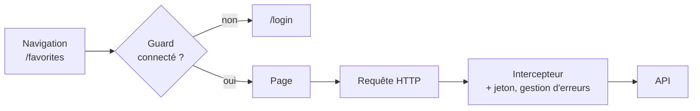

# Guards Resolvers et Intercepteurs Angular

> [!abstract] En bref
> Trois « gardiens » qui agissent **à un seul endroit** pour toute l'application. Un **guard** décide si on peut entrer sur une page (connecté ?). Un **resolver** charge des données avant d'afficher une page. Un **intercepteur** modifie toutes les requêtes HTTP (ajouter le jeton, gérer les erreurs).



## Guard : protéger une route

```ts
// core/auth/auth.guard.ts
export const authGuard: CanActivateFn = (route, state) => {
  const auth = inject(AuthStore);
  const router = inject(Router);
  return auth.isLoggedIn()
    ? true
    : router.createUrlTree(['/login'], { queryParams: { returnUrl: state.url } });   // redirection
};
```

```ts
// app.routes.ts
{ path: 'favorites', canActivate: [authGuard], loadComponent: () => import('./features/favorites/pages/favorites.page').then(m => m.FavoritesPage) }
```

| Guard | Question |
|---|---|
| `canActivate` | peut-on **entrer** sur cette page ? |
| `canMatch` | cette route doit-elle **même être chargée** ? (évite de télécharger le code) |
| `canDeactivate` | peut-on **quitter** ? (« modifications non enregistrées, quitter quand même ? ») |

> [!warning] Le guard n'est pas une sécurité
> Il améliore l'expérience, mais le code du front est modifiable par l'utilisateur. **La vraie protection est sur le serveur**, qui refuse la requête sans jeton valide.

## Intercepteur : agir sur toutes les requêtes

```ts
// core/http/auth.interceptor.ts
export const authInterceptor: HttpInterceptorFn = (req, next) => {
  const token = inject(AuthStore).token();
  return next(token ? req.clone({ setHeaders: { Authorization: `Bearer ${token}` } }) : req);
};

// core/http/error.interceptor.ts
export const errorInterceptor: HttpInterceptorFn = (req, next) => {
  const router = inject(Router);
  const toast = inject(MessageService);          // PrimeNG Toast
  return next(req).pipe(
    catchError((err: HttpErrorResponse) => {
      if (err.status === 401) router.navigate(['/login']);
      else if (err.status >= 500 || err.status === 0) toast.add({ severity: 'error', summary: 'Le serveur ne répond pas' });
      return throwError(() => err);              // on laisse aussi la page réagir
    }),
  );
};
```

```ts
// app.config.ts
provideHttpClient(withInterceptors([authInterceptor, errorInterceptor]))
```

Les intercepteurs s'exécutent **dans l'ordre** de la liste pour la requête. Usages courants : jeton, URL de base, langue, indicateur de chargement global, gestion des erreurs.

## Resolver : charger avant d'afficher

```ts
export const movieResolver: ResolveFn<Movie> = (route) =>
  inject(MoviesApi).details(Number(route.paramMap.get('id')));

{ path: 'movies/:id', resolve: { movie: movieResolver }, loadComponent: … }
// dans la page : movie = input.required<Movie>();
```

Le resolver **bloque** la navigation jusqu'à la réponse : l'utilisateur ne voit rien bouger. On préfère souvent afficher la page tout de suite avec un état de chargement (`httpResource`). Utilise un resolver seulement si la page n'a aucun sens sans ses données.

## Pièges

- **Compter sur le guard pour la sécurité** : non, c'est le serveur.
- **Un intercepteur qui modifie la requête d'origine** : elle est non modifiable, utilise `req.clone(…)`.
- **Avaler l'erreur dans l'intercepteur** (sans `throwError`) : la page croit que tout s'est bien passé.
