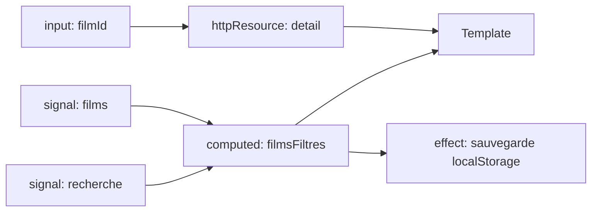

# Signals Avancés Angular

> [!abstract] Introduction
> Au-delà de `signal`/`computed`/`effect` : `linkedSignal`, `resource`/`httpResource`, l'interop RxJS (`toSignal`, `toObservable`), `untracked` — de quoi construire toute une application réactive sans Zone.js.

> [!warning]- Prérequis
> [[ANG-10-Signals|Signals Angular]], [[ANG-08-RxJS|Programmation Réactive RxJS Angular]]

---

## Théorie

> [!question]- C'est quoi ?
> ```typescript
> recherche = signal('');
> films = toSignal(this.filmService.tous$, { initialValue: [] });      // Observable → signal
> recherche$ = toObservable(this.recherche);                           // signal → Observable
> filmChoisi = linkedSignal(() => this.films()[0]);                   // dérivé MAIS modifiable
> filmId = input.required<number>();
> detail = httpResource<Film>(() => `/api/films/${this.filmId()}`);  // requête qui se relance si filmId change
> ```

> [!example]- Analogie
> `computed` est un thermomètre (lecture seule, suit la température) ; `linkedSignal` est un thermostat : il suit une valeur par défaut, mais on peut le régler à la main, et il se réinitialise quand la source change.

> [!question]- Pourquoi l'utiliser ?
> Gérer l'état asynchrone (chargement, erreur, valeur) de façon déclarative, supprimer les abonnements manuels, préparer le mode zoneless (par défaut sur les nouveaux projets récents).

> [!question]- Comment ça marche ?
> - `computed(fn)` : dérivé, mémoïsé, paresseux
> - `effect(fn)` : effets de bord (log, localStorage, lib externe) — pas pour propager de l'état
> - `untracked(fn)` : lire un signal sans créer de dépendance
> - `linkedSignal` : état local réinitialisé quand sa source change (sélection dans une liste)
> - `resource({ params, loader })` / `rxResource` / `httpResource` : état async avec `.value()`, `.isLoading()`, `.error()`, `.reload()` (API récentes : vérifier leur statut stable/expérimental selon ta version)
> - Égalité : un signal ne notifie pas si la nouvelle valeur est `===` à l'ancienne

> [!question]- Quand l'utiliser ?
> État local et dérivé : signals. Flux temporels complexes (debounce, websockets, annulation fine) : RxJS puis `toSignal` pour l'affichage.

> [!danger]- Quand NE PAS l'utiliser / Limites
> `effect()` qui écrit dans d'autres signals crée des cascades difficiles à suivre (préférer `computed`/`linkedSignal`). `toSignal` s'abonne immédiatement et doit être appelé dans un contexte d'injection.

### Schéma



---

## Vocabulaire

| Terme | Définition en une ligne |
|-------|--------------------------|
| `linkedSignal` | Signal modifiable dérivé d'une source |
| `resource` | Charge une donnée async à partir de signals |
| `toSignal` / `toObservable` | Ponts RxJS ↔ signals |
| `untracked` | Lecture sans dépendance |
| Graphe réactif | Réseau de dépendances entre signals |

---

## Points clés

- `computed` pour dériver, `effect` pour sortir du monde réactif
- Nouvelle référence obligatoire pour notifier (tableaux/objets)
- `toSignal` dans un contexte d'injection (champ de classe/constructor)
- Zoneless + OnPush + signals = rendu le plus efficace

---

## Pièges courants

> [!bug]- Erreurs fréquentes
> - `effect(() => this.b.set(this.a() * 2))` au lieu de `computed`
> - Muter un tableau dans un signal (`this.films().push(x)`) → aucune notification
> - Utiliser `toSignal` dans une méthode appelée plusieurs fois (abonnements multiples)

---

## Exemple minimal

```typescript
@Component({ /* ... */ changeDetection: ChangeDetectionStrategy.OnPush })
export class RechercheFilmsComponent {
  private http = inject(HttpClient);
  terme = signal('');
  private terme$ = toObservable(this.terme).pipe(debounceTime(300), distinctUntilChanged());
  resultats = toSignal(
    this.terme$.pipe(switchMap(t => t.length < 2 ? of([]) : this.http.get<Film[]>(`/api/films?q=${t}`))),
    { initialValue: [] as Film[] },
  );
  nombre = computed(() => this.resultats().length);
}
```

> [!note] Ce que j'en retiens
> RxJS gère le temps (debounce, annulation), les signals gèrent l'affichage : chacun son rôle.

---

## Pour aller plus loin (niveau senior)

> [!tip]- Ce qui distingue un dev expérimenté
> - Concevoir des services d'état signal-first (état privé `signal`, exposition `asReadonly`/`computed`)
> - Migrer un composant Zone.js vers zoneless et comprendre ce qui déclenche le rendu

---

## Connexions

**Arbre théorique :**
- Sujet parent → [[Angular]]
- Sous-sujets → (aucun pour l'instant)
- À comparer avec → [[VUE-02-Reactivite|Réactivité Vue.js]]

**Pratique :**
- Extrait de code → [[04_Snippets/ang-23-signals-avances]]
- Projet → [[02_Projects/CinéTrack]]

---

## Auto-vérification

> [!check]- Est-ce que je maîtrise vraiment ?
> - Quand utiliser `linkedSignal` plutôt que `computed` ?

> [!faq]- Questions d'entretien
> - Signals vs RxJS : quand utiliser l'un ou l'autre ?

---

## Tâches

- [ ] #task Réécrire la recherche de CinéTrack avec toObservable + switchMap + toSignal
- [ ] #task Mettre à jour `status` une fois maîtrisé

---

## Notes brutes

- ?
