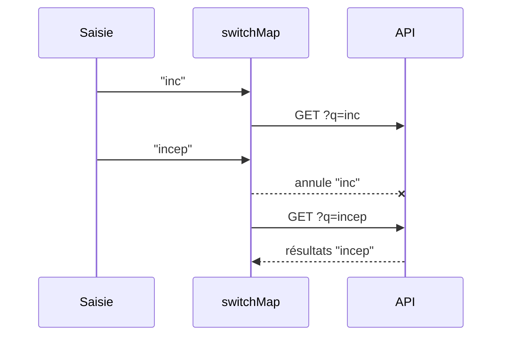

# RxJS Avancé

> [!abstract] Introduction
> Maîtriser les Subjects, les opérateurs d'aplatissement (switchMap, mergeMap, concatMap, exhaustMap), les combinaisons (combineLatest, forkJoin) et le partage (shareReplay) — ce qui distingue un dev Angular confirmé.

> [!warning]- Prérequis
> [[ANG-08-RxJS|Programmation Réactive RxJS Angular]]

---

## Théorie

> [!question]- C'est quoi ?
> **Subjects** (Observables sur lesquels on peut pousser des valeurs) :
> - `Subject` : pas de valeur initiale, pas de mémoire
> - `BehaviorSubject(init)` : garde la dernière valeur, la donne aux nouveaux abonnés
> - `ReplaySubject(n)` : rejoue les n dernières valeurs
> **Opérateurs d'aplatissement** (un Observable qui déclenche d'autres Observables) :
> | Opérateur | Nouvelle valeur pendant qu'une requête tourne… | Cas d'usage |
> |---|---|---|
> | `switchMap` | annule l'ancienne | recherche, autocomplétion |
> | `mergeMap` | les fait en parallèle | téléchargements indépendants |
> | `concatMap` | met en file, une à la fois | sauvegardes ordonnées |
> | `exhaustMap` | ignore la nouvelle | bouton « payer », login |

> [!example]- Analogie
> switchMap : changer de chaîne TV (l'ancienne s'arrête). mergeMap : plusieurs écrans allumés. concatMap : une playlist, chanson après chanson. exhaustMap : un ascenseur qui ignore les appels pendant qu'il est en mouvement.

> [!question]- Pourquoi l'utiliser ?
> Choisir le mauvais opérateur crée des bugs subtils : résultats de recherche dans le désordre, double paiement, sauvegardes perdues.

> [!question]- Comment ça marche ?
> Combinaisons :
> - `combineLatest([a$, b$])` : émet à chaque changement de l'un, avec la dernière valeur de chacun (filtres combinés)
> - `forkJoin([a$, b$])` : attend que TOUS se terminent, émet une fois (≈ Promise.all)
> - `withLatestFrom`, `merge`, `zip`
> Partage : `shareReplay({ bufferSize: 1, refCount: true })` évite de refaire la requête HTTP pour chaque abonné.
> Nettoyage : `takeUntilDestroyed()`, `async` pipe, `toSignal`.
> Erreurs : `catchError` DANS le `switchMap` pour ne pas tuer le flux principal, `retry({ count: 3, delay: 1000 })`.

> [!question]- Quand l'utiliser ?
> Flux utilisateur (saisie, clics), websockets, polling, orchestration de requêtes dépendantes.

> [!danger]- Quand NE PAS l'utiliser / Limites
> RxJS a une courbe d'apprentissage raide : pour un simple état synchrone, un signal est plus lisible. Les « chaînes de 15 opérateurs » sont illisibles → découper et nommer.

### Schéma



---

## Vocabulaire

| Terme | Définition en une ligne |
|-------|--------------------------|
| Subject | Observable + émetteur manuel |
| Higher-order Observable | Observable qui émet des Observables |
| Cold / Hot | Démarre à l'abonnement / émet indépendamment des abonnés |
| Multicast | Partager une exécution entre plusieurs abonnés |

---

## Points clés

- switchMap = annule, mergeMap = parallèle, concatMap = file, exhaustMap = ignore
- `combineLatest` pour des filtres, `forkJoin` pour des requêtes parallèles finies
- `shareReplay` pour mettre en cache un appel partagé
- `catchError` dans l'opérateur interne
- Exposer `asObservable()`, jamais le Subject

---

## Pièges courants

> [!bug]- Erreurs fréquentes
> - `subscribe` imbriqués dans un `subscribe`
> - `forkJoin` avec un Observable qui ne se termine jamais (ex. `valueChanges`) → n'émet jamais
> - `shareReplay(1)` sans `refCount` sur un flux infini → fuite
> - `catchError` au mauvais niveau → le flux s'arrête définitivement après la 1re erreur

---

## Exemple minimal

```typescript
private rafraichir$ = new Subject<void>();
films$ = combineLatest([
  this.filtres.genre$,
  this.filtres.tri$,
  this.rafraichir$.pipe(startWith(undefined)),
]).pipe(
  debounceTime(0),
  switchMap(([genre, tri]) =>
    this.api.films({ genre, tri }).pipe(catchError(() => of([] as Film[])))
  ),
  shareReplay({ bufferSize: 1, refCount: true }),
);
rafraichir() { this.rafraichir$.next(); }
```

> [!note] Ce que j'en retiens
> Un seul flux déclaratif : filtres + rafraîchissement manuel → requête annulable, erreurs contenues, résultat partagé.

---

## Pour aller plus loin (niveau senior)

> [!tip]- Ce qui distingue un dev expérimenté
> - Écrire des tests marble (`TestScheduler`)
> - Créer ses propres opérateurs
> - Diagnostiquer une fuite d'abonnement

---

## Connexions

**Arbre théorique :**
- Sujet parent → [[Angular]]
- Sous-sujets → (aucun pour l'instant)
- À comparer avec → [[JS-07-Promises-Async-Await|Promises et Async Await JavaScript]]

**Pratique :**
- Extrait de code → [[04_Snippets/ang-24-rxjs-avance]]
- Projet → [[02_Projects/CinéTrack]]

---

## Auto-vérification

> [!check]- Est-ce que je maîtrise vraiment ?
> - Quel opérateur pour un bouton « Payer » cliqué deux fois ?

> [!faq]- Questions d'entretien
> - Différence entre switchMap, mergeMap, concatMap et exhaustMap ?
> - Différence entre Subject et BehaviorSubject ?

---

## Tâches

- [ ] #task Implémenter une autocomplétion avec debounceTime + distinctUntilChanged + switchMap + catchError
- [ ] #task Jouer avec rxmarbles.com
- [ ] #task Mettre à jour `status` une fois maîtrisé

---

## Notes brutes

- ?
