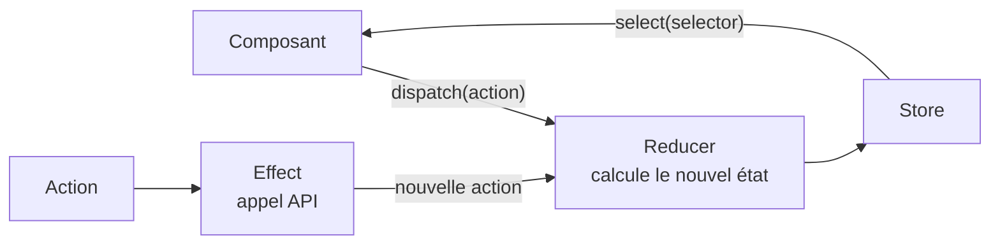

# NgRx et Signal Store

> [!abstract] En bref
> **NgRx** est la librairie de state management la plus répandue en Angular. Deux versions : le **Store classique** (inspiré de Redux, beaucoup de fichiers : actions, reducers, effects, selectors) et le **Signal Store**, plus récent et bien plus léger. Si ton entreprise l'utilise, c'est ici. Sinon, un service avec des signals ([[ANG-12-State-Management|State management]]) suffit.

## Le Signal Store

C'est le store « maison » de la note précédente, avec une structure standard :

```ts
import { signalStore, withState, withComputed, withMethods, patchState } from '@ngrx/signals';

type FavoritesState = { ids: number[]; filter: string };

export const FavoritesStore = signalStore(
  { providedIn: 'root' },

  withState<FavoritesState>({ ids: [], filter: '' }),        // l'état

  withComputed(({ ids }) => ({                               // les valeurs calculées
    count: computed(() => ids().length),
  })),

  withMethods((store) => ({                                  // les actions
    toggle(id: number) {
      patchState(store, ({ ids }) => ({
        ids: ids.includes(id) ? ids.filter(x => x !== id) : [...ids, id],
      }));
    },
  })),
);
```

```ts
// dans un composant
protected favorites = inject(FavoritesStore);
```
```html
<span>♥ {{ favorites.count() }}</span>
<button type="button" (click)="favorites.toggle(movie().id)">♡</button>
```

| Bloc | Rôle |
|---|---|
| `withState` | les données de départ ; chaque champ devient un signal |
| `withComputed` | les valeurs calculées |
| `withMethods` | les actions (seul endroit où on modifie) |
| `patchState` | modifier une partie de l'état |
| `withHooks` | code au démarrage (charger des données) |

Extensions utiles : `withEntities` (listes avec ajout / suppression par id), `rxMethod` (actions basées sur RxJS, comme une recherche avec délai).

## Le Store classique (Redux)

Tu le croiseras dans des applications plus anciennes :



- **Action** : un événement (« films chargés »).
- **Reducer** : une fonction pure qui calcule le nouvel état.
- **Selector** : lit une partie de l'état.
- **Effect** : fait les appels API et renvoie une action.

Plus de code, mais tout est tracé : l'extension **Redux DevTools** montre chaque action et chaque état, pratique sur une grosse application.

## Lequel choisir ?

| Situation | Choix |
|---|---|
| CinéTrack, la plupart des apps | service + signals |
| une équipe qui veut une structure commune | **NgRx Signal Store** |
| une grosse application existante en NgRx | **Store classique** (suis l'existant) |

## Pièges

- **Ajouter NgRx « parce que c'est pro »** sur une petite app : beaucoup de code pour rien.
- **Modifier l'état hors des méthodes** du store : on perd l'intérêt d'un point de passage unique.
