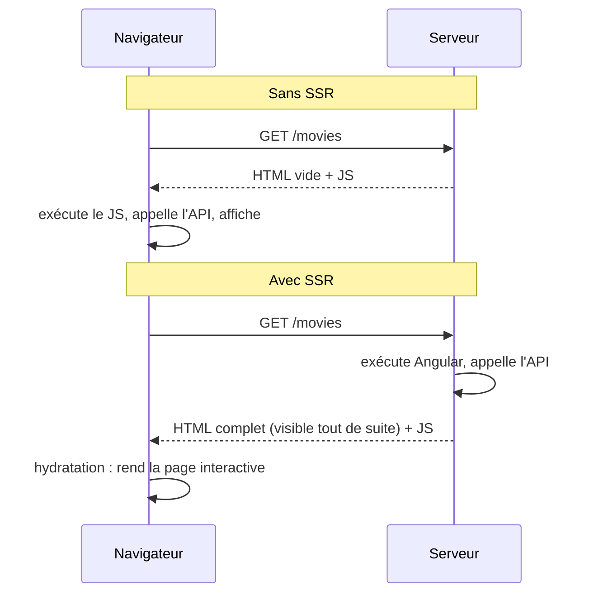

# SSR et Hydratation Angular

> [!abstract] En bref
> Par défaut, le serveur envoie une page **vide** et le navigateur construit tout en JavaScript. Avec le **SSR** (*Server-Side Rendering*), le serveur envoie une page **déjà remplie** : affichage plus rapide et meilleur référencement Google. L'**hydratation**, c'est le navigateur qui « réveille » cette page pour la rendre interactive, sans tout reconstruire.

## Avec et sans SSR



| | Sans SSR | Avec SSR |
|---|---|---|
| Premier affichage | après le JS | immédiat |
| Google, aperçus de partage | moins bon | excellent |
| Hébergement | fichiers statiques | un serveur Node (ou pré-rendu statique) |
| Complexité | simple | plus de pièges |

## Quand l'activer ?

- **Oui** : site public qui doit être trouvé sur Google (catalogue, vitrine, blog).
- **Pas nécessaire** : application derrière une connexion (outil interne, tableau de bord).

Pour CinéTrack, c'est un bon exercice **après** avoir terminé la version classique.

```bash
ng new cinetrack --ssr        # à la création
ng add @angular/ssr           # sur un projet existant
```

Le **pré-rendu** (SSG) génère les pages au build : idéal pour les pages qui changent peu.

## Les pièges du code côté serveur

Sur le serveur, il n'y a **pas de navigateur** : pas de `window`, `document`, `localStorage`.

```ts
// ❌ plante sur le serveur
const theme = localStorage.getItem('theme');

// ✅ seulement dans le navigateur
constructor() {
  afterNextRender(() => {
    const theme = localStorage.getItem('theme');
  });
}
```

| Piège | Solution |
|---|---|
| `window`, `document`, `localStorage` | `afterNextRender`, ou vérifier `isPlatformBrowser` |
| la même requête API faite deux fois (serveur puis navigateur) | `HttpClient` la transmet automatiquement grâce au cache de transfert |
| un contenu différent entre serveur et navigateur (date du jour, nombre aléatoire) | erreur d'hydratation : calcule-le après l'affichage |

L'équivalent Vue : [[VUE-18-Nuxt-SSR|Nuxt]].
