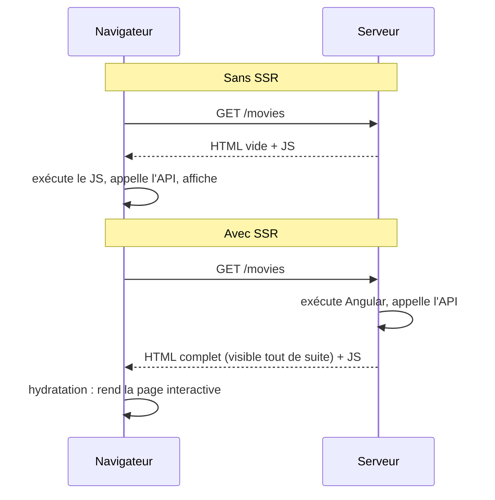

# SSR et Hydratation Angular

> [!abstract] En bref
> Par défaut, le serveur envoie une page **vide** et le navigateur construit tout en JavaScript. Avec le **SSR** (*Server-Side Rendering*), le serveur envoie une page **déjà remplie** : affichage plus rapide et meilleur référencement Google. L'**hydratation**, c'est le navigateur qui « réveille » cette page pour la rendre interactive, sans tout reconstruire.

## Avec et sans SSR


```mermaid
sequenceDiagram
  participant N as Navigateur
  participant S as Serveur
  Note over N,S: Sans SSR
  N->>S: GET /movies
  S-->>N: HTML vide + JS
  N->>N: exécute le JS, appelle l'API, affiche
  Note over N,S: Avec SSR
  N->>S: GET /movies
  S->>S: exécute Angular, appelle l'API
  S-->>N: HTML complet (visible tout de suite) + JS
  N->>N: hydratation : rend la page interactive
```

| | Sans SSR | Avec SSR |
|---|---|---|
| Premier affichage | après le JS | immédiat |
| Google, aperçus de partage | moins bon | excellent |
| Hébergement | fichiers statiques | un serveur Node (ou pré-rendu statique) |
| Complexité | simple | plus de pièges |

## Quand l'activer ?

- **Oui** : site public qui doit être trouvé sur Google (catalogue, vitrine, blog).
- **Pas nécessaire** : application derrière une connexion (outil interne, tableau de bord).

Pour CinéTrack, c'est un bon exercice **après** avoir terminé la version classique.

```bash
ng new cinetrack --ssr        # à la création
ng add @angular/ssr           # sur un projet existant
```

Le **pré-rendu** (SSG) génère les pages au build : idéal pour les pages qui changent peu.

## Les pièges du code côté serveur

Sur le serveur, il n'y a **pas de navigateur** : pas de `window`, `document`, `localStorage`.

```ts
// ❌ plante sur le serveur
const theme = localStorage.getItem('theme');

// ✅ seulement dans le navigateur
constructor() {
  afterNextRender(() => {
    const theme = localStorage.getItem('theme');
  });
}
```

| Piège | Solution |
|---|---|
| `window`, `document`, `localStorage` | `afterNextRender`, ou vérifier `isPlatformBrowser` |
| la même requête API faite deux fois (serveur puis navigateur) | `HttpClient` la transmet automatiquement grâce au cache de transfert |
| un contenu différent entre serveur et navigateur (date du jour, nombre aléatoire) | erreur d'hydratation : calcule-le après l'affichage |

L'équivalent Vue : [[VUE-18-Nuxt-SSR|Nuxt]].

## Exercices

### Exercice 1 · SSR ou pas ?

Pour chaque application, activerais-tu le SSR ?
1. CinéTrack, dont les fiches de films doivent être trouvées sur Google ;
2. un back-office interne derrière une connexion ;
3. ton portfolio.

> [!success]- Solution
> 1. **Oui** : les fiches sont publiques, le référencement compte.
> 2. **Non** : pas de référencement nécessaire, et plus simple à héberger.
> 3. **Oui, ou un rendu statique au build** (prerendering) : peu de pages, référencement utile.

### Exercice 2 · Le piège côté serveur

Pourquoi ce code plante-t-il avec le SSR ? Corrige-le.

```ts
export class ThemeService {
  theme = signal(localStorage.getItem('theme') ?? 'light');
}
```

> [!success]- Solution
> Côté serveur, il n'y a **pas de navigateur** : `localStorage` n'existe pas.
>
> ```ts
> export class ThemeService {
>   private isBrowser = isPlatformBrowser(inject(PLATFORM_ID));
>   theme = signal(this.isBrowser ? (localStorage.getItem('theme') ?? 'light') : 'light');
> }
> ```
