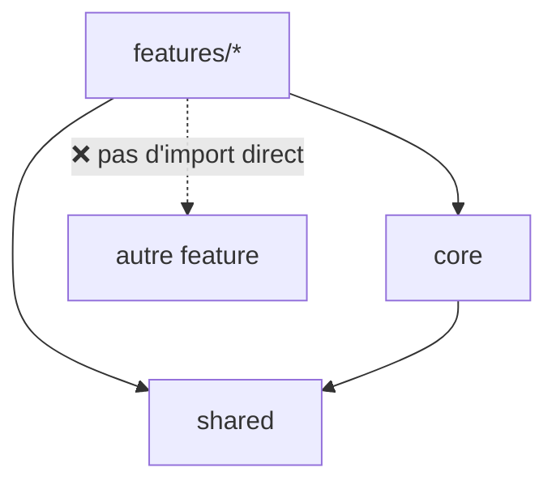

# Architecture d'un Projet Angular

> [!abstract] En bref
> Les **principes** qui gardent un projet Angular lisible quand il grossit (50 écrans, 10 développeurs). L'arborescence concrète et le code de chaque couche sont dans [[ANG-30-Template-Architecture-Angular|Template d'architecture Angular]] ; le modèle général, valable aussi pour Vue et NestJS, dans [[ARCH-15-Structure-de-Projet|Structure de projet]].

## Les 5 principes

### 1. Par fonctionnalité

Un dossier par fonctionnalité métier (`features/movies`, `features/favorites`, `features/auth`), plutôt qu'un dossier géant `components/` et un dossier géant `services/`.

### 2. Pages et composants d'affichage

| | Page (conteneur) | Composant d'affichage |
|---|---|---|
| Rôle | récupère les données, gère les actions | affiche ce qu'on lui donne |
| Injecte des services | oui | **non** |
| Communique par | stores / services | `input()` / `output()` |
| Testabilité | tests avec faux services | très simple |

### 3. Une couche d'accès aux données

`api` (HTTP) → `mapper` (DTO → modèle) → `store` (état). Les composants ne voient jamais la forme brute de l'API : si TMDB change, ou si tu passes par ton API NestJS, seuls ces fichiers bougent.

### 4. Des règles d'import

- une feature n'importe pas une autre feature : le code commun va dans `shared` ;
- `shared` ne connaît rien du métier ;
- `core` contient ce qui existe une seule fois (intercepteurs, layout, configuration).

Sur un gros projet, ces règles peuvent être vérifiées automatiquement (ESLint, Nx).

### 5. Tout est chargé à la demande

Chaque feature a son fichier de routes, chargé avec `loadChildren`. Le premier écran ne télécharge que ce dont il a besoin.

## Adapter à la taille

| Projet | Organisation |
|---|---|
| petit (quelques écrans) | `core` + `shared` + 2-3 features, un service par feature |
| moyen (CinéTrack) | structure complète, stores par feature |
| gros, plusieurs équipes ou applications | monorepo **Nx** avec des librairies et des règles d'import vérifiées |

## Pièges

- **`shared` qui devient un fourre-tout** : n'y mets que ce qui est vraiment utilisé par plusieurs features.
- **Un service qui fait tout** : sépare accès aux données et état.
- **Au travail** : suis la structure existante, et propose des améliorations progressives.
