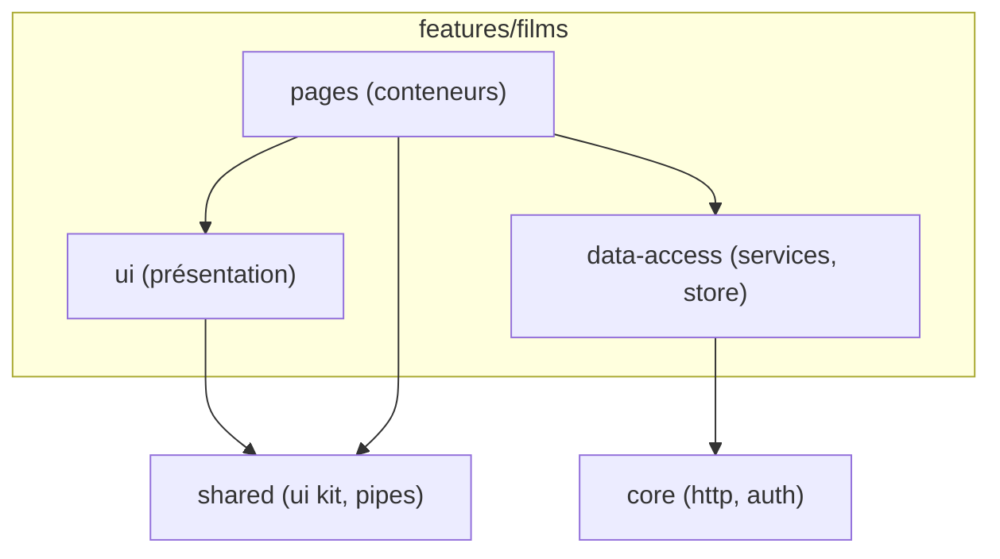

# Architecture d'un Projet Angular

> [!abstract] Introduction
> Organiser un projet Angular pour qu'il reste maintenable à 50 écrans et 10 développeurs : découpage par fonctionnalités, composants conteneurs/présentation, services par couche, règles d'import.

> [!warning]- Prérequis
> [[ANG-05-Services-DI|Services & Injection de Dépendances (DI) Angular]], [[ANG-06-Routing|Routing Angular]]

---

## Théorie

> [!question]- C'est quoi ?
> Structure par fonctionnalité (feature-first) :
> ```text
> src/app/
> ├── core/            # singletons transverses : auth, intercepteurs, layout, error handler
> ├── shared/          # composants UI, pipes, directives réutilisables (sans logique métier)
> ├── features/
> │   ├── films/
> │   │   ├── data-access/   # services API, store
> │   │   ├── ui/            # composants de présentation
> │   │   ├── pages/         # composants conteneurs (routés)
> │   │   └── films.routes.ts
> │   └── favoris/
> ├── app.config.ts
> └── app.routes.ts
> ```

> [!example]- Analogie
> Une entreprise organisée par départements (features) avec des services communs (core : accueil, sécurité) et une réserve de fournitures partagées (shared) — plutôt qu'un seul bureau où tout le monde s'entasse.

> [!question]- Pourquoi l'utiliser ?
> Localiser rapidement le code d'une fonctionnalité, limiter les dépendances croisées, permettre le lazy loading par feature, faciliter l'onboarding.

> [!question]- Comment ça marche ?
> - **Conteneur (smart)** : injecte les services, gère l'état, passe les données
> - **Présentation (dumb)** : inputs/outputs uniquement, OnPush, facile à tester et à mettre dans Storybook
> - **Data-access** : services HTTP + état ; les composants ne font jamais d'HTTP directement
> - Règles : une feature n'importe pas une autre feature (passer par shared/core), vérifiables avec ESLint (Nx module boundaries)
> - Conventions de nommage du style guide Angular (les suffixes `.component` sont optionnels depuis la v20)

> [!question]- Quand l'utiliser ?
> Dès qu'un projet dépasse quelques écrans. En monorepo (Nx) pour plusieurs applications/librairies partagées.

> [!danger]- Quand NE PAS l'utiliser / Limites
> Sur-découper un petit projet (10 dossiers pour 3 composants) ajoute de la friction ; adapter au besoin.

### Schéma



---

## Vocabulaire

| Terme | Définition en une ligne |
|-------|--------------------------|
| Feature | Domaine fonctionnel de l'application |
| Smart / Dumb | Composant conteneur / de présentation |
| Data-access | Couche d'accès aux données |
| Monorepo | Plusieurs projets dans un même dépôt |
| Module boundaries | Règles d'import entre parties du code |

---

## Points clés

- Organiser par fonctionnalité, pas par type de fichier
- Composants de présentation purs et OnPush
- Accès aux données centralisé dans des services
- Lazy loading par feature

---

## Pièges courants

> [!bug]- Erreurs fréquentes
> - Dossier `shared` qui devient un fourre-tout avec de la logique métier
> - Composants qui appellent `HttpClient` directement
> - Imports croisés entre features

---

## Exemple minimal

```typescript
// features/films/pages/liste-films.page.ts (conteneur)
@Component({
  imports: [FilmCardComponent],
  template: `@for (f of store.films(); track f.id) { <app-film-card [film]="f" (favori)="store.basculer(f.id)" /> }`,
})
export class ListeFilmsPage { store = inject(FilmsStore); }
```

> [!note] Ce que j'en retiens
> La page orchestre, la carte affiche : la carte est réutilisable et testable sans aucun service.

---

## Pour aller plus loin (niveau senior)

> [!tip]- Ce qui distingue un dev expérimenté
> - Mettre en place Nx avec des tags et des règles de dépendances
> - Rédiger un ADR sur la structure retenue

---

## Connexions

**Arbre théorique :**
- Sujet parent → [[Angular]]
- Sous-sujets → (aucun pour l'instant)
- À comparer avec → [[VUE-19-Architecture-Projet-Vue|Architecture d'un Projet Vue.js]]

**Pratique :**
- Extrait de code → [[04_Snippets/ang-28-architecture-projet-angular]]
- Projet → [[02_Projects/CinéTrack]]

---

## Auto-vérification

> [!check]- Est-ce que je maîtrise vraiment ?
> - Pourquoi un composant de présentation ne doit-il pas injecter de service métier ?

> [!faq]- Questions d'entretien
> - Comment structurez-vous une grosse application Angular ?

---

## Tâches

- [ ] #task Comparer la structure du projet au travail avec ce modèle et noter les différences
- [ ] #task Mettre à jour `status` une fois maîtrisé

---

## Notes brutes

- ?
