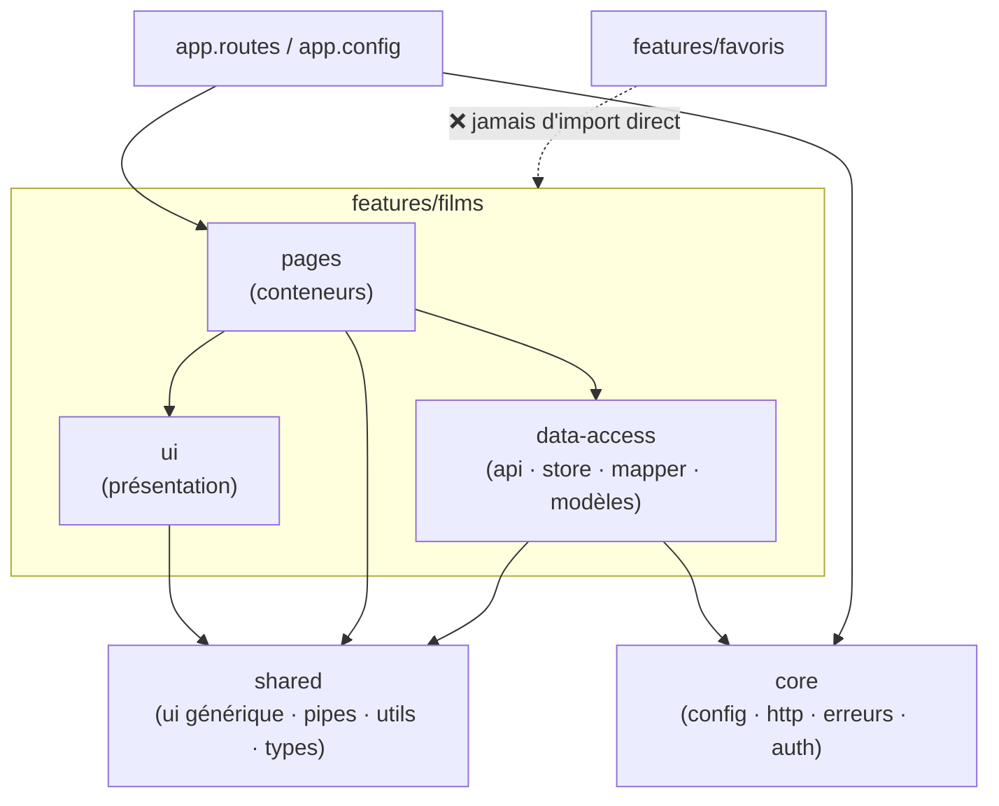

# Template d'Architecture Angular

> [!abstract] Introduction
> Un modèle de projet Angular prêt à copier — arborescence, rôle de chaque dossier, règles de dépendances et code de chaque couche — pour qu'une application reste propre, testable et facile à faire évoluer, de 3 à 50 écrans.

> [!warning]- Prérequis
> [[ANG-28-Architecture-Projet-Angular|Architecture d'un Projet Angular]], [[ANG-05-Services-DI|Services & Injection de Dépendances (DI) Angular]], [[ANG-10-Signals|Signals Angular]], [[ANG-06-Routing|Routing Angular]]

---

## Théorie

> [!question]- C'est quoi ?
> ```text
> src/
> ├── app/
> │   ├── core/                         # Singletons transverses, chargés UNE fois
> │   │   ├── config/app-config.ts      # InjectionToken de configuration
> │   │   ├── http/api.interceptor.ts   # URL de base, en-têtes, token
> │   │   ├── http/error.interceptor.ts # Gestion globale des erreurs HTTP
> │   │   ├── error/global-error-handler.ts
> │   │   └── layout/                   # Shell : en-tête, menu, pied de page
> │   │       └── shell.component.ts
> │   ├── shared/                       # Réutilisable, SANS logique métier
> │   │   ├── ui/                       # Composants de présentation génériques
> │   │   │   ├── empty-state.component.ts
> │   │   │   └── loader.component.ts
> │   │   ├── models/page.model.ts      # Types transverses (Page<T>, EtatChargement<T>)
> │   │   ├── pipes/ · directives/
> │   │   └── utils/                    # Fonctions pures testées
> │   ├── features/                     # Un dossier par domaine métier
> │   │   └── films/
> │   │       ├── data-access/          # Accès aux données + état
> │   │       │   ├── film.model.ts     # Modèle de l'application
> │   │       │   ├── film.dto.ts       # Forme brute renvoyée par l'API
> │   │       │   ├── film.mapper.ts    # DTO → modèle
> │   │       │   ├── films.api.ts      # Appels HTTP (et rien d'autre)
> │   │       │   └── films.store.ts    # État (signals) + actions
> │   │       ├── ui/                   # Composants de présentation de la feature
> │   │       │   ├── film-card.component.ts
> │   │       │   └── film-grid.component.ts
> │   │       ├── pages/                # Composants routés (conteneurs)
> │   │       │   ├── films-list.page.ts
> │   │       │   └── film-detail.page.ts
> │   │       └── films.routes.ts
> │   ├── app.config.ts                 # Providers globaux
> │   ├── app.routes.ts                 # Routes racines (lazy par feature)
> │   └── app.component.ts
> ├── environments/
> └── styles/                           # tokens.css, styles globaux, thème
> ```
> Les tests (`*.spec.ts`) sont placés **à côté** du fichier testé.

> [!example]- Analogie
> Une ville bien urbanisée : des quartiers (features) autonomes, des services publics communs (core : électricité, police), du mobilier urbain standard (shared/ui), et des règles d'urbanisme (qui peut construire quoi, où) qui empêchent le chaos quand la ville grandit.

> [!question]- Pourquoi l'utiliser ?
> - **Maintenable** : on sait où est chaque chose ; une feature se lit d'un bloc
> - **Flexible** : la couche mapper isole l'API (si TMDB change ou si tu passes par ton API NestJS, seuls `dto` + `mapper` + `api` bougent)
> - **Testable** : composants de présentation purs, store et mapper testables sans DOM
> - **Performant** : chaque feature est chargée à la demande (lazy loading)

> [!question]- Comment ça marche ?
> **1. Configuration injectable (core)** — aucune URL en dur dans les services :
> ```typescript
> // core/config/app-config.ts
> export interface AppConfig { apiUrl: string; tmdbImageUrl: string }
> export const APP_CONFIG = new InjectionToken<AppConfig>('APP_CONFIG');
> ```
> **2. Modèle, DTO et mapper (data-access)** — le reste de l'app ne voit JAMAIS le format de l'API :
> ```typescript
> // film.dto.ts — forme exacte de l'API
> export interface FilmDto { id: number; title: string; poster_path: string | null; release_date: string; vote_average: number }
> // film.model.ts — forme utile à l'application
> export interface Film { id: number; titre: string; affiche: string | null; annee: number | null; note: number }
> // film.mapper.ts — fonction pure, testée
> export const versFilm = (dto: FilmDto, imageUrl: string): Film => ({
>   id: dto.id,
>   titre: dto.title,
>   affiche: dto.poster_path ? `${imageUrl}${dto.poster_path}` : null,
>   annee: dto.release_date ? Number(dto.release_date.slice(0, 4)) : null,
>   note: Math.round(dto.vote_average * 10) / 10,
> });
> ```
> **3. Service API** — seulement HTTP + mapping :
> ```typescript
> @Injectable({ providedIn: 'root' })
> export class FilmsApi {
>   private http = inject(HttpClient);
>   private config = inject(APP_CONFIG);
>   populaires(page = 1): Observable<Page<Film>> {
>     return this.http.get<PageDto<FilmDto>>(`${this.config.apiUrl}/movie/popular`, { params: { page } }).pipe(
>       map(r => ({ page: r.page, total: r.total_pages, items: r.results.map(d => versFilm(d, this.config.tmdbImageUrl)) })),
>     );
>   }
> }
> ```
> **4. Store (état + actions)** — état privé, lecture seule à l'extérieur :
> ```typescript
> @Injectable({ providedIn: 'root' })
> export class FilmsStore {
>   private api = inject(FilmsApi);
>   private etat = signal<EtatChargement<Page<Film>>>({ statut: 'idle' });
>   readonly films = computed(() => { const e = this.etat(); return e.statut === 'success' ? e.data.items : []; });
>   readonly chargement = computed(() => this.etat().statut === 'loading');
>   readonly erreur = computed(() => { const e = this.etat(); return e.statut === 'error' ? e.erreur : null; });
>
>   charger(page = 1): void {
>     this.etat.set({ statut: 'loading' });
>     this.api.populaires(page).subscribe({
>       next: data => this.etat.set({ statut: 'success', data }),
>       error: () => this.etat.set({ statut: 'error', erreur: 'Impossible de charger les films' }),
>     });
>   }
> }
> ```
> **5. Composant de présentation (ui)** — aucun service injecté :
> ```typescript
> @Component({
>   selector: 'app-film-card',
>   changeDetection: ChangeDetectionStrategy.OnPush,
>   template: `
>     <article class="film-card">
>       @if (film().affiche; as src) {  }
>       <h3>{{ film().titre }}</h3>
>       <p>{{ film().annee ?? '—' }} · ★ {{ film().note }}</p>
>       <button type="button" (click)="favori.emit(film().id)" aria-label="Ajouter aux favoris">♡</button>
>     </article>`,
> })
> export class FilmCardComponent {
>   film = input.required<Film>();
>   favori = output<number>();
> }
> ```
> **6. Page (conteneur)** — branche le store sur l'UI :
> ```typescript
> @Component({
>   imports: [FilmGridComponent, EmptyStateComponent, LoaderComponent],
>   changeDetection: ChangeDetectionStrategy.OnPush,
>   template: `
>     @if (store.chargement()) { <app-loader /> }
>     @else if (store.erreur(); as e) { <app-empty-state [message]="e" /> }
>     @else { <app-film-grid [films]="store.films()" (favori)="favoris.basculer($event)" /> }`,
> })
> export class FilmsListPage {
>   protected store = inject(FilmsStore);
>   protected favoris = inject(FavorisStore);
>   constructor() { this.store.charger(); }
> }
> ```
> **7. Routes lazy + configuration globale** :
> ```typescript
> // features/films/films.routes.ts
> export default [
>   { path: '', loadComponent: () => import('./pages/films-list.page').then(m => m.FilmsListPage), title: 'Films' },
>   { path: ':id', loadComponent: () => import('./pages/film-detail.page').then(m => m.FilmDetailPage) },
> ] satisfies Routes;
> // app.routes.ts
> export const routes: Routes = [
>   { path: '', component: ShellComponent, children: [
>     { path: 'films', loadChildren: () => import('./features/films/films.routes') },
>     { path: '', pathMatch: 'full', redirectTo: 'films' },
>   ]},
>   { path: '**', loadComponent: () => import('./core/layout/not-found.page').then(m => m.NotFoundPage) },
> ];
> // app.config.ts
> export const appConfig: ApplicationConfig = {
>   providers: [
>     provideRouter(routes, withComponentInputBinding()),
>     provideHttpClient(withInterceptors([apiInterceptor, errorInterceptor])),
>     { provide: APP_CONFIG, useValue: environment },
>     { provide: ErrorHandler, useClass: GlobalErrorHandler },
>   ],
> };
> ```

> [!question]- Quand l'utiliser ?
> Dès le premier jour d'un projet (même petit : on peut commencer avec seulement `core/`, `shared/` et une feature). Sur un projet existant au travail : suivre la convention en place et l'améliorer progressivement.

> [!danger]- Quand NE PAS l'utiliser / Limites
> - Pas de dossiers vides « au cas où » : créer `pipes/` le jour où il y a un pipe
> - Au-delà de plusieurs applications ou équipes : monorepo Nx avec librairies et règles d'import automatiques
> - Deux features qui partagent beaucoup → extraire le code commun dans `shared/` (ou une feature « domaine » dédiée), pas d'import croisé

### Schéma



---

## Vocabulaire

| Terme | Définition en une ligne |
|-------|--------------------------|
| Core | Services uniques et transverses de l'application |
| Shared | Briques réutilisables sans logique métier |
| Feature | Domaine fonctionnel autonome |
| Data-access | Couche d'accès aux données et d'état |
| DTO | Format brut des données de l'API |
| Mapper | Fonction qui convertit un DTO en modèle |
| Conteneur / présentation | Composant qui orchestre / composant qui affiche |

---

## Points clés

- Organiser par feature, pas par type de fichier
- DTO + mapper = l'API ne « fuit » pas dans l'application
- Store = état privé + lecture seule + actions
- Composants de présentation : `input`/`output`, OnPush, zéro service
- Une route lazy par feature
- Configuration injectée (`InjectionToken`), jamais en dur

---

## Pièges courants

> [!bug]- Erreurs fréquentes
> - Utiliser directement les types de l'API (`poster_path`, `vote_average`) dans les templates → tout casse au moindre changement d'API
> - Composant qui injecte `HttpClient`
> - Dossier `shared` rempli de services métier
> - Imports relatifs à rallonge (`../../../../shared`) au lieu d'alias
> - Un store global unique pour toute l'application

---

## Paramètres / Configuration

| Règle | Pourquoi |
|---|---|
| `pages` → `ui`, `data-access`, `shared` | Les pages orchestrent |
| `ui` → `shared` uniquement | Composants réutilisables et testables |
| `data-access` → `core`, `shared` | Pas de dépendance à l'affichage |
| `shared` → rien de métier | Sinon il devient un fourre-tout |
| Une feature n'importe jamais une autre feature | Features indépendantes et supprimables |
| Composants : HTTP interdit (passer par `data-access`) | Un seul endroit pour les appels |
| Alias `@core/*`, `@shared/*`, `@features/*` (tsconfig `paths`) | Imports lisibles, déplacements faciles |
| Règles vérifiées par ESLint (`eslint-plugin-boundaries` ou Nx) | La discipline n'est pas laissée à la mémoire |

---

## Exemple minimal

```json
// tsconfig.json (extrait)
{ "compilerOptions": { "baseUrl": ".", "paths": {
  "@core/*": ["src/app/core/*"], "@shared/*": ["src/app/shared/*"], "@features/*": ["src/app/features/*"] } } }
```
```typescript
import { APP_CONFIG } from '@core/config/app-config';
import { EmptyStateComponent } from '@shared/ui/empty-state.component';
```

> [!note] Ce que j'en retiens
> Les alias rendent chaque import explicite sur la couche utilisée : une revue de code repère immédiatement une dépendance interdite.

---

## Pour aller plus loin (niveau senior)

> [!tip]- Ce qui distingue un dev expérimenté
> - Remplacer le store maison par `signalStore` (NgRx) quand la feature grossit, sans toucher aux pages grâce au découpage
> - Ajouter une couche « facade » si plusieurs pages partagent la même orchestration
> - Mettre en place Nx et ses tags (`type:feature`, `type:ui`, `type:data-access`, `scope:films`) pour automatiser les règles

---

## Connexions

**Arbre théorique :**
- Sujet parent → [[Angular]]
- Sous-sujets → (aucun pour l'instant)
- À comparer avec → [[VUE-22-Template-Architecture-Vue|Template d'Architecture Vue]]

**Pratique :**
- Extrait de code → [[04_Snippets/ang-30-template-architecture-angular]]
- Projet → [[02_Projects/CinéTrack]]

---

## Auto-vérification

> [!check]- Est-ce que je maîtrise vraiment ?
> - Pourquoi un mapper DTO → modèle rend-il l'application plus flexible ?
> - Qu'est-ce qu'un composant de présentation n'a jamais le droit de faire ?

> [!faq]- Questions d'entretien
> - Comment organisez-vous une application Angular pour qu'elle reste maintenable ?

---

## Tâches

- [ ] #task Créer ce squelette pour CinéTrack avant d'écrire la première fonctionnalité
- [ ] #task Ajouter les alias `@core`, `@shared`, `@features` et vérifier qu'aucun import relatif ne remonte de plus d'un niveau
- [ ] #task Mettre à jour `status` une fois maîtrisé

---

## Notes brutes

- ?
