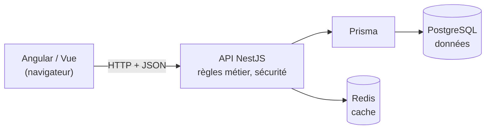

# Choisir son Backend

> [!abstract] En bref
> Le **back-end** est la partie serveur : il stocke les données, applique les règles métier et protège l'accès. Pour un développeur Angular / Vue, le choix le plus efficace est **NestJS**, en TypeScript : même langage que le front, et une organisation copiée sur Angular. Tu mets toute ton énergie sur les vrais sujets du back (HTTP, SQL, sécurité), pas sur un nouveau langage.

## Le rôle du back-end



Le front **affiche** et **demande**. Le back **décide** : il vérifie que l'utilisateur a le droit, que les données sont valides, puis lit ou écrit en base.

## Comparatif

| | **NestJS** (TypeScript) | Spring Boot (Java) | FastAPI (Python) | ASP.NET Core (C#) | Express (Node) |
|---|---|---|---|---|---|
| Langage | **déjà connu** | nouveau | connu en partie | nouveau | déjà connu |
| Organisation | modules, services, injection (**comme Angular**) | très structurée | légère | très structurée | libre, peu cadrée |
| Pour toi | ⭐ démarrage rapide | effort important | pour l'IA / la data | effort important | simple mais sans cadre |
| Marché en France | en forte hausse | **leader** en entreprise | data / IA | fort (Microsoft) | très répandu |
| Types partagés avec le front | **oui** | non | non | non | oui |

## Mon choix : NestJS

1. **Même langage** que tes projets front.
2. **Même architecture qu'Angular** : modules, services, injection de dépendances, décorateurs, guards, intercepteurs, pipes. Tout ce que tu as appris se transfère.
3. **Types partagés** front / back dans un monorepo (voir [[ARCH-15-Structure-de-Projet|Structure de projet]]).
4. **Structure d'entreprise** : couches, DTO, tests. Les bonnes pratiques sont imposées.

**Plan B :** si le back de ton entreprise est en Java, **Spring Boot** sera facile en année 2 : les concepts sont identiques (controller, service, repository, injection, DTO).

## L'ordre d'apprentissage (projet CinéTrack-API)

1. [[NODE-01-Node-npm|Node et npm]] : exécuter du JavaScript côté serveur.
2. [[NODE-02-Express-Middleware|Express]] : comprendre ce que NestJS fait pour toi.
3. [[NEST-01-Fondamentaux|NestJS]] : controllers, services, DTO.
4. [[ORM-01-Prisma-Schema-Migrations|Prisma]] + [[SQL-01-Fondamentaux-SELECT|SQL]] : la base de données.
5. [[NEST-10-Authentification-JWT|Authentification]] et [[SEC-02-OWASP-Top-10|sécurité]].
6. [[NEST-11-Tests-NestJS|Tests]], puis Docker et CI.

```bash
npm i -g @nestjs/cli
nest new cinetrack-api
cd cinetrack-api && npm run start:dev    # http://localhost:3000
```

## Pièges

- **Apprendre trois back-ends en surface** au lieu d'un en profondeur.
- **Confondre « connaître NestJS » et « savoir faire du back »** : HTTP, SQL, transactions et sécurité comptent plus que le framework.
- **Demande à ton équipe** quel back consomment vos fronts : ça peut orienter ton année 2.
