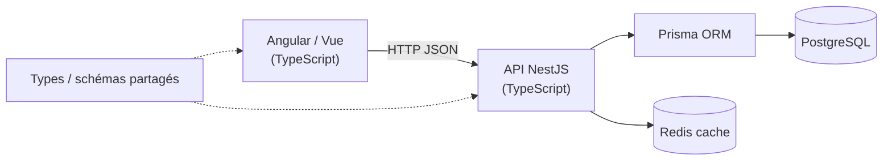

# Choisir son Backend

> [!abstract] Introduction
> Comparatif des backends courants (NestJS, Express, Spring Boot, FastAPI, .NET) et recommandation argumentée pour un développeur Angular/Vue : **NestJS en TypeScript** comme backend principal.

---

## Théorie

> [!question]- C'est quoi ?
> | Critère | NestJS (Node/TS) | Spring Boot (Java) | FastAPI (Python) | ASP.NET Core (C#) | Express (Node) |
> |---|---|---|---|---|---|
> | Langage | TypeScript ✅ déjà maîtrisé | Java/Kotlin | Python | C# | JS/TS |
> | Architecture | Modules, DI, décorateurs (≈ Angular) | DI, annotations, très structuré | Léger, fonctions + types | DI, très structuré | Minimaliste, libre |
> | Courbe pour toi | ⭐ très douce | Moyenne/forte | Douce | Moyenne | Douce mais peu cadrée |
> | Marché FR (ESN, grands comptes) | En forte hausse | ⭐ Leader en entreprise | Data/IA | Fort (Microsoft) | Très répandu |
> | Performance | Bonne (I/O) | Très bonne | Bonne (async) | Très bonne | Bonne |
> | Full stack TS (types partagés) | ✅ | ❌ | ❌ | ❌ | ✅ |

> [!example]- Analogie
> Choisir son backend, c'est choisir une deuxième langue étrangère : autant en choisir une proche de celle que tu parles déjà (TypeScript) pour devenir vite opérationnel, puis en apprendre une autre plus tard si le marché le demande.

> [!question]- Pourquoi l'utiliser ?
> **Recommandation : NestJS** car :
> 1. Même langage que le front (TypeScript) → toute l'énergie va sur les concepts backend (HTTP, BDD, sécurité, archi)
> 2. Architecture calquée sur Angular (modules, services, DI, décorateurs, guards, pipes, intercepteurs) → transfert immédiat
> 3. Types et validation partageables entre front et back (monorepo)
> 4. Structure « entreprise » qui enseigne les bonnes pratiques (couches, DTO, tests)
> **Plan B** : si l'entreprise (Assystem) utilise Java côté back, apprendre **Spring Boot** en année 2 sera facile : les concepts (controller, service, repository, DI, DTO, JPA ≈ ORM) sont identiques. Les notes Python existantes permettent FastAPI pour de l'IA/data.

> [!question]- Comment ça marche ?
> Ordre d'apprentissage : [[NODE-01-Node-npm|Node.js et npm]] → [[NODE-02-Express-Middleware|Express et Middleware]] (comprendre ce que Nest abstrait) → NestJS (NEST-01 à 14) → Prisma → sécurité → tests → Docker/CI.

> [!question]- Quand l'utiliser ?
> Décision à confirmer en demandant à l'équipe : quel back consomment les fronts Angular/Vue au travail ? Si c'est Java, garder NestJS pour les projets perso et ajouter Spring Boot au plan de l'année 2.

> [!danger]- Quand NE PAS l'utiliser / Limites
> Node n'est pas idéal pour du calcul CPU lourd (le thread principal bloque) — on délègue alors à des workers ou à un autre service.

### Schéma



---

## Vocabulaire

| Terme | Définition en une ligne |
|-------|--------------------------|
| Backend | Partie serveur : logique métier, données, sécurité |
| API | Interface exposée au front (souvent REST/JSON) |
| ORM | Outil qui mappe tables SQL ↔ objets |
| Runtime | Environnement d'exécution (Node, JVM) |

---

## Points clés

- NestJS = choix principal (TS + archi Angular)
- Les concepts back sont universels : controller, service, repository, DTO, DI
- Spring Boot = plan B/année 2 si l'entreprise est Java
- Toujours vérifier la stack réelle de l'entreprise

---

## Pièges courants

> [!bug]- Erreurs fréquentes
> - Apprendre 3 backends en surface au lieu d'un en profondeur
> - Confondre « connaître un framework » et « savoir faire du backend » (HTTP, SQL, sécurité, transactions)

---

## Exemple minimal

```bash
npm i -g @nestjs/cli
nest new cinetrack-api
cd cinetrack-api && npm run start:dev    # http://localhost:3000
```

> [!note] Ce que j'en retiens
> En 3 commandes on a une API TypeScript structurée comme un projet Angular.

---

## Pour aller plus loin (niveau senior)

> [!tip]- Ce qui distingue un dev expérimenté
> - Savoir justifier un choix de stack par des critères (équipe, recrutement, perf, écosystème) et le documenter dans un ADR

---

## Connexions

**Arbre théorique :**
- Sujet parent → [[Backend]]
- Sous-sujets → [[NODE-01-Node-npm|Node.js et npm]], [[NEST-01-Fondamentaux|Fondamentaux NestJS]]
- À comparer avec → (—)

**Pratique :**
- Extrait de code → [[04_Snippets/back-00-choisir-son-backend]]
- Projet → [[02_Projects/CinéTrack]]

---

## Auto-vérification

> [!check]- Est-ce que je maîtrise vraiment ?
> - Quels concepts de NestJS sont directement hérités d'Angular ?

> [!faq]- Questions d'entretien
> - Pourquoi avoir choisi ce backend pour votre projet ?

---

## Tâches

- [ ] #task Demander à l'équipe quel backend alimente les fronts Angular/Vue
- [ ] #task Écrire un ADR « Choix du backend pour CinéTrack »
- [ ] #task Mettre à jour `status` une fois maîtrisé

---

## Notes brutes

- ?
