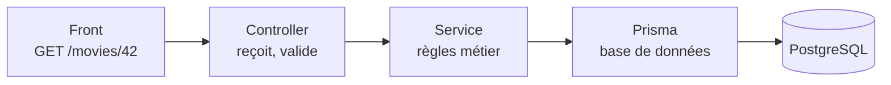

# Fondamentaux NestJS

> [!abstract] En bref
> NestJS est un framework pour construire des **API** en TypeScript. Il reprend l'organisation d'Angular (modules, services, injection de dépendances, décorateurs) et impose une architecture en couches claire. C'est le back-end de CinéTrack-API.

## Le chemin d'une requête



| Couche | Rôle | Ne fait PAS |
|---|---|---|
| **Controller** | reçoit la requête HTTP, extrait les données, renvoie la réponse | de logique métier |
| **Service** | applique les règles (droits, calculs, vérifications) | de HTTP |
| **Prisma / repository** | lit et écrit en base | de règles métier |

Image : au restaurant, le **serveur** (controller) prend la commande, le **cuisinier** (service) prépare, le **magasinier** (Prisma) va chercher les ingrédients.

## Démarrer

```bash
npm i -g @nestjs/cli
nest new cinetrack-api
cd cinetrack-api
npm run start:dev               # http://localhost:3000, redémarre à chaque modification

nest g resource movies          # génère module + controller + service + DTO pour « movies »
```

## Le trio de base

```ts
// movies.controller.ts
@Controller('movies')                               // routes /movies…
export class MoviesController {
  constructor(private readonly movies: MoviesService) {}   // injection

  @Get()                                            // GET /movies
  findAll(@Query('page') page = 1) {
    return this.movies.findAll(Number(page));
  }

  @Get(':id')                                       // GET /movies/42
  findOne(@Param('id', ParseIntPipe) id: number) {
    return this.movies.findOne(id);
  }

  @Post()                                           // POST /movies
  create(@Body() dto: CreateMovieDto) {
    return this.movies.create(dto);
  }
}
```

```ts
// movies.service.ts
@Injectable()
export class MoviesService {
  constructor(private readonly prisma: PrismaService) {}

  async findOne(id: number) {
    const movie = await this.prisma.movie.findUnique({ where: { id } });
    if (!movie) throw new NotFoundException(`Film ${id} introuvable`);   // → 404 automatique
    return movie;
  }
}
```

```ts
// movies.module.ts
@Module({
  controllers: [MoviesController],
  providers: [MoviesService],
})
export class MoviesModule {}
```

Ce que tu renvoies d'une méthode du controller est **automatiquement converti en JSON**.

## Si tu viens d'Angular

| Angular | NestJS |
|---|---|
| `@Component` | `@Controller` |
| `@Injectable` service | `@Injectable` service |
| `inject()` / constructeur | constructeur |
| guard de route | guard (`CanActivate`) |
| intercepteur HTTP | interceptor |
| pipe | pipe (transformer / valider) |

## La suite

[[NEST-02-Modules|Modules]] → [[NEST-03-Controllers|Controllers]] → [[NEST-04-Providers-DI|Services et injection]] → [[NEST-05-DTO-Validation-Pipes|DTO et validation]] → [[NEST-09-Prisma-Base-de-Donnees|Prisma]]. Structure des dossiers : [[ARCH-15-Structure-de-Projet|Structure de projet]].

## Pièges

- **De la logique métier dans le controller** : impossible à réutiliser et difficile à tester.
- **Oublier d'ajouter le module** dans `AppModule` (`imports: [MoviesModule]`) : les routes n'existent pas.
- **Renvoyer toute la ligne de la base** (avec le mot de passe haché de l'utilisateur !) : choisis les champs renvoyés.
