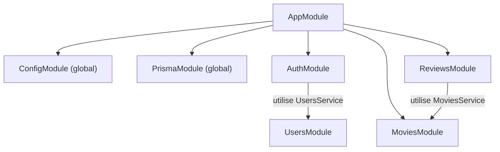

# Modules NestJS

> [!abstract] En bref
> Un **module** regroupe tout ce qui concerne une fonctionnalité : son controller, ses services. Il déclare aussi ce qu'il **partage** avec les autres modules. L'application est un assemblage de modules : `MoviesModule`, `AuthModule`, `ReviewsModule`…

## Un module

```ts
@Module({
  imports: [PrismaModule],              // les modules dont j'ai besoin
  controllers: [ReviewsController],     // mes routes
  providers: [ReviewsService],          // mes services
  exports: [ReviewsService],            // ce que je partage avec les autres modules
})
export class ReviewsModule {}
```

| Clé | Contient |
|---|---|
| `imports` | les autres modules utilisés |
| `controllers` | les controllers de ce module |
| `providers` | les services créés par ce module |
| `exports` | les services que les autres modules peuvent utiliser |

Image : chaque module est un **service d'une entreprise** (compta, RH). Il a ses employés (providers), un guichet (controller), et il met certains employés **à disposition** des autres services (exports).

## L'assemblage de CinéTrack-API



```ts
@Module({
  imports: [
    ConfigModule.forRoot({ isGlobal: true }),
    PrismaModule,
    AuthModule,
    UsersModule,
    MoviesModule,
    ReviewsModule,
  ],
})
export class AppModule {}
```

## Partager un service

`ReviewsService` a besoin de vérifier qu'un film existe via `MoviesService` :

1. `MoviesModule` met `MoviesService` dans ses **`exports`** ;
2. `ReviewsModule` met `MoviesModule` dans ses **`imports`** ;
3. `ReviewsService` le reçoit dans son constructeur.

## Module global

Pour un service utilisé **partout** (Prisma, configuration), on évite de l'importer dans chaque module :

```ts
@Global()
@Module({ providers: [PrismaService], exports: [PrismaService] })
export class PrismaModule {}
```

À réserver à ces quelques services transverses.

## Pièges

- **« Nest can't resolve dependencies of ReviewsService (?, MoviesService)… »** : le message d'erreur le plus courant. Le service demandé n'est pas exporté par son module, ou son module n'est pas importé. Vérifie `exports` et `imports`.
- **Deux modules qui s'importent mutuellement** : dépendance circulaire. Déplace le code commun dans un troisième module.
- **Tout mettre en `@Global()`** : on ne sait plus qui dépend de quoi.
