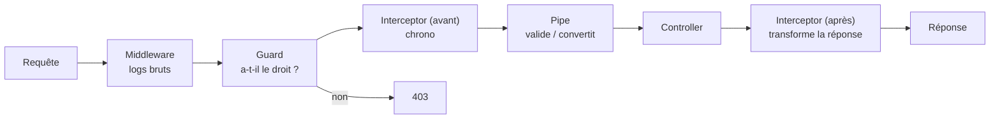

# Middleware Guards et Interceptors NestJS

> [!abstract] En bref
> Certaines choses doivent se faire pour **beaucoup de routes** : noter chaque requête dans les logs, vérifier que l'utilisateur est connecté, mesurer le temps de réponse. NestJS propose des briques spécialisées pour ça, qui s'exécutent **autour** de tes controllers, dans un ordre précis.

## L'ordre de passage



| Brique | Question | Usage typique |
|---|---|---|
| **Middleware** | — | log de chaque requête, en-têtes de sécurité (helmet), CORS |
| **Guard** | « a-t-il le droit de passer ? » | connecté ? admin ? |
| **Interceptor** | « que faire avant / après ? » | mesurer le temps, mettre en cache, reformater la réponse |
| **Pipe** | « les données sont-elles valides ? » | validation des DTO (voir [[NEST-05-DTO-Validation-Pipes\|DTO]]) |
| **Exception filter** | « comment présenter l'erreur ? » | format d'erreur uniforme (voir [[NEST-07-Exceptions-Gestion-Erreurs\|Exceptions]]) |

## Guard : autoriser ou refuser

```ts
@Injectable()
export class RolesGuard implements CanActivate {
  constructor(private reflector: Reflector) {}

  canActivate(ctx: ExecutionContext): boolean {
    const roles = this.reflector.get<string[]>('roles', ctx.getHandler());
    if (!roles) return true;                                   // route sans rôle exigé
    const user = ctx.switchToHttp().getRequest().user;         // ajouté par le guard JWT
    return roles.includes(user?.role);
  }
}

// un décorateur pour marquer les routes
export const Roles = (...roles: string[]) => SetMetadata('roles', roles);

@Delete(':id')
@Roles('admin')
remove(@Param('id', ParseIntPipe) id: number) {}
```

Le guard d'authentification JWT : [[NEST-10-Authentification-JWT|Authentification JWT]]. Les rôles et permissions : [[SEC-11-Autorisation-RBAC|Autorisation]].

## Interceptor : avant et après

```ts
@Injectable()
export class TimingInterceptor implements NestInterceptor {
  private logger = new Logger('HTTP');

  intercept(ctx: ExecutionContext, next: CallHandler) {
    const req = ctx.switchToHttp().getRequest();
    const start = Date.now();
    return next.handle().pipe(                                  // next.handle() = le controller
      tap(() => this.logger.log(`${req.method} ${req.url} ${Date.now() - start} ms`)),
    );
  }
}
```

## Middleware

```ts
// main.ts
app.use(helmet());                        // en-têtes de sécurité
app.enableCors({ origin: ['http://localhost:4200', 'https://cinetrack.fr'] });
```

## Où les brancher

| Portée | Comment |
|---|---|
| toute l'API | `app.useGlobalGuards(…)` dans `main.ts`, ou `{ provide: APP_GUARD, useClass: … }` dans un module (permet l'injection) |
| un controller | `@UseGuards(RolesGuard)` sur la classe |
| une route | `@UseGuards(…)` / `@UseInterceptors(…)` sur la méthode |

## Pièges

- **Mettre la vérification des droits dans un middleware** : il ne sait pas quelle route va être appelée. Utilise un guard.
- **L'ordre d'exécution** : un guard passe **avant** les pipes, donc les données ne sont pas encore validées dans un guard.
- **Oublier une route** : protège **tout par défaut** (guard global) et marque les exceptions comme publiques.
