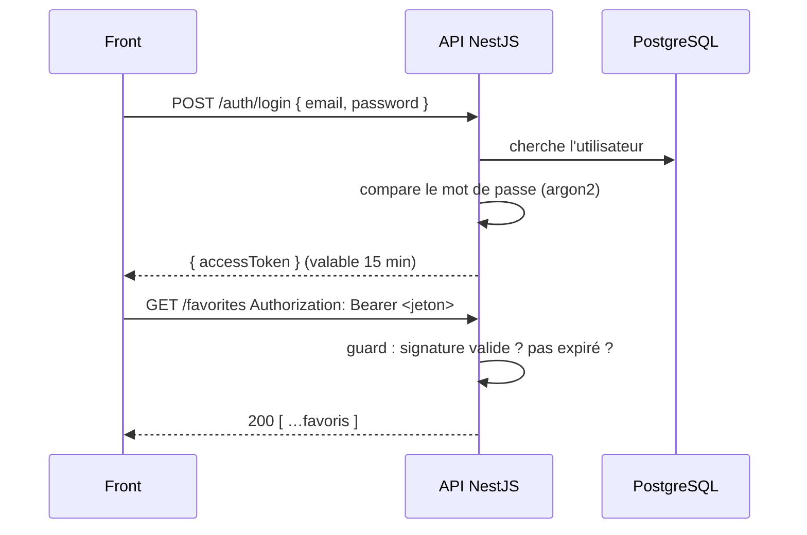

# Authentification JWT NestJS

> [!abstract] En bref
> L'**authentification**, c'est vérifier **qui** est l'utilisateur. Le déroulé : il s'inscrit (mot de passe **haché**), il se connecte, l'API lui donne un **jeton** (JWT) ; ensuite il présente ce jeton à chaque requête. Un **guard** vérifie le jeton sur toutes les routes, sauf celles marquées publiques.

## Le déroulé



Un **JWT** est un texte signé qui contient l'identifiant de l'utilisateur. L'API peut vérifier qu'elle l'a bien fabriqué (grâce à la signature) **sans consulter la base**. Détails : [[SEC-03-Authentification-Sessions-JWT|Sessions et JWT]].

## 1. Inscription : hacher le mot de passe

```bash
npm i @nestjs/jwt argon2
```

```ts
async register(dto: RegisterDto) {
  const exists = await this.prisma.user.findUnique({ where: { email: dto.email } });
  if (exists) throw new ConflictException('E-mail déjà utilisé');

  const passwordHash = await argon2.hash(dto.password);   // JAMAIS le mot de passe en clair
  const user = await this.prisma.user.create({ data: { email: dto.email, passwordHash } });
  return this.signToken(user.id, user.role);
}
```

Pourquoi hacher : voir [[SEC-05-Hachage-Mots-de-Passe|Hachage des mots de passe]].

## 2. Connexion : vérifier et donner un jeton

```ts
async login(dto: LoginDto) {
  const user = await this.prisma.user.findUnique({ where: { email: dto.email } });
  const ok = user && await argon2.verify(user.passwordHash, dto.password);
  if (!ok) throw new UnauthorizedException('Identifiants invalides');   // même message dans les 2 cas
  return this.signToken(user.id, user.role);
}

private async signToken(userId: number, role: string) {
  return { accessToken: await this.jwt.signAsync({ sub: userId, role }) };
}
```

```ts
// auth.module.ts
JwtModule.registerAsync({
  inject: [ConfigService],
  useFactory: (c: ConfigService) => ({ secret: c.getOrThrow('JWT_SECRET'), signOptions: { expiresIn: '15m' } }),
})
```

## 3. Protéger toutes les routes par défaut

```ts
export const IS_PUBLIC = 'isPublic';
export const Public = () => SetMetadata(IS_PUBLIC, true);

@Injectable()
export class JwtAuthGuard implements CanActivate {
  constructor(private jwt: JwtService, private reflector: Reflector) {}

  async canActivate(ctx: ExecutionContext) {
    const isPublic = this.reflector.getAllAndOverride<boolean>(IS_PUBLIC, [ctx.getHandler(), ctx.getClass()]);
    if (isPublic) return true;

    const req = ctx.switchToHttp().getRequest();
    const token = req.headers.authorization?.replace('Bearer ', '');
    if (!token) throw new UnauthorizedException();
    try {
      req.user = await this.jwt.verifyAsync(token);     // { sub, role }
      return true;
    } catch {
      throw new UnauthorizedException('Session expirée');
    }
  }
}

// app.module.ts : guard global
providers: [{ provide: APP_GUARD, useClass: JwtAuthGuard }]
```

```ts
@Public() @Post('login') login(@Body() dto: LoginDto) {}
@Public() @Get('movies') findAll() {}
@Get('favorites') list(@CurrentUser() user: AuthUser) {}   // protégée par défaut
```

## 4. Récupérer l'utilisateur connecté

```ts
export const CurrentUser = createParamDecorator(
  (_: unknown, ctx: ExecutionContext) => ctx.switchToHttp().getRequest().user,
);
```

## Le jeton de rafraîchissement

Un jeton court (15 min) limite les dégâts s'il est volé. Pour ne pas redemander le mot de passe toutes les 15 minutes, on ajoute un **refresh token** (plus long, stocké en cookie `HttpOnly`) qui permet d'obtenir un nouveau jeton. À ajouter une fois la base en place.

## Pièges

- **Stocker le mot de passe en clair** ou avec un simple SHA-256 : utilise argon2 (ou bcrypt).
- **Messages différents** pour « e-mail inconnu » et « mauvais mot de passe » : un attaquant découvre quels e-mails existent.
- **Un secret JWT court ou commité** : n'importe qui peut fabriquer des jetons.
- **Mettre des données sensibles dans le JWT** : son contenu est **lisible** par tous (il est signé, pas chiffré).
- **Oublier de limiter les tentatives** de connexion : ajoute `@nestjs/throttler`.
