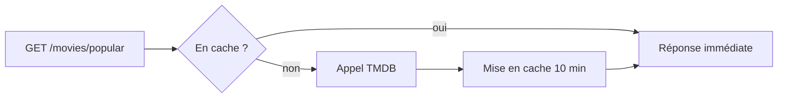

# Cache Queues et Tâches NestJS

> [!abstract] En bref
> Trois outils pour qu'une API reste **rapide** et **fiable** sous la charge. Le **cache** garde un résultat coûteux pour le resservir (les films populaires de TMDB). Une **file de tâches** (queue) fait les traitements longs en arrière-plan (envoyer un e-mail). Les **tâches planifiées** s'exécutent à heure fixe (nettoyage nocturne).

## 1. Le cache (avec Redis)

Les films populaires de TMDB changent peu : inutile d'appeler TMDB à chaque visite.



```bash
npm i @nestjs/cache-manager cache-manager @keyv/redis
```

```ts
// app.module.ts
CacheModule.registerAsync({
  isGlobal: true,
  inject: [ConfigService],
  useFactory: (c: ConfigService) => ({ stores: [new KeyvRedis(c.getOrThrow('REDIS_URL'))], ttl: 600_000 }),
})
```

```ts
@Injectable()
export class MoviesService {
  constructor(@Inject(CACHE_MANAGER) private cache: Cache, private tmdb: TmdbClient) {}

  async popular(page: number) {
    const key = `popular:${page}`;
    const cached = await this.cache.get<Movie[]>(key);
    if (cached) return cached;

    const movies = await this.tmdb.popular(page);
    await this.cache.set(key, movies, 10 * 60_000);   // 10 minutes
    return movies;
  }
}
```

**Le plus difficile** avec un cache : savoir quand le **vider**. Quand un utilisateur publie une critique, supprime le cache de la note moyenne du film. Voir [[ARCH-09-Cache-Performance|Cache]] et [[BDD-07-Redis-Cle-Valeur|Redis]].

## 2. Les files de tâches (BullMQ)

Envoyer un e-mail de bienvenue prend 1 à 2 secondes. L'utilisateur ne doit pas attendre : on **met la tâche dans une file**, on répond tout de suite, et un « travailleur » l'exécute à côté.

```ts
// à l'inscription
await this.emailQueue.add('welcome', { userId: user.id });   // quelques millisecondes

// le travailleur
@Processor('emails')
export class EmailProcessor extends WorkerHost {
  async process(job: Job<{ userId: number }>) {
    await this.mailer.sendWelcome(job.data.userId);          // réessayé automatiquement en cas d'échec
  }
}
```

Usages : e-mails, génération de PDF, traitement d'images, appels à une IA.

## 3. Les tâches planifiées

```bash
npm i @nestjs/schedule
```

```ts
@Injectable()
export class CleanupService {
  @Cron('0 3 * * *')          // tous les jours à 3 h du matin
  async purgeExpiredTokens() {
    await this.prisma.refreshToken.deleteMany({ where: { expiresAt: { lt: new Date() } } });
  }
}
```

Le format cron : minute, heure, jour du mois, mois, jour de la semaine.

## Quand s'en servir ?

| Symptôme | Outil |
|---|---|
| la même donnée coûteuse est demandée souvent | cache |
| une action fait attendre l'utilisateur plusieurs secondes | file de tâches |
| il faut faire quelque chose régulièrement | tâche planifiée |

Pour CinéTrack-API : le **cache** pour TMDB est utile tout de suite, le reste à ajouter si le besoin apparaît.

## Pièges

- **Mettre en cache des données propres à un utilisateur** avec une clé commune : un utilisateur voit les favoris d'un autre. Mets l'id de l'utilisateur dans la clé.
- **Une tâche cron sur plusieurs serveurs** : elle s'exécute autant de fois qu'il y a de serveurs. Il faut un verrou, ou une file de tâches.
