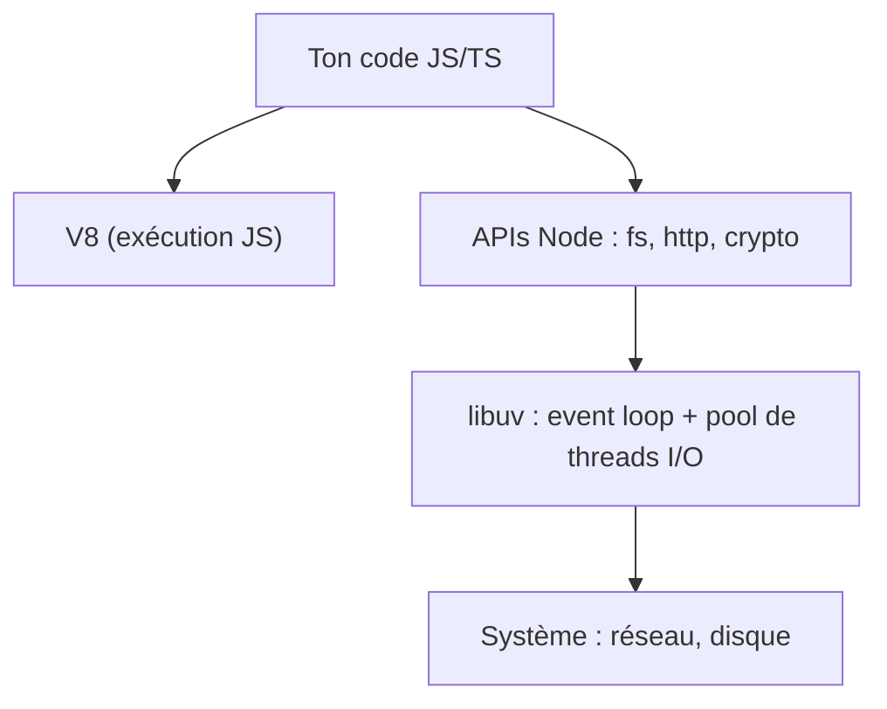

# Node.js et npm

> [!abstract] Introduction
> Node.js exécute du JavaScript hors du navigateur (serveurs, outils CLI, scripts de build) ; npm gère les dépendances et les scripts du projet via `package.json`.

> [!warning]- Prérequis
> [[JS-06-Event-Loop|Event Loop JavaScript]], [[JS-09-Modules-ESM|Modules ES JavaScript]]

---

## Théorie

> [!question]- C'est quoi ?
> ```bash
> node -v                 # version (utiliser une LTS paire : 22, 24…)
> npm init -y             # crée package.json
> npm install express     # dépendance
> npm install -D typescript vitest   # dépendance de dev
> npm run build           # exécute un script
> npx tsc --init          # exécute un binaire local
> ```

> [!example]- Analogie
> Node sort JavaScript du navigateur comme on sortirait un moteur de sa voiture pour l'utiliser dans un bateau ; npm est le magasin de pièces détachées.

> [!question]- Pourquoi l'utiliser ?
> Tous les outils front (Angular CLI, Vite, ESLint) tournent sur Node, et NestJS aussi : comprendre Node = comprendre son environnement de travail quotidien.

> [!question]- Comment ça marche ?
> - Node = moteur V8 + libuv (event loop, I/O asynchrones) + APIs (`fs`, `http`, `path`, `crypto`, `process`)
> - `package.json` : dépendances, scripts, `"type": "module"`, `engines`
> - `package-lock.json` : versions exactes installées → **toujours commité**
> - Versionnement sémantique : `^1.2.3` (mineures OK), `~1.2.3` (patchs), `1.2.3` (exact)
> - `npm ci` : installation reproductible depuis le lock (CI, Docker)
> - Alternatives : pnpm (rapide, économe en disque), yarn ; Bun et Deno comme runtimes alternatifs
> - Variables d'environnement : `process.env.X`, fichiers `.env` (`node --env-file=.env`)
> - Gestion des versions de Node : nvm, fnm, volta ; fichier `.nvmrc`

> [!question]- Quand l'utiliser ?
> Serveurs d'API, outils, scripts d'automatisation, SSR.

> [!danger]- Quand NE PAS l'utiliser / Limites
> Mono-thread pour le JS : un calcul CPU lourd bloque toutes les requêtes → `worker_threads` ou service dédié.

### Schéma



---

## Vocabulaire

| Terme | Définition en une ligne |
|-------|--------------------------|
| LTS | Version à support long, à utiliser en production |
| `package.json` | Manifeste du projet |
| Lockfile | Versions exactes des dépendances installées |
| SemVer | MAJEUR.MINEUR.PATCH |
| `npx` | Exécute un binaire de paquet |

---

## Points clés

- Utiliser une version LTS
- Commiter le lockfile, ne jamais commiter `node_modules`
- `npm ci` en CI/Docker
- `devDependencies` pour les outils de build/test
- Secrets dans des variables d'environnement, jamais dans le code

---

## Pièges courants

> [!bug]- Erreurs fréquentes
> - Supprimer le lockfile « pour régler un problème »
> - Installer des paquets globalement au lieu de les mettre en devDependencies
> - Versions de Node différentes entre développeurs → `.nvmrc` + `engines`
> - Installer un paquet douteux (typosquatting, scripts postinstall malveillants)

---

## Exemple minimal

```json
{
  "name": "cinetrack-api",
  "type": "module",
  "engines": { "node": ">=22" },
  "scripts": {
    "dev": "node --watch --env-file=.env src/main.js",
    "test": "vitest",
    "lint": "eslint ."
  }
}
```

> [!note] Ce que j'en retiens
> Node récent gère nativement watch et `.env` : plus besoin de nodemon ni dotenv pour démarrer.

---

## Pour aller plus loin (niveau senior)

> [!tip]- Ce qui distingue un dev expérimenté
> - Auditer les dépendances (`npm audit`, Renovate), comprendre les peerDependencies
> - Profiler un process Node (`--inspect`, `--cpu-prof`)
> - Connaître les phases de l'event loop Node et `process.nextTick`

---

## Connexions

**Arbre théorique :**
- Sujet parent → [[Backend]]
- Sous-sujets → [[NODE-02-Express-Middleware|Express et Middleware]]
- À comparer avec → [[PY-13-Environnements-Virtuels-Pip|Environnements Virtuels et Pip]]

**Pratique :**
- Extrait de code → [[04_Snippets/node-01-node-npm]]
- Projet → [[02_Projects/CinéTrack]]

---

## Auto-vérification

> [!check]- Est-ce que je maîtrise vraiment ?
> - Pourquoi commiter le lockfile ?
> - Différence entre `npm install` et `npm ci` ?

> [!faq]- Questions d'entretien
> - Node.js est mono-thread : comment gère-t-il la concurrence ?

---

## Tâches

- [ ] #task Créer un script Node qui lit un fichier JSON de films et affiche les statistiques
- [ ] #task Mettre à jour `status` une fois maîtrisé

---

## Notes brutes

- ?
