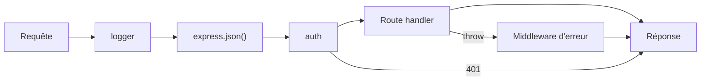

# Express et Middleware

> [!abstract] Introduction
> Express est le framework HTTP minimaliste de Node : des routes et une chaîne de middlewares. NestJS l'utilise sous le capot — le comprendre, c'est comprendre ce que Nest automatise.

> [!warning]- Prérequis
> [[NODE-01-Node-npm|Node.js et npm]], [[NET-05-HTTP-Approfondi|HTTP Approfondi]]

---

## Théorie

> [!question]- C'est quoi ?
> ```javascript
> import express from 'express';
> const app = express();
> app.use(express.json());                                // middleware : parse le body JSON
> const films = [{ id: 1, titre: 'Inception' }];
> app.get('/films', (req, res) => res.json(films));
> app.get('/films/:id', (req, res) => {
>   const film = films.find(f => f.id === Number(req.params.id));
>   if (!film) return res.status(404).json({ message: 'Film introuvable' });
>   res.json(film);
> });
> app.post('/films', (req, res) => {
>   const film = { id: Date.now(), ...req.body };
>   films.push(film);
>   res.status(201).json(film);
> });
> app.listen(3000);
> ```

> [!example]- Analogie
> Une chaîne de montage : chaque requête passe par une série de postes (middlewares : logs, parsing, auth) avant d'arriver au poste final (la route) qui produit la réponse.

> [!question]- Pourquoi l'utiliser ?
> Voir « à nu » le cycle requête/réponse : méthode, URL, params, query, body, statut, en-têtes. Beaucoup de projets Node en production sont encore en Express.

> [!question]- Comment ça marche ?
> Un middleware = `(req, res, next) => { … next(); }`. L'ordre d'enregistrement = ordre d'exécution. Un middleware d'erreur a 4 paramètres `(err, req, res, next)`.
> - `req.params` (/films/:id), `req.query` (?q=…), `req.body`, `req.headers`
> - `res.status()`, `res.json()`, `res.set()`

> [!question]- Quand l'utiliser ?
> Petites API, prototypes, ou pour comprendre les bases avant NestJS.

> [!danger]- Quand NE PAS l'utiliser / Limites
> Aucune structure imposée : sur un gros projet, chaque équipe réinvente l'architecture (d'où NestJS). Pas de validation ni de DI intégrées.

### Schéma



---

## Vocabulaire

| Terme | Définition en une ligne |
|-------|--------------------------|
| Middleware | Fonction intermédiaire du pipeline de requête |
| Route handler | Fonction qui traite une route précise |
| `next()` | Passe la main au middleware suivant |
| Params / query / body | Parties de la requête |

---

## Points clés

- Tout est middleware, l'ordre compte
- Toujours renvoyer une réponse (ou appeler next)
- Codes de statut corrects (201 création, 404, 400…)
- Middleware d'erreur centralisé

---

## Pièges courants

> [!bug]- Erreurs fréquentes
> - Oublier `express.json()` → `req.body` undefined
> - Oublier `return` après `res.status(404).json()` → « headers already sent »
> - Erreurs async non attrapées (Express 4) → utiliser Express 5 ou un wrapper

---

## Exemple minimal

```javascript
app.use((req, res, next) => {
  const debut = Date.now();
  res.on('finish', () => console.log(`${req.method} ${req.url} ${res.statusCode} ${Date.now() - debut}ms`));
  next();
});
app.use((err, req, res, next) => {
  console.error(err);
  res.status(500).json({ message: 'Erreur interne' });
});
```

> [!note] Ce que j'en retiens
> Un logger et un gestionnaire d'erreurs en 10 lignes : c'est exactement le rôle des intercepteurs et filtres d'exception de NestJS.

---

## Pour aller plus loin (niveau senior)

> [!tip]- Ce qui distingue un dev expérimenté
> - Comparer Express, Fastify (plus rapide, schémas) et Hono

---

## Connexions

**Arbre théorique :**
- Sujet parent → [[Backend]]
- Sous-sujets → (aucun pour l'instant)
- À comparer avec → [[NEST-01-Fondamentaux|Fondamentaux NestJS]]

**Pratique :**
- Extrait de code → [[04_Snippets/node-02-express-middleware]]
- Projet → [[02_Projects/CinéTrack]]

---

## Auto-vérification

> [!check]- Est-ce que je maîtrise vraiment ?
> - Que se passe-t-il si un middleware n'appelle pas `next()` et ne répond pas ?

---

## Tâches

- [ ] #task Coder une mini-API CRUD de films en Express (en mémoire) avant de passer à NestJS
- [ ] #task Mettre à jour `status` une fois maîtrisé

---

## Notes brutes

- ?
