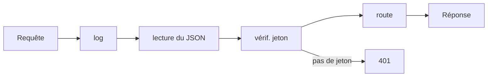

# Express et Middleware

> [!abstract] En bref
> **Express** est le framework serveur le plus simple de Node : on déclare des routes (« quand on reçoit GET /movies, réponds ceci ») et des **middlewares** (des étapes par lesquelles passe chaque requête). NestJS utilise Express en coulisses. Le comprendre, c'est comprendre ce que NestJS automatise pour toi.

## Une API en 15 lignes

```ts
import express from 'express';

const app = express();
app.use(express.json());                       // middleware : lit le corps JSON des requêtes

const movies = [{ id: 1, title: 'Inception' }];

app.get('/movies', (req, res) => {
  res.json(movies);
});

app.get('/movies/:id', (req, res) => {
  const movie = movies.find(m => m.id === Number(req.params.id));
  if (!movie) return res.status(404).json({ message: 'Film introuvable' });
  res.json(movie);
});

app.post('/movies', (req, res) => {
  const movie = { id: Date.now(), title: req.body.title };
  movies.push(movie);
  res.status(201).json(movie);
});

app.listen(3000, () => console.log('API sur http://localhost:3000'));
```

| Objet | Contient |
|---|---|
| `req.params` | les parties variables de l'URL (`:id`) |
| `req.query` | les paramètres après `?` (`?page=2`) |
| `req.body` | le corps de la requête (le JSON envoyé) |
| `req.headers` | les en-têtes (jeton, langue…) |
| `res.status(…).json(…)` | la réponse |

## Les middlewares : une chaîne de contrôles

Image : un **contrôle de sécurité à l'aéroport**. Chaque passager (requête) passe par plusieurs postes dans l'ordre ; chaque poste peut le laisser continuer (`next()`) ou l'arrêter.



```ts
// Un middleware = une fonction (req, res, next)
function logger(req, res, next) {
  console.log(req.method, req.url);
  next();                                     // passer au suivant
}

function auth(req, res, next) {
  if (!req.headers.authorization) return res.status(401).json({ message: 'Non connecté' });
  next();
}

app.use(logger);                              // pour toutes les routes
app.get('/favorites', auth, (req, res) => …); // seulement pour cette route
```

## Ce que NestJS ajoute par-dessus

| En Express, tu écris à la main… | NestJS le fait avec… |
|---|---|
| valider `req.body` | des DTO + `ValidationPipe` |
| le middleware `auth` | un **guard** |
| la gestion des erreurs | des exceptions et des filtres |
| l'organisation des fichiers | modules, controllers, services |
| créer et relier les objets | l'injection de dépendances |

C'est pour ça qu'on passe à [[NEST-01-Fondamentaux|NestJS]] : moins de code répétitif, et une structure imposée.

## Pièges

- **Oublier `next()`** dans un middleware : la requête reste bloquée, le client attend indéfiniment.
- **Oublier `express.json()`** : `req.body` est vide.
- **Faire confiance à `req.body`** sans le valider : n'importe qui peut envoyer n'importe quoi.
