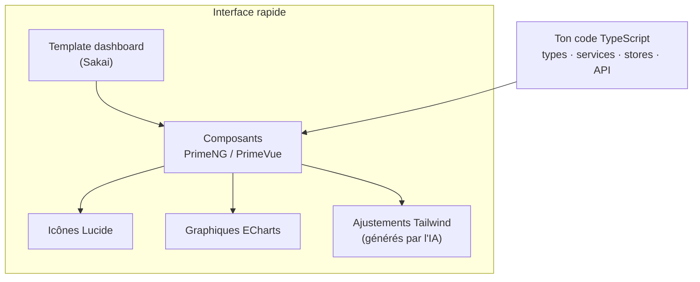

# Librairies UI pour Interfaces Rapides

> [!abstract] Introduction
> Pour construire vite des interfaces pro en Angular et Vue sans écrire tout le HTML/CSS : librairies de composants, CSS utilitaire, icônes, graphiques, tableaux de données et templates de dashboard — avec les choix recommandés pour chaque framework.

> [!warning]- Prérequis
> [[ANG-02-Composants|Composants Angular]], [[VUE-03-Composants-SFC|Composants & SFC Vue.js]]

---

## Théorie

> [!question]- C'est quoi ?
> **Choix recommandé pour aller vite dans les DEUX frameworks : PrimeNG (Angular) + PrimeVue (Vue)** — même éditeur, mêmes composants, même système de thèmes, plus de 80 composants (DataTable, formulaires, dialogues, menus, graphiques…) et des templates de dashboard gratuits. Tu apprends une fois, tu l'utilises partout.
>
> | Besoin | Angular | Vue | Commun |
> |---|---|---|---|
> | Kit de composants complet | **PrimeNG**, Angular Material, Taiga UI, NG-ZORRO | **PrimeVue**, Vuetify, Quasar, Naive UI, Element Plus | — |
> | Composants à copier dans ton code (Tailwind) | Spartan/ui (inspiré de shadcn) | shadcn-vue, Reka UI | Tailwind CSS |
> | CSS utilitaire | Tailwind | Tailwind | Tailwind + DaisyUI ou Flowbite |
> | Icônes | lucide-angular, `@ng-icons`, PrimeIcons, Material Symbols | lucide-vue-next, `@iconify/vue`, PrimeIcons | **Lucide**, Iconify (200 000+ icônes), Font Awesome |
> | Graphiques | ngx-echarts, ng2-charts | vue-echarts, vue-chartjs | **ECharts**, Chart.js, ApexCharts |
> | Tableaux de données | PrimeNG Table, Material Table, AG Grid | PrimeVue DataTable, AG Grid | **AG Grid**, TanStack Table |
> | Notifications (toasts) | PrimeNG Toast, ngx-toastr | PrimeVue Toast, vue-sonner | — |
> | Drag & drop | Angular CDK DragDrop | vuedraggable, VueUse | — |
> | Templates de dashboard | **Sakai** (PrimeNG) | **Sakai** (PrimeVue) | TailAdmin, templates Tailwind |
> | Utilitaires | Angular CDK | VueUse | date-fns |

> [!example]- Analogie
> Construire chaque bouton, tableau et graphique soi-même, c'est fabriquer ses briques avant de bâtir la maison ; une librairie UI te livre des briques standard, solides et assorties : tu te concentres sur l'agencement (le TypeScript, la logique, les données).

> [!question]- Pourquoi l'utiliser ?
> Ton objectif est de maîtriser TypeScript, Angular et Vue, pas le CSS : une librairie UI (+ l'IA pour les ajustements de mise en page) te permet de livrer des écrans propres, accessibles et cohérents en quelques heures, et de passer ton temps sur la logique.

> [!question]- Comment ça marche ?
> **Démarrage PrimeNG (Angular)** — la syntaxe exacte évolue entre versions, vérifier la doc de ta version :
> ```bash
> npm install primeng @primeuix/themes primeicons
> ```
> ```typescript
> // app.config.ts
> import { providePrimeNG } from 'primeng/config';
> import Aura from '@primeuix/themes/aura';
> import { provideAnimationsAsync } from '@angular/platform-browser/animations/async';
>
> export const appConfig: ApplicationConfig = {
>   providers: [provideAnimationsAsync(), providePrimeNG({ theme: { preset: Aura } })],
> };
> ```
> ```typescript
> // liste-films.page.ts
> import { TableModule } from 'primeng/table';
> import { ButtonModule } from 'primeng/button';
> import { TagModule } from 'primeng/tag';
>
> @Component({
>   imports: [TableModule, ButtonModule, TagModule],
>   template: `
>     <p-table [value]="films()" [paginator]="true" [rows]="10" [loading]="chargement()">
>       <ng-template #header>
>         <tr><th pSortableColumn="titre">Titre <p-sortIcon field="titre" /></th><th>Année</th><th>Statut</th><th></th></tr>
>       </ng-template>
>       <ng-template #body let-film>
>         <tr>
>           <td>{{ film.titre }}</td><td>{{ film.annee }}</td>
>           <td><p-tag [value]="film.statut" [severity]="film.statut === 'vu' ? 'success' : 'info'" /></td>
>           <td><p-button icon="pi pi-heart" [text]="true" (onClick)="favori(film)" ariaLabel="Ajouter aux favoris" /></td>
>         </tr>
>       </ng-template>
>     </p-table>`,
> })
> export class ListeFilmsPage { /* films = signal<Film[]>([]) … */ }
> ```
> **Démarrage PrimeVue (Vue)** :
> ```bash
> npm install primevue @primeuix/themes primeicons
> ```
> ```typescript
> // main.ts
> import PrimeVue from 'primevue/config';
> import Aura from '@primeuix/themes/aura';
> import 'primeicons/primeicons.css';
> createApp(App).use(PrimeVue, { theme: { preset: Aura } }).mount('#app');
> ```
> ```vue
> <script setup lang="ts">
> import DataTable from 'primevue/datatable';
> import Column from 'primevue/column';
> import Button from 'primevue/button';
> defineProps<{ films: Film[]; chargement: boolean }>();
> const emit = defineEmits<{ favori: [film: Film] }>();
> </script>
> <template>
>   <DataTable :value="films" paginator :rows="10" :loading="chargement">
>     <Column field="titre" header="Titre" sortable />
>     <Column field="annee" header="Année" />
>     <Column header="">
>       <template #body="{ data }">
>         <Button icon="pi pi-heart" text aria-label="Ajouter aux favoris" @click="emit('favori', data)" />
>       </template>
>     </Column>
>   </DataTable>
> </template>
> ```
> **Icônes Lucide (même librairie dans les deux frameworks)** :
> ```typescript
> // Angular : npm i lucide-angular
> import { LucideAngularModule, Heart } from 'lucide-angular';
> // template : <lucide-icon [img]="Heart" [size]="20" aria-hidden="true" />
> ```
> ```vue
> <!-- Vue : npm i lucide-vue-next -->
> <script setup lang="ts">import { Heart } from 'lucide-vue-next';</script>
> <template><Heart :size="20" aria-hidden="true" /></template>
> ```
> **Méthode « interface rapide »** :
> 1. Partir d'un template de dashboard (Sakai) ou d'un layout de la librairie (menu latéral + en-tête + contenu)
> 2. Assembler les composants de la librairie (DataTable, Card, Dialog, formulaires)
> 3. Demander à l'IA le HTML/CSS de mise en page en précisant « avec les composants PrimeNG/PrimeVue et Tailwind »
> 4. Concentrer ton effort sur le TypeScript : types, services/stores, appels API, états (chargement, vide, erreur)

> [!question]- Quand l'utiliser ?
> Applications métier, back-offices, dashboards, prototypes, projets perso. Au travail : **utiliser la librairie déjà en place** (demander laquelle, lire sa doc de thème).

> [!danger]- Quand NE PAS l'utiliser / Limites
> - Une librairie impose son style : un design très spécifique demande de la personnalisation (thème, tokens) ; ne jamais surcharger ses classes internes
> - Chaque librairie ajoute du poids : importer seulement les composants utilisés (standalone / imports par composant)
> - Ne pas mélanger deux kits de composants dans une même application
> - Les versions changent vite (noms de paquets de thèmes, syntaxe des templates) : toujours suivre la doc de la version installée

### Schéma



---

## Vocabulaire

| Terme | Définition en une ligne |
|-------|--------------------------|
| Kit de composants | Bibliothèque de composants UI prêts à l'emploi |
| Thème / preset | Ensemble de couleurs et styles appliqué à tous les composants |
| Design tokens | Variables de design (couleurs, espacements) du thème |
| Template de dashboard | Application de démarrage avec layout, menus et pages types |
| Headless | Composants avec la logique mais sans style imposé |

---

## Points clés

- PrimeNG + PrimeVue = même savoir-faire sur les deux frameworks
- Lucide ou Iconify pour les icônes, ECharts pour les graphiques, AG Grid pour les gros tableaux
- Partir d'un template de dashboard pour gagner des jours
- Un seul kit par application, celui de l'équipe en priorité
- L'effort doit aller au TypeScript, pas au CSS

---

## Pièges courants

> [!bug]- Erreurs fréquentes
> - Installer un kit sans son thème ni ses icônes → composants « nus »
> - Oublier d'importer le module du composant (Angular) → balise inconnue
> - Surcharger les classes internes (`.p-datatable-…`) au lieu d'utiliser le thème / les tokens
> - Choisir une librairie peu maintenue ou non compatible avec ta version d'Angular/Vue
> - Icône seule dans un bouton sans `aria-label`

---

## Exemple minimal

```vue
<!-- Carte statistique de dashboard (Vue + PrimeVue + Lucide + Tailwind) -->
<script setup lang="ts">
import Card from 'primevue/card';
import { Film } from 'lucide-vue-next';
defineProps<{ titre: string; valeur: number; evolution: number }>();
</script>
<template>
  <Card>
    <template #content>
      <div class="flex items-center justify-between">
        <div>
          <p class="text-sm opacity-70">{{ titre }}</p>
          <p class="text-3xl font-semibold">{{ valeur }}</p>
          <p :class="evolution >= 0 ? 'text-green-600' : 'text-red-600'">{{ evolution >= 0 ? '+' : '' }}{{ evolution }} %</p>
        </div>
        <Film :size="32" aria-hidden="true" />
      </div>
    </template>
  </Card>
</template>
```

> [!note] Ce que j'en retiens
> Une carte de KPI complète en 20 lignes : le kit gère le style, toi les props typées et la logique d'affichage.

---

## Pour aller plus loin (niveau senior)

> [!tip]- Ce qui distingue un dev expérimenté
> - Créer ses propres composants « maison » par-dessus la librairie (ex. `AppKpiCard`) pour pouvoir changer de librairie sans toucher aux pages
> - Personnaliser le thème via les design tokens (couleurs de l'entreprise) plutôt que du CSS de surcharge
> - Évaluer une librairie : accessibilité, maintenance, taille, licence, compatibilité avec les versions

---

## Connexions

**Arbre théorique :**
- Sujet parent → [[Frameworks]]
- Sous-sujets → (aucun pour l'instant)
- À comparer avec → [[Angular-vs-Vue|Angular vs Vue Correspondances]]

**Pratique :**
- Extrait de code → [[04_Snippets/ui-librairies-interfaces-rapides]]
- Projet → [[02_Projects/CinéTrack]]

---

## Auto-vérification

> [!check]- Est-ce que je maîtrise vraiment ?
> - Pourquoi encapsuler les composants d'une librairie dans des composants maison ?
> - Quelle librairie d'icônes fonctionne à l'identique en Angular et en Vue ?

> [!faq]- Questions d'entretien
> - Comment accélérez-vous le développement d'une interface métier ?

---

## Tâches

- [ ] #task Demander au travail quelle librairie UI est utilisée dans les projets Angular et Vue
- [ ] #task Installer PrimeNG dans CinéTrack et PrimeVue dans CinéTrack-Vue, afficher la liste des films en DataTable
- [ ] #task Partir du template Sakai pour le dashboard admin de CinéTrack
- [ ] #task Mettre à jour `status` une fois maîtrisé

---

## Notes brutes

- ?
