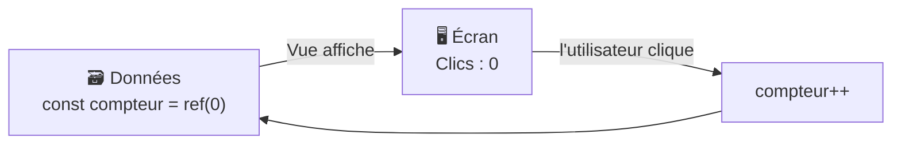

# Fondamentaux Vue.js

> [!abstract] En bref
> Vue est un framework pour construire des interfaces. Le principe : tu décris **à quoi l'écran doit ressembler en fonction de tes données**, et quand les données changent, Vue met l'écran à jour tout seul. Plus besoin de `querySelector` et `textContent`. C'est le framework de ton premier projet, le Portfolio.

## L'idée centrale



Tu ne touches jamais l'écran directement : tu modifies les données, Vue s'occupe du reste. C'est la **réactivité**.

## Ton premier composant

```vue
<!-- Compteur.vue -->
<script setup lang="ts">
import { ref } from 'vue';

const compteur = ref(0);                 // une donnée réactive
const incrementer = () => compteur.value++;
</script>

<template>
  <button type="button" @click="incrementer">
    Clics : {{ compteur }}
  </button>
</template>

<style scoped>
button { padding: 8px 16px; }
</style>
```

Un fichier `.vue` a trois parties :
- `<script setup lang="ts">` : la logique en TypeScript ;
- `<template>` : le HTML, avec `{{ }}` pour afficher une donnée ;
- `<style scoped>` : le CSS, limité à ce composant.

## Créer un projet

```bash
npm create vue@latest portfolio   # coche TypeScript, Router, Pinia, Vitest, ESLint, Prettier
cd portfolio
npm install
npm run dev                       # http://localhost:5173
```

Ce qui est généré :

| Fichier | Rôle |
|---|---|
| `src/main.ts` | démarre l'application (`createApp(App).mount('#app')`) |
| `src/App.vue` | le composant racine |
| `src/router/index.ts` | les routes (pages) |
| `src/components/` | tes composants (à réorganiser selon la [[VUE-22-Template-Architecture-Vue\|structure du projet]]) |
| `index.html` | la page où l'application s'affiche |
| `vite.config.ts` | la configuration de Vite, l'outil de build |

## Les notions, dans l'ordre où tu en auras besoin

1. [[VUE-02-Reactivite|Réactivité]] : `ref`, la donnée qui met l'écran à jour.
2. [[VUE-04-Directives-Templates|Directives]] : `v-if`, `v-for`, `@click`, `:class` dans le template.
3. [[VUE-03-Composants-SFC|Composants]] et [[VUE-05-Props-Emits|props / emits]] : découper l'écran en morceaux.
4. [[VUE-06-Computed-Watchers|Computed]] : les valeurs calculées (liste filtrée).
5. [[VUE-08-Vue-Router|Vue Router]] : plusieurs pages.
6. [[VUE-07-Composition-API|Composables]] : réutiliser de la logique.

## Pièges

- **Oublier `.value`** dans le `<script>` : `compteur++` ne marche pas, c'est `compteur.value++`. (Dans le template, pas de `.value`.)
- **Modifier le DOM à la main** (`document.querySelector`) : Vue risque d'écraser tes changements. Passe par les données.
- **Installer Vue DevTools** (extension navigateur) dès le début : tu vois tes composants et leurs données en direct.
