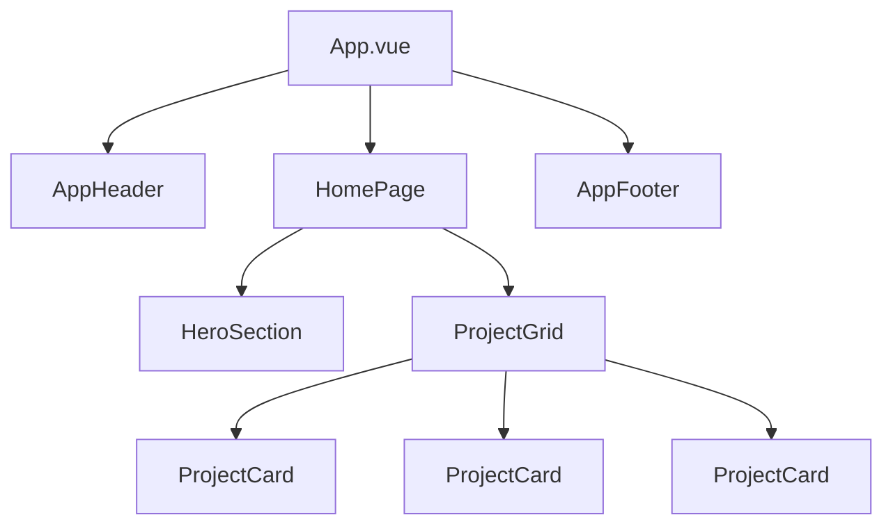

# Composants & SFC Vue.js

> [!abstract] En bref
> Un **composant** est un morceau d'interface réutilisable : un bouton, une carte projet, un en-tête. En Vue, chaque composant est un fichier `.vue` (*Single File Component*) qui contient son HTML, son TypeScript et son CSS. Une page = un assemblage de composants.

## Découper un écran

La page d'accueil du Portfolio :



**Quand créer un composant ?** Quand un morceau est **répété** (la carte projet), ou quand un fichier devient **trop long** (plus de 150-200 lignes), ou quand un bloc a un **rôle clair** (l'en-tête).

## Anatomie d'un fichier `.vue`

```vue
<!-- ProjectCard.vue -->
<script setup lang="ts">
import type { Project } from '../data/project.model';

defineProps<{ project: Project }>();   // les données reçues du parent
</script>

<template>
  <article class="card">
    <h3>{{ project.title }}</h3>
    <p>{{ project.summary }}</p>
  </article>
</template>

<style scoped>
.card { padding: 20px; border-radius: 14px; }
</style>
```

## Utiliser un composant

```vue
<!-- ProjectGrid.vue -->
<script setup lang="ts">
import ProjectCard from './ProjectCard.vue';   // importé = utilisable, rien d'autre à déclarer
defineProps<{ projects: Project[] }>();
</script>

<template>
  <div class="grid">
    <ProjectCard v-for="p in projects" :key="p.slug" :project="p" />
  </div>
</template>
```

## Conventions

| Règle | Exemple |
|---|---|
| Nom en **PascalCase**, en plusieurs mots | `ProjectCard.vue`, pas `Card.vue` |
| Composants génériques préfixés | `BaseButton.vue`, `BaseLoader.vue` |
| Composants d'une seule instance préfixés | `AppHeader.vue`, `AppFooter.vue` |
| Une page (liée à une route) | `ProjectsPage.vue` dans `pages/` |

## `<style scoped>`

`scoped` limite le CSS **à ce composant** : `.card` ici n'affecte pas les `.card` des autres composants. Mets-le presque toujours.

## Deux types de composants

| | Composant **d'affichage** | **Page** |
|---|---|---|
| Rôle | afficher ce qu'on lui donne | récupérer les données et assembler |
| Reçoit | des props | rien (ou un paramètre de route) |
| Appels API | **jamais** | oui (via un composable ou un store) |
| Exemple | `ProjectCard` | `ProjectsPage` |

Garder les composants d'affichage « bêtes » les rend faciles à réutiliser et à tester.

La suite : comment un parent parle à ses enfants → [[VUE-05-Props-Emits|Props & Emits]].
