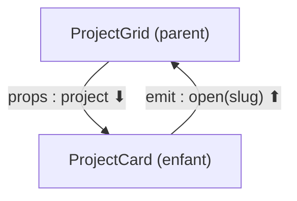

# Props & Emits Vue.js (Communication Parent-Enfant)

> [!abstract] En bref
> Un parent **donne des données** à son enfant avec les **props**. L'enfant **prévient** son parent qu'il s'est passé quelque chose avec les **emits** (événements). Les données descendent, les événements remontent : c'est tout le secret de la communication entre composants.

## Le schéma



Image : le parent est un **chef** qui donne une fiche de mission (props) ; l'enfant **ne modifie pas la fiche**, il **rend compte** (emit), et c'est le chef qui décide quoi faire.

## Côté enfant

```vue
<!-- ProjectCard.vue -->
<script setup lang="ts">
import type { Project } from '../data/project.model';

const props = defineProps<{
  project: Project;          // obligatoire
  highlighted?: boolean;     // optionnel
}>();

const emit = defineEmits<{
  open: [slug: string];      // événement "open" qui transporte un slug
}>();
</script>

<template>
  <article :class="{ highlighted }">
    <h3>{{ project.title }}</h3>
    <button type="button" @click="emit('open', project.slug)">Étude de cas</button>
  </article>
</template>
```

## Côté parent

```vue
<!-- ProjectGrid.vue -->
<script setup lang="ts">
const router = useRouter();
const ouvrir = (slug: string) => router.push(`/projects/${slug}`);
</script>

<template>
  <ProjectCard
    v-for="p in projects"
    :key="p.slug"
    :project="p"
    :highlighted="p.slug === 'cinetrack'"
    @open="ouvrir"
  />
</template>
```

- `:project="p"` → passe une **donnée** (avec les `:`).
- `@open="ouvrir"` → écoute l'**événement**.

## Valeurs par défaut

```ts
const { size = 'md', highlighted = false } = defineProps<{
  size?: 'sm' | 'md' | 'lg';
  highlighted?: boolean;
}>();
```

## `v-model` sur un composant

Pour un composant qui modifie une valeur du parent (un champ de recherche, un filtre) :

```vue
<!-- TechFilter.vue -->
<script setup lang="ts">
const tech = defineModel<Tech | null>();   // prop + événement de mise à jour en une ligne
</script>

<template>
  <button type="button" @click="tech = 'vue'">Vue</button>
</template>
```

```vue
<!-- parent -->
<TechFilter v-model="selectedTech" />
```

## Pièges

- **Modifier une prop dans l'enfant** (`props.project.title = …`) : interdit. L'enfant émet, le parent modifie.
- **Passer une prop à travers 4 niveaux** de composants : utilise un [[VUE-09-Pinia-State-Management|store Pinia]] ou [[VUE-13-Provide-Inject|provide/inject]].
- **Oublier les `:`** : `project="p"` passe le texte « p ».
