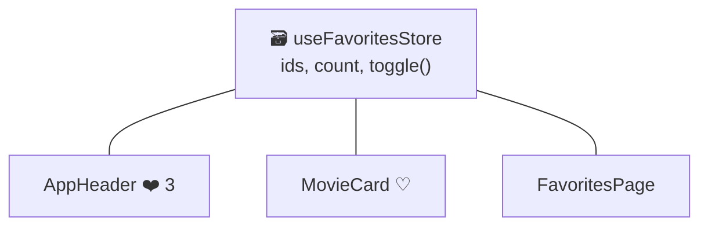

# Pinia (State Management Vue.js)

> [!abstract] En bref
> **Pinia** est une boîte de données **partagée par toute l'application**. Plusieurs pages ont besoin de la même info (l'utilisateur connecté, les favoris, le panier) ? On la met dans un **store** Pinia, et chaque composant y lit et écrit au même endroit.

## Pourquoi un store

Sans store, pour que la page Favoris et l'icône ❤️ de l'en-tête affichent le même nombre, il faudrait faire passer les données de parent en enfant sur plusieurs niveaux. Avec un store, chacun s'y branche directement.



## Écrire un store

La syntaxe « setup » ressemble à un composable :

```ts
// features/favorites/data/favorites.store.ts
import { defineStore } from 'pinia';
import { ref, computed } from 'vue';

export const useFavoritesStore = defineStore('favorites', () => {
  // état
  const ids = ref<number[]>([]);

  // valeurs calculées (getters)
  const count = computed(() => ids.value.length);
  const has = (id: number) => ids.value.includes(id);

  // actions
  function toggle(id: number) {
    ids.value = has(id) ? ids.value.filter(x => x !== id) : [...ids.value, id];
  }

  return { ids, count, has, toggle };
});
```

## L'utiliser

```vue
<script setup lang="ts">
import { storeToRefs } from 'pinia';

const favorites = useFavoritesStore();
const { count } = storeToRefs(favorites);   // pour les données : garder la réactivité
const { toggle } = favorites;               // pour les fonctions : déstructuration normale
</script>

<template>
  <span>❤️ {{ count }}</span>
  <button type="button" @click="toggle(movie.id)">♡</button>
</template>
```

## Un store qui charge des données

```ts
export const useProjectsStore = defineStore('projects', () => {
  const projects = ref<Project[]>([]);
  const loading = ref(false);
  const error = ref<string | null>(null);

  async function load() {
    if (projects.value.length) return;   // déjà chargé
    loading.value = true;
    try {
      projects.value = await projectsApi.list();
    } catch {
      error.value = 'Impossible de charger les projets';
    } finally {
      loading.value = false;
    }
  }

  return { projects, loading, error, load };
});
```

## Quand utiliser Pinia ?

| Situation | Où mettre l'état |
|---|---|
| utilisé par **un seul** composant | dans le composant (`ref`) |
| logique réutilisable, état propre à chaque usage | un [[VUE-07-Composition-API\|composable]] |
| **partagé** entre plusieurs pages | un store Pinia |

Pour le Portfolio, tu peux t'en passer au début : un fichier de données et un composable suffisent. Pinia devient utile avec CinéTrack-Vue (favoris, utilisateur).

## Pièges

- **Déstructurer sans `storeToRefs`** : `const { count } = useFavoritesStore()` donne une valeur figée.
- **Tout mettre dans des stores** : un état local reste local.
- **Garder les favoris après rechargement** : ajoute un plugin de persistance (`pinia-plugin-persistedstate`) ou `useLocalStorage` de VueUse.
