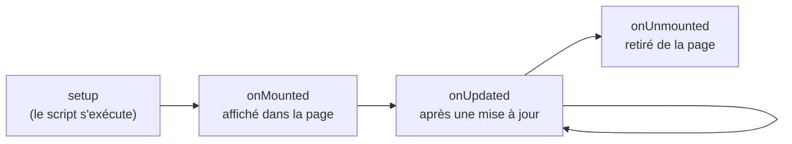

# Cycle de Vie Vue.js

> [!abstract] En bref
> Un composant **naît** (il est créé), **apparaît** dans la page, **se met à jour**, puis **disparaît**. Vue te permet d'exécuter du code à ces moments-là avec des fonctions comme `onMounted` et `onUnmounted`. Dans la pratique, deux suffisent presque toujours.

## Les moments de la vie d'un composant



## Les deux à connaître

### `onMounted` : le composant est affiché

C'est le moment où les éléments HTML existent vraiment. Utile pour :
- lancer un chargement de données ;
- donner le focus à un champ ;
- mesurer un élément ou démarrer une librairie externe (graphique, carte).

```ts
import { onMounted, useTemplateRef } from 'vue';

const search = useTemplateRef<HTMLInputElement>('search');

onMounted(() => {
  search.value?.focus();
  store.load();
});
```

### `onUnmounted` : le composant disparaît

Pour **nettoyer** ce que tu as ouvert : un minuteur, un écouteur sur `window`, un abonnement.

```ts
onMounted(() => window.addEventListener('resize', onResize));
onUnmounted(() => window.removeEventListener('resize', onResize));

const timer = setInterval(rafraichir, 30_000);
onUnmounted(() => clearInterval(timer));
```

Sans ce nettoyage, les écouteurs continuent de tourner après le départ de la page : fuite de mémoire et bugs étranges.

## Et les autres ?

| Hook | Usage |
|---|---|
| `onBeforeMount`, `onBeforeUnmount` | juste avant ; rarement utile |
| `onUpdated` | après chaque mise à jour de l'affichage ; à éviter (un `watch` est plus précis) |
| `onErrorCaptured` | attraper les erreurs des composants enfants |

## Astuce : VueUse nettoie pour toi

```ts
useEventListener(window, 'resize', onResize);   // retiré automatiquement
useIntervalFn(rafraichir, 30_000);               // arrêté automatiquement
```

## Pièges

- **Chercher un élément du template dans le `setup`** (avant `onMounted`) : il n'existe pas encore → `null`.
- **Oublier de nettoyer** un `setInterval` ou un `addEventListener` sur `window`.
