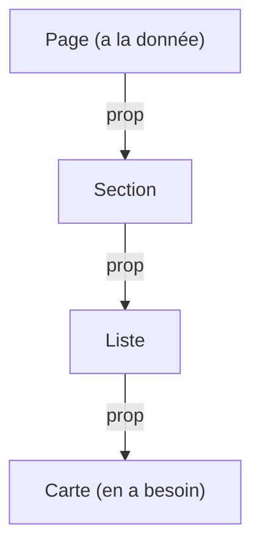

# Provide Inject Vue.js

> [!abstract] En bref
> `provide` / `inject` permet à un composant de **mettre une valeur à disposition de tous ses descendants**, sans la faire passer en prop à chaque niveau. Utile pour un contexte partagé par un groupe de composants (un formulaire, des onglets). Pour des données partagées par toute l'application, préfère Pinia.

## Le problème : le « prop drilling »



`Section` et `Liste` ne font que transmettre une donnée dont elles n'ont pas besoin. Avec `provide` / `inject`, la page la **dépose**, et la carte la **prend** directement.

## Utilisation

```ts
// keys.ts : une clé typée, pour éviter les fautes de frappe
import type { InjectionKey, Ref } from 'vue';
export const THEME_KEY: InjectionKey<Ref<'light' | 'dark'>> = Symbol('theme');
```

```vue
<!-- composant parent -->
<script setup lang="ts">
const theme = ref<'light' | 'dark'>('dark');
provide(THEME_KEY, theme);
</script>
```

```vue
<!-- n'importe quel descendant, à n'importe quelle profondeur -->
<script setup lang="ts">
const theme = inject(THEME_KEY);                       // peut être undefined
const theme = inject(THEME_KEY, ref('dark'));          // avec une valeur par défaut
</script>
```

## Quand l'utiliser ?

| Situation | Outil |
|---|---|
| parent → enfant direct | props |
| un groupe de composants qui travaillent ensemble (`Tabs` + `Tab`, `Form` + `Field`) | provide / inject |
| donnée partagée par toute l'application | [[VUE-09-Pinia-State-Management\|Pinia]] |
| un plugin ou une configuration globale | `app.provide(…)` dans `main.ts` |

Dans une application, tu t'en serviras peu. Les librairies (PrimeVue, VeeValidate, Vue Router) l'utilisent beaucoup en interne : c'est comme ça que `useRouter()` retrouve le routeur.

## Pièges

- **Fournir une valeur simple** (`provide(KEY, 'dark')`) : les descendants ne verront jamais les changements. Fournis une `ref`.
- **Les descendants qui modifient la valeur** : difficile de savoir qui a changé quoi. Fournis plutôt une valeur en lecture seule (`readonly(theme)`) et une fonction pour la modifier.
